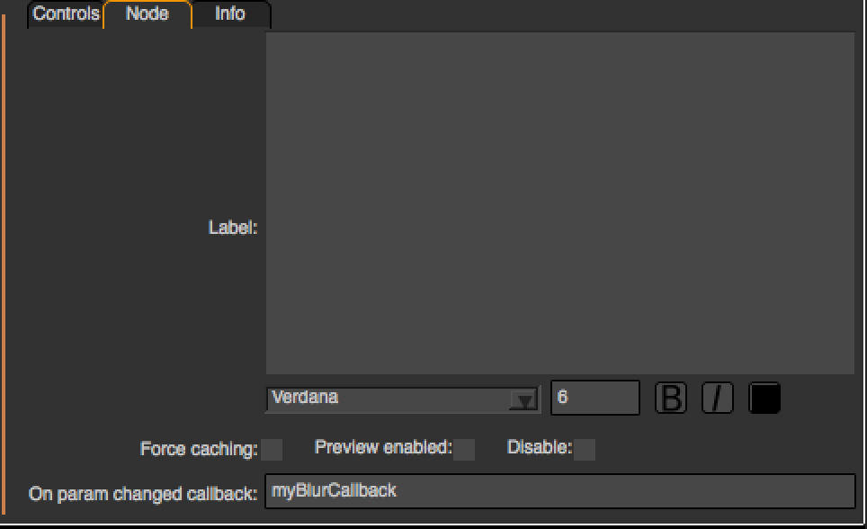
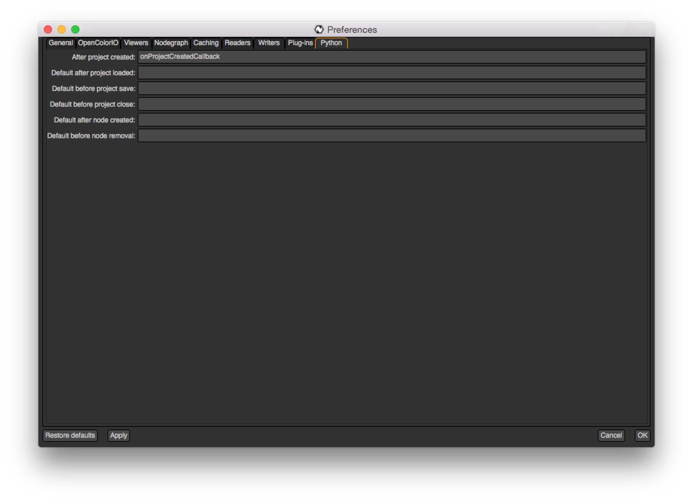
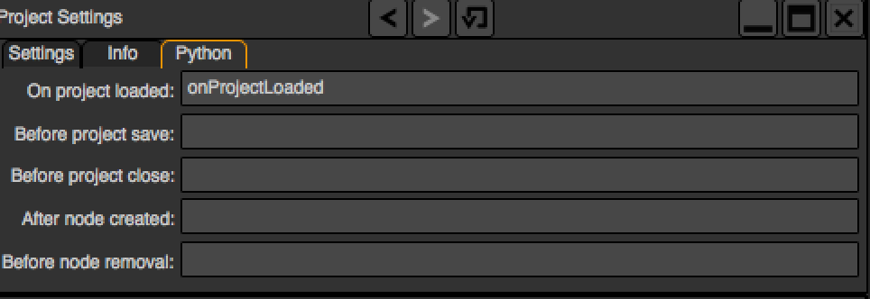
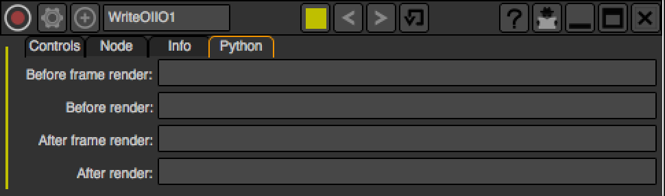

.. _callbacks:

Using Callbacks
===============

*Callbacks* are functions that are executed after or before a certain event in Natron. 
They are Python-defined methods that you declare yourself and then register to Natron
in a different manner for each callback.

.. warning::

	Note that callbacks will be called in background and GUI modes, hence you should 
	wrap all GUI code by the following condition::
	
		if not natron.isBackground():
			#...do gui stuff
	
Callback persistence
--------------------

If you want your callback to persist 2 runs of Natron; it is necessary that you define it
in your **init.py** script (or **initGui.py** if you want it only available in GUI mode). 
See :ref:`this section<startupScripts>` for more infos.

Here is the list of the different callbacks:

The param changed callback
--------------------------

This function is called every times the value of a :ref:`parameter<Param>` changes.
This callback is available for all objects that can hold parameters,namely:

	* :ref:`Effect<Effect>`
	* :ref:`PyPanel<pypanel>`
	* :ref:`PyModalDialog<pyModalDialog>`

When called, Natron will pre-define for you the boolean variable **userEdited** indicating
whether or not the parameter change is due to user interaction (i.e: because the user changed
the value by herself/himself) or due to another parameter changing the value of the parameter
via a derivative of the :func:`setValue(value)<>` function.

For the param changed callback of the :ref:`Effect<Effect>` class **only** , some other variables
will be declared by Natron: 

	* The **thisParam** variable. This is a :ref:`Param<Param>` pointing to the parameter which just had its value changed.
	
	* The **thisNode** variable. This is a :ref:`Effect<Effect>` pointing to the effect holding **thisParam**
	
	* The **thisGroup** variable. This is a :ref:`Effect<Effect>` pointing to the group  holding **thisNode**.
	 Note that it will be declared only if **thisNode** is part of a group.
	
	* The **app** variable will be set so it points to the correct :ref:`application instance<App>`.
	
	

For the param changed callback of :ref:`PyPanel<pypanel>` and :ref:`PyModalDialog<pyModalDialog>`
on the other hand, Natron will define a string variable **paramName** indicating the :ref:`script-name<autoVar>`
of the parameter which just had its value changed.

.. note::
	
	The difference is due to technical reasons: mainly because the parameters of the 
	:ref:`PyPanel<pypanel>` class and :ref:`PyModalDialog<pyModalDialog>` are not declared
	as attributes of the object.
	 

Registering the param changed callback
----------------------------------------

To register the param changed callback of an :ref:`Effect<Effect>`, you can do so in
the settings panel of the node, in the "Node" tab, by entering the name of your Python function:

You can also set the callback directly from the script: The callback is just another :ref:`parameter<Param>`
of the node, on which you can call :func:`setValue(value)<>` to set the name of the callback

::

	def myBlurCallback():
		...

	app.BlurCImg1.onParamChanged.set("myBlurCallback")
	
	
Example
^^^^^^^^
::

	# This simple callback just prints a string when the "size" parameter of the BlurCImg
	# node changes
	def myBlurCallback():
		if thisParam == thisNode.size:
			print("The size of the blur just changed!")

	app.BlurCImg1.onParamChanged.set("myBlurCallback")
	

Using the param changed callback for  :ref:`PyModalDialog<pyModalDialog>` and  :ref:`PyModalDialog<pyModalDialog>`
--------------------------------------------------------------------------------------------------------------------

To register the callback to the object, use the :func:`setParamChangedCallback(pythonFunctionName)<>` function.

The following example is taken from the initGui.py script provided as example in :ref:`this section<sourcecodeEx>`.
	
Example
^^^^^^^^

::

	#Callback called when a parameter of the player changes
	#The variable paramName is declared by Natron; indicating the name of the parameter which just had its value changed
	def myPlayerParamChangedCallback():

		viewer = app.getViewer("Viewer1")
		if viewer == None:
			return
		if paramName == "previous":
			viewer.seek(viewer.getCurrentFrame() - 1)
		elif paramName == "backward":
			viewer.startBackward()
		elif paramName == "forward":
			viewer.startForward()
		elif paramName == "next":
			viewer.seek(viewer.getCurrentFrame() + 1)
		elif paramName == "stop":
			viewer.pause()

	def createMyPlayer():
		app.player = NatronGui.PyPanel("fr.inria.myplayer","My Player",True,app)
		#...
		app.player.setParamChangedCallback("myPlayerParamChangedCallback")
	
The After project created callback
-----------------------------------

This function is called whenever a new project is created, that is either when launching Natron
without loading a project, or when clicking "Create a new project" or "Close project".

.. note:: 

	Note that this function is never called when a project is loaded either via an auto-save
	or from user interaction.

The **app** variable will be set so it points to the correct :ref:`application instance<App>`
being created.
	
You can set the callback via the *afterProjectCreated* parameter of the settings of Natron.

	
This is a good place to create custom panels and/or setup the node-graph with node presets.

Example, taken from the initGui.py script provided as example in :ref:`this section<sourcecodeEx>`:

::

	def onProjectCreated():
		
		#Always create our icon viewer on project creation
		createIconViewer()

	
	natron.settings.afterProjectCreated.set("onProjectCreated")
	
	

The After project loaded callback
----------------------------------

This function is very similar to the After project created callback but is a per-project callback,
called only when a project is loaded from an auto-save or from user interaction.

The **app** variable will be set so it points to the correct :ref:`application instance<App>`
being loaded.

You can set this callback in the project settings:

	
This is a good place to do some checks to opened projects or to setup something:

::

	def onProjectLoaded():
		
		if not natron.isBackground():
			if app.getUserPanel("fr.inria.iconviewer") is None:
				createIconViewer()
		
	app.afterProjectLoad.set("onProjectLoaded")
	
.. note:: 

	You can set a default After project loaded callback for all new projects in the *Preferences-->Python* tab.
	
The Before project save callback
--------------------------------

This function will be called prior to saving a project either via an auto-save or from
user interaction.

The string variable **filename** will be declared prior to calling this function indicating the file-path
where the project is initially going to be saved.
This function should return the filename under which the project should really be saved.

The boolean variable **autoSave** will be declared prior to calling this function, indicating whether
the save was originated from an auto-save or from user interaction.

The **app** variable will be set so it points to the correct :ref:`application instance<App>`
being created.

You can set the callback from the project settings:

	

:: 

	def beforeProjectSave():
		print("Saving project under: ",filename)
		return filename
	
	app.beforeProjectSave.set("beforeProjectSave")
	
.. note:: 

	You can set a default Before project save callback for all new projects in the *Preferences-->Python* tab.
	
	
The Before project close callback
---------------------------------

This function is called prior to closing a project either because the application is about
to quit or because the user closed the project.

The **app** variable will be set so it points to the correct :ref:`application instance<App>`
being closed.

This function can be used to synchronize any other device or piece of software communicating
with Natron.

You can set the callback from the project settings:

	
:: 

	def beforeProjectClose():
		print("Closing project)
	
	app.beforeProjectClose.set("beforeProjectClose")
	
.. note:: 

	You can set a default Before project close callback for all new projects in the *Preferences-->Python* tab.
	

The After node created callback
---------------------------------

This function is called after creating a node in Natron. 

The **app** variable will be set so it points to the correct :ref:`application instance<App>`.

The **thisNode** variable will be set to point to the :ref:`node<Effect>` that has been created.

The boolean **userEdited** variable will be declared and set to *True* if the node was created
by the user (or by a script using the :func:`createNode(pluginID,version,group)<>` function)
or *False* if the node was created by actions such as pasting a node or when the project is
loaded.

This is a good place to change default parameters values.

You can set the callback from the project settings:

	
:: 

	def onNodeCreated():
		print(thisNode.getScriptName()," was just created")
		if userEdited:
			print(" due to user interaction")
		else:
			print(" due to project load or node pasting")
	
	app.afterNodeCreated.set("onNodeCreated")
	
.. note:: 

	You can set a default After node created callback for all new projects in the *Preferences-->Python* tab.
	
	
The Before node removal callback:
---------------------------------

This function is called prior to deleting a node in Natron.

The **app** variable will be set so it points to the correct :ref:`application instance<App>`.

The **thisNode** variable will be set to point to the :ref:`node<Effect>` about to be deleted.

.. warning::

	This function will **NOT** be called when the project is closing
	
You can set the callback from the project settings:

	
:: 

	def beforeNodeDeleted():
		print(thisNode.getScriptName()," is going to be destroyed")

	
	app.beforeNodeRemoval.set("beforeNodeDeleted")
	
.. note:: 

	You can set a default Before node removal callback for all new projects in the *Preferences-->Python* tab.
	
	
The Before frame render callback:
---------------------------------

This function is called prior to rendering any frame with a Write node.

The **app** variable will be set so it points to the correct :ref:`application instance<App>`.

The **thisNode** variable will be set to point to the :ref:`write node<Effect>`.

To execute code specific when in background render mode or in GUI mode, use the following condition
::

	if natron.isBackground():
		#We are in background mode

You can set the callback from the Write node settings panel in the "Python" tab.

This function can be used to communicate with external programs for example.

The After frame rendered callback:
---------------------------------

This function is called after each frame is finished rendering with a Write node. 

The **app** variable will be set so it points to the correct :ref:`application instance<App>`.

The **thisNode** variable will be set to point to the :ref:`write node<Effect>`.

To execute code specific when in background render mode or in GUI mode, use the following condition
::

	if natron.isBackground():
		#We are in background mode

You can set the callback from the Write node settings panel in the "Python" tab.

This function can be used to communicate with external programs for example.

The Before render callback:
---------------------------

This function is called once before starting rendering the first frame of a sequence with 
the Write node.

The **app** variable will be set so it points to the correct :ref:`application instance<App>`.

The **thisNode** variable will be set to point to the :ref:`write node<Effect>`.

To execute code specific when in background render mode or in GUI mode, use the following condition
::

	if natron.isBackground():
		#We are in background mode

You can set the callback from the Write node settings panel in the "Python" tab.

This function can be used to communicate with external programs for example.

.. _afterRenderCallback:

The After render callback:
---------------------------

This function is called once after the rendering of the last frame is finished with
the Write node or if the render was aborted.

The **app** variable will be set so it points to the correct :ref:`application instance<App>`.

The **thisNode** variable will be set to point to the :ref:`write node<Effect>`.

The **aborted** boolean variable will be set to *True* if the rendering was aborted or *False* otherwise.

To execute code specific when in background render mode or in GUI mode, use the following condition
::

	if natron.isBackground():
		#We are in background mode

You can set the callback from the Write node settings panel in the "Python" tab.

This function can be used to communicate with external programs for example.
