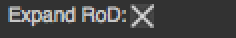

.. module:: NatronEngine
.. _BooleanParam:

BooleanParam
************

**Inherits** :doc:`AnimatedParam`

Synopsis
--------

A parameter that contains a boolean value. See :ref:`detailed<bparam-details>` description below

Functions
^^^^^^^^^

- def :meth:`get<NatronEngine.BooleanParam.get>` ()
- def :meth:`get<NatronEngine.BooleanParam.get>` (frame)
- def :meth:`getDefaultValue<NatronEngine.BooleanParam.getDefaultValue>` ()
- def :meth:`getValue<NatronEngine.BooleanParam.getValue>` ()
- def :meth:`getValueAtTime<NatronEngine.BooleanParam.getValueAtTime>` (time)
- def :meth:`restoreDefaultValue<NatronEngine.BooleanParam.restoreDefaultValue>` ()
- def :meth:`set<NatronEngine.BooleanParam.set>` (x)
- def :meth:`set<NatronEngine.BooleanParam.set>` (x, frame)
- def :meth:`setDefaultValue<NatronEngine.BooleanParam.setDefaultValue>` (value)
- def :meth:`setValue<NatronEngine.BooleanParam.setValue>` (value)
- def :meth:`setValueAtTime<NatronEngine.BooleanParam.setValueAtTime>` (value, time)

.. _bparam-details:

Detailed Description
--------------------

A BooleanParam looks like a checkbox in the user interface.

Member functions description
^^^^^^^^^^^^^^^^^^^^^^^^^^^^

.. method:: NatronEngine.BooleanParam.get()

    :rtype: :class:`bool<PySide.QtCore.bool>`

Returns the value of the parameter at the current timeline's time.

.. method:: NatronEngine.BooleanParam.get(frame)

    :param frame: :class:`float<PySide.QtCore.float>`
    :rtype: :class:`bool<PySide.QtCore.bool>`

Returns the value of the parameter at the given *frame*. This value may be interpolated
given the *interpolation* of the underlying animation curve.

.. method:: NatronEngine.BooleanParam.getDefaultValue()

    :rtype: :class:`bool<PySide.QtCore.bool>`

Returns the default value for this parameter.

.. method:: NatronEngine.BooleanParam.getValue()

    :rtype: :class:`bool<PySide.QtCore.bool>`

Same as :func:`get()<NatronEngine.BooleanParam.get>`

.. method:: NatronEngine.BooleanParam.getValueAtTime(time)

    :param time: :class:`float<PySide.QtCore.float>`
    :rtype: :class:`bool<PySide.QtCore.bool>`

Same as :func:`get(frame)<NatronEngine.BooleanParam.get>`

.. method:: NatronEngine.BooleanParam.restoreDefaultValue()

Removes all animation and expression set on this parameter and set the value
to be the default value.

.. method:: NatronEngine.BooleanParam.set(x)

    :param x: :class:`bool<PySide.QtCore.bool>`

Set the value of this parameter to be *x*. If this parameter is animated (see :func:`getIsAnimated(dimension)<NatronEngine.AnimatedParam.getIsAnimated>`
then this function will automatically add a keyframe at the timeline's current time.

.. method:: NatronEngine.BooleanParam.set(x, frame)

    :param x: :class:`bool<PySide.QtCore.bool>`
    :param frame: :class:`float<PySide.QtCore.float>`

Set a new keyframe on the parameter with the value *x* at the given *frame*.

.. method:: NatronEngine.BooleanParam.setDefaultValue(value)

    :param value: :class:`bool<PySide.QtCore.bool>`

Set the default *value* for this parameter.

.. method:: NatronEngine.BooleanParam.setValue(value)

    :param value: :class:`bool<PySide.QtCore.bool>`

Same as :func:`set(value)<NatronEngine.BooleanParam.set>`

.. method:: NatronEngine.BooleanParam.setValueAtTime(value, time)

    :param value: :class:`bool<PySide.QtCore.bool>`
    :param time: :class:`float<PySide.QtCore.float>`

Same as :func:`set(value,time)<NatronEngine.BooleanParam.set>`

