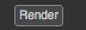

.. module:: NatronEngine
.. _ButtonParam:

ButtonParam
***********

**Inherits** :doc:`Param`

Synopsis
--------

A button parameter that appears in the settings panel of the node.

To insert code to be executed upon a user click of the button, register a function to the
onParamChanged callback on the node.

Functions
^^^^^^^^^

- def :meth:`trigger<NatronEngine.ButtonParam.trigger>` ()
- def :meth:`isCheckable<NatronEngine.ButtonParam.trigger>` ()
- def :meth:`setDown<NatronEngine.ButtonParam.trigger>` (down)
- def :meth:`isDown<NatronEngine.ButtonParam.trigger>` ()

Member functions description
^^^^^^^^^^^^^^^^^^^^^^^^^^^^

.. method:: NatronEngine.ButtonParam.trigger()

   Triggers the button action as though the user had pressed it.

.. method:: NatronEngine.ButtonParam.isCheckable()

    :rtype: :class:`bool<PySide.QtCore.bool>`

   Returns whether this button parameter can be checked or not

.. method:: NatronEngine.ButtonParam.setDown(down)

    :param down: :class:`bool<PySide.QtCore.bool>`

   If this button is checkable, this will set the button down or up depending on
   the value of *down*.

.. method:: NatronEngine.ButtonParam.isDown()

    :rtype: :class:`bool<PySide.QtCore.bool>`

   Returns whether this button parameter is down or not
