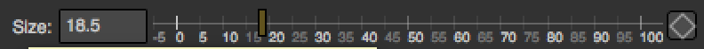
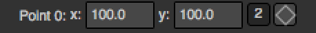

.. module:: NatronEngine
.. _DoubleParam:

DoubleParam
***********

**Inherits** :doc:`AnimatedParam`

**Inherited by:** :doc:`Double2DParam`, :doc:`Double3DParam`

Synopsis
--------

A double param can contain one or multiple floating point values.
See :ref:`detailed<double.details>` description...

Functions
^^^^^^^^^

- def :meth:`get<NatronEngine.DoubleParam.get>` ()
- def :meth:`get<NatronEngine.DoubleParam.get>` (frame)
- def :meth:`getDefaultValue<NatronEngine.DoubleParam.getDefaultValue>` ([dimension=0])
- def :meth:`getDisplayMaximum<NatronEngine.DoubleParam.getDisplayMaximum>` (dimension)
- def :meth:`getDisplayMinimum<NatronEngine.DoubleParam.getDisplayMinimum>` (dimension)
- def :meth:`getMaximum<NatronEngine.DoubleParam.getMaximum>` ([dimension=0])
- def :meth:`getMinimum<NatronEngine.DoubleParam.getMinimum>` ([dimension=0])
- def :meth:`getValue<NatronEngine.DoubleParam.getValue>` ([dimension=0])
- def :meth:`getValueAtTime<NatronEngine.DoubleParam.getValueAtTime>` (time[, dimension=0])
- def :meth:`restoreDefaultValue<NatronEngine.DoubleParam.restoreDefaultValue>` ([dimension=0])
- def :meth:`set<NatronEngine.DoubleParam.set>` (x)
- def :meth:`set<NatronEngine.DoubleParam.set>` (x, frame)
- def :meth:`setDefaultValue<NatronEngine.DoubleParam.setDefaultValue>` (value[, dimension=0])
- def :meth:`setDisplayMaximum<NatronEngine.DoubleParam.setDisplayMaximum>` (maximum[, dimension=0])
- def :meth:`setDisplayMinimum<NatronEngine.DoubleParam.setDisplayMinimum>` (minimum[, dimension=0])
- def :meth:`setMaximum<NatronEngine.DoubleParam.setMaximum>` (maximum[, dimension=0])
- def :meth:`setMinimum<NatronEngine.DoubleParam.setMinimum>` (minimum[, dimension=0])
- def :meth:`setValue<NatronEngine.DoubleParam.setValue>` (value[, dimension=0])
- def :meth:`setValueAtTime<NatronEngine.DoubleParam.setValueAtTime>` (value, time[, dimension=0])

.. _double.details:

Detailed Description
--------------------

A double param can have 1 to 3 dimensions. (See :doc:`Double2DParam` and :doc:`Double3DParam`).
Usually this is used to represent a single floating point value that may animate over time.

The user interface for them varies depending on the number of dimensions.

A 1-dimensional :doc:`DoubleParam`

A 2-dimensional :doc:`Double2DParam`

A 3-dimensional :doc:`Double3DParam`

.. figure:: double3DParam.png

Member functions description
^^^^^^^^^^^^^^^^^^^^^^^^^^^^

.. method:: NatronEngine.DoubleParam.get(frame)

    :param frame: :class:`float<PySide.QtCore.float>`
    :rtype: :class:`float<PySide.QtCore.double>`

Returns the value of this parameter at the given *frame*. If the animation curve has an
animation (see :func:`getIsAnimated(dimension)<NatronEngine.AnimatedParam.getIsAnimated>` then the
value will be interpolated using the *interpolation* chosen by the user for the curve.

.. method:: NatronEngine.DoubleParam.get()

    :rtype: :class:`float<PySide.QtCore.double>`

Returns the value of this parameter at the given current timeline's time.

.. method:: NatronEngine.DoubleParam.getDefaultValue([dimension=0])

    :param dimension: :class:`int<PySide.QtCore.int>`
    :rtype: :class:`float<PySide.QtCore.double>`

Returns the default value for this parameter. *dimension* is meaningless for the DoubleParam
class because it is 1-dimensional, but is useful for inherited classes :doc:`Double2DParam`
and :doc:`Double3DParam`

.. method:: NatronEngine.DoubleParam.getDisplayMaximum(dimension)

    :param dimension: :class:`int<PySide.QtCore.int>`
    :rtype: :class:`double<PySide.QtCore.double>`

Returns the display maximum for this parameter at the given *dimension*.
The display maximum is the maximum value visible on the slider, internally the value
can exceed this range.

.. method:: NatronEngine.DoubleParam.getDisplayMinimum(dimension)

    :param dimension: :class:`int<PySide.QtCore.int>`
    :rtype: :class:`float<PySide.QtCore.double>`

Returns the display minimum for this parameter at the given *dimension*.
The display minimum is the minimum value visible on the slider, internally the value
can exceed this range.

.. method:: NatronEngine.DoubleParam.getMaximum([dimension=0])

    :param dimension: :class:`int<PySide.QtCore.int>`
    :rtype: :class:`float<PySide.QtCore.double>`

Returns the maximum for this parameter at the given *dimension*.
The maximum value cannot be exceeded and any higher value will be clamped to this value.

.. method:: NatronEngine.DoubleParam.getMinimum([dimension=0])

    :param dimension: :class:`int<PySide.QtCore.int>`
    :rtype: :class:`float<PySide.QtCore.double>`

Returns the minimum for this parameter at the given *dimension*.
The minimum value cannot be exceeded and any lower value will be clamped to this value.

.. method:: NatronEngine.DoubleParam.getValue([dimension=0])

    :param dimension: :class:`int<PySide.QtCore.int>`
    :rtype: :class:`float<PySide.QtCore.double>`

Returns the value of this parameter at the given *dimension* at the current timeline's time.

.. method:: NatronEngine.DoubleParam.getValueAtTime(time[, dimension=0])

    :param time: :class:`float<PySide.QtCore.float>`
    :param dimension: :class:`int<PySide.QtCore.int>`
    :rtype: :class:`float<PySide.QtCore.double>`

Returns the value of this parameter at the given *dimension* at the given *time*.

If the animation curve has an
animation (see :func:`getIsAnimated(dimension)<NatronEngine.AnimatedParam.getIsAnimated>` then the
value will be interpolated using the *interpolation* chosen by the user for the curve.

.. method:: NatronEngine.DoubleParam.restoreDefaultValue([dimension=0])

    :param dimension: :class:`int<PySide.QtCore.int>`

Returns the value of this parameter at the given *dimension* at the given *time*.

.. method:: NatronEngine.DoubleParam.set(x, frame)

    :param x: :class:`float<PySide.QtCore.double>`
    :param frame: :class:`float<PySide.QtCore.float>`

Set a new keyframe on the parameter with the value *x* at the given *frame*.

.. method:: NatronEngine.DoubleParam.set(x)

    :param x: :class:`float<PySide.QtCore.double>`

Set the value of this parameter to be *x*.
If this parameter is animated (see :func:`getIsAnimated(dimension)<NatronEngine.AnimatedParam.getIsAnimated>`
then this function will automatically add a keyframe at the timeline's current time.

.. method:: NatronEngine.DoubleParam.setDefaultValue(value[, dimension=0])

    :param value: :class:`float<PySide.QtCore.double>`
    :param dimension: :class:`int<PySide.QtCore.int>`

Set the default *value* for this parameter at the given *dimension*.

.. method:: NatronEngine.DoubleParam.setDisplayMaximum(maximum[, dimension=0])

    :param maximum: :class:`float<PySide.QtCore.double>`
    :param dimension: :class:`int<PySide.QtCore.int>`

Set the display maximum of the parameter to be *maximum* for the given *dimension*.
See :func:`getDisplayMaximum<Natron.DoubleParam.getDisplayMaximum>`

.. method:: NatronEngine.DoubleParam.setDisplayMinimum(minimum[, dimension=0])

    :param minimum: :class:`float<PySide.QtCore.double>`
    :param dimension: :class:`int<PySide.QtCore.int>`

Set the display minimum of the parameter to be *minmum* for the given *dimension*.
See :func:`getDisplayMinimum<Natron.DoubleParam.getDisplayMinimum>`

.. method:: NatronEngine.DoubleParam.setMaximum(maximum[, dimension=0])

    :param maximum: :class:`float<PySide.QtCore.double>`
    :param dimension: :class:`int<PySide.QtCore.int>`

Set the maximum of the parameter to be *maximum* for the given *dimension*.
See :func:`getMaximum<Natron.DoubleParam.getMaximum>`

.. method:: NatronEngine.DoubleParam.setMinimum(minimum[, dimension=0])

    :param minimum: :class:`float<PySide.QtCore.double>`
    :param dimension: :class:`int<PySide.QtCore.int<`

Set the minimum of the parameter to be *minimum* for the given *dimension*.
See :func:`getMinimum<Natron.DoubleParam.getMinimum>`

.. method:: NatronEngine.DoubleParam.setValue(value[, dimension=0])

    :param value: :class:`float<PySide.QtCore.double>`
    :param dimension: :class:`int<PySide.QtCore.int>`

Same as :func:`set(value,dimension)<NatronEngine.DoubleParam.set>`

.. method:: NatronEngine.DoubleParam.setValueAtTime(value, time[, dimension=0])

    :param value: :class:`float<PySide.QtCore.double>`
    :param time: :class:`float<PySide.QtCore.float>`
    :param dimension: :class:`int<PySide.QtCore.int>`

Same as :func:`set(value,time,dimension)<NatronEngine.DoubleParam.set>`

