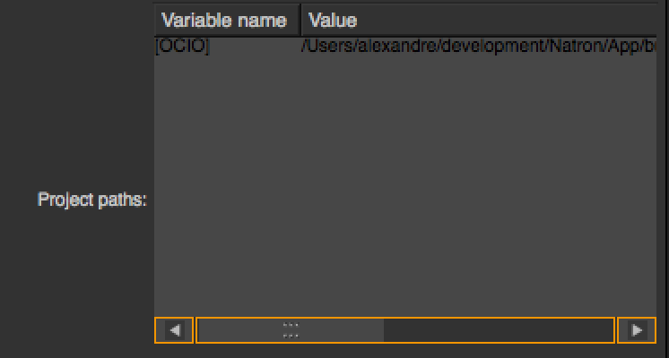

.. module:: NatronEngine
.. _PathParam:

PathParam
*********

**Inherits** :doc:`StringParamBase`

Synopsis
--------

A path param is used to indicate the path to a directory.
See :ref:`details<dirdetails>`...

Functions
^^^^^^^^^

- def :meth:`setAsMultiPathTable<NatronEngine.PathParam.setAsMultiPathTable>` ()
- def :meth:`getTable<NatronEngine.PathParam.getTable>` ()
- def :meth:`setTable<NatronEngine.PathParam.setTable>` (table)

.. _dirdetails:

Detailed Description
--------------------

By default the user can select a single directory as path, unless
:func:`setAsMultiPathTable()<NatronEngine.PathParam.setAsMultiPathTable>` is called in which
case a table is presented to the user to specify multiple directories like this:

When using multiple paths, internally they are separated by a *;* and the following characters
are escaped as per the XML specification:

    * *<* becomes &lt;
    * *>* becomes &gt;
    * *&* becomes &amp;
    * *"* becomes &quot;
    * *'* becomes &apos;

Some more characters are escaped, you can see the full function in the source code of Natron
`here <https://github.com/NatronGitHub/Natron/blob/master/Engine/ProjectPrivate.cpp>`_

Member functions description
^^^^^^^^^^^^^^^^^^^^^^^^^^^^

.. method:: NatronEngine.PathParam.setAsMultiPathTable()

When called, the parameter will be able to store multiple paths.

.. method:: NatronEngine.PathParam.getTable()

    :rtype: :class:`PySequence`

    Returns a list of list of strings. Each sub-list corresponds to a row in the table.
    Each elements of the row are the cell value for each column.

.. method:: NatronEngine.PathParam.setTable(table)

    :rparam table: :class:`PySequence`

    Set the parameter to a list of list of strings. Each sub-list corresponds to a row in the table.
    Each elements of the row are the cell value for each column.
    An error will be invoked if the number of columns in the provided *table* do not match
    the number of columns of the parameter's table.

