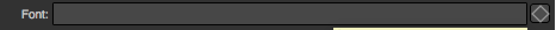
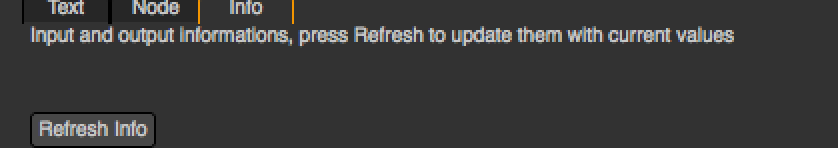

.. module:: NatronEngine
.. _StringParam:

StringParam
***********

**Inherits** :doc:`StringParamBase`

Synopsis
--------

This parameter is used to contain a string.
See :ref:`here<string.details>` for more details.

Functions
^^^^^^^^^

- def :meth:`setType<NatronEngine.StringParam.setType>` (type)

.. _string.details:

Detailed Description
--------------------

A StringParam can have several forms on the user interface, depending on its
:ref:`type<NatronEngine.StringParam.TypeEnum>`

Here are the different types of string parameters:

   A basic string that can be edited by the user

   A non animating label string that the user cannot edit

.. figure:: multiLineString.png
   :width: 400px
   :align: center

   A multi-line string that the user can edit and animate

.. figure:: multiLineRichTextParam.png
   :width: 400px
   :align: center

   A multi-line string with rich text support with a `subset of html <https://qt-project.org/doc/qt-4.8/richtext-html-subset.html>`_

Member functions description
^^^^^^^^^^^^^^^^^^^^^^^^^^^^

.. method:: NatronEngine.StringParam.setType(type)

    :param type: :attr:`NatronEngine.StringParam.TypeEnum`

Set the type of the StringParam. This should be called right away after creation
time.

.. warning::

    Once called, you should call :func:`refreshUserParamsGUI()<NatronEngine.Effect.refreshUserParamsGUI>`
    to update the user interface.

