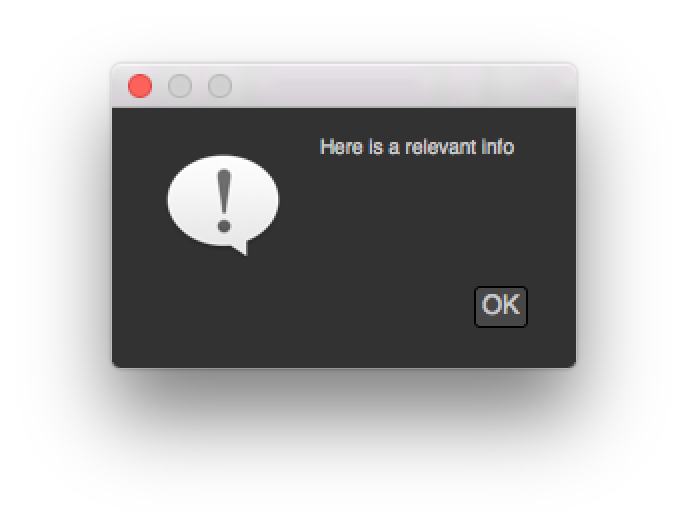
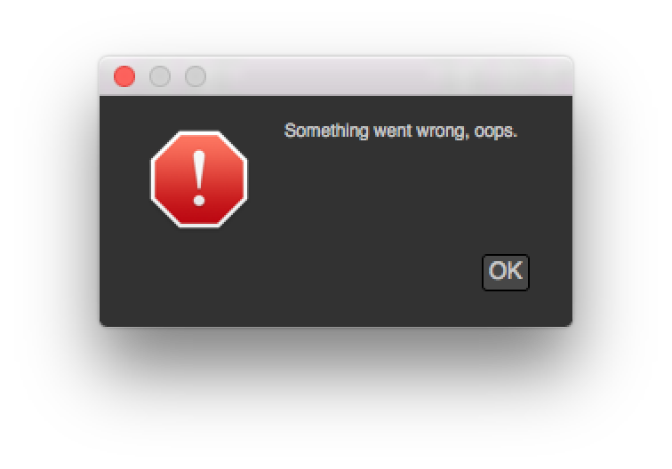
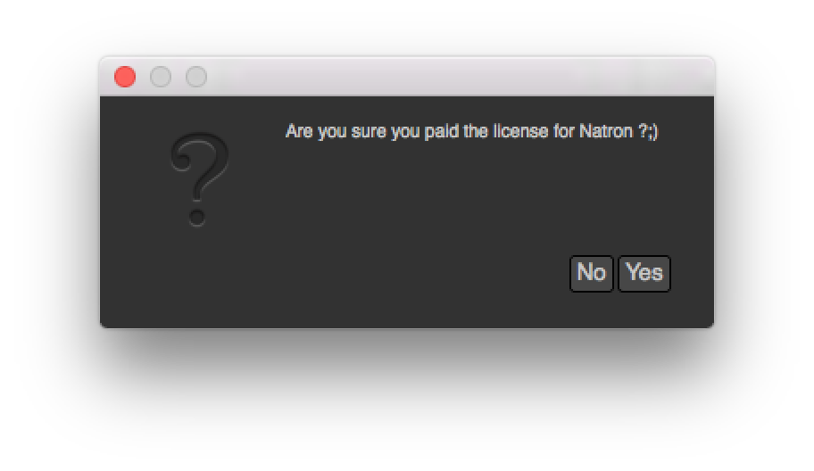
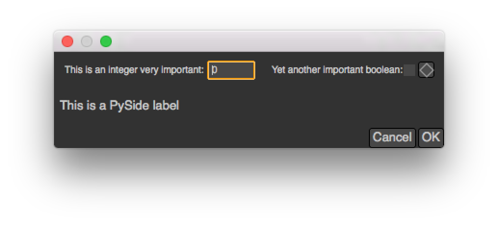

.. _modalDialogs:

Modal dialogs
=============

Modal dialogs are windows (or popup) that inform the user about something or ask for some
information and that does not allow any other action to be performed while the dialog is opened.

This can be used as a quick way to retrieve user inputs.

Simple dialogs
---------------

The most simple dialogs in Natron are the information/warning/error/question dialog
which basically just take some text in input and may return a reply from the user

::

    natron.informationDialog("Info","Here is a relevant info")

::

    natron.warningDialog("Warning","Warning you might lose everything on your computer")

.. figure:: warnDialog.png
    :width: 300px
    :align: center

::

    natron.errorDialog("Error","Something went wrong, oops.")

::

    reply = natron.questionDialog("Question","Are you sure you paid the license for Natron ?;)")
    if reply == NatronEngine.Natron.StandardButtonEnum.eStandardButtonNo:
        ...
    elif reply == NatronEngine.Natron.StandardButtonEnum.eStandardButtonYes:
        ...

More refined dialogs
---------------------

To create dialogs that may request some information such as colors, frame range, coordinates
or text input, you can create :ref:`modal dialogs<pyModalDialog>`.

Basically you can add :ref:`user parameters<Param>`, and retrieve their value afterwards
when the user pressed **OK**.

You can start adding user parameters using all the :func:`createXParam<>` functions inherited from the :doc:`PythonReference/NatronEngine/UserParamHolder` class.
See the documentation of the :ref:`PyModalDialog<pyModalDialog>` for more information:

    dialog = app.createModalDialog()
    myInteger = dialog.createIntParam("myInt","This is an integer very important")
    myInteger.setAnimationEnabled(False)
    myInteger.setAddNewLine(False)

    #Create a boolean on the same line
    myBoolean = dialog.createBooleanParam("myBool","Yet another important boolean")

    dialog.refreshUserParamsGUI()

You can also add custom PySide widgets that can be inserted **after** any user parameter(s)
using the :func:`addWidget(widget)<>` and :func:`insertWidget(index,widget)<>` functions.
::

    label = QLabel("This is a PySide label")
    dialog.addWidget(label)

To make the dialog show-up, use the :func:`exec()<>` function on the dialog.
This function will return once the user pressed either "OK" or "Canceled"::

    if dialog.exec():
        #User pressed OK

You can add a custom callback when a parameter changes, for instance to hide another parameter::

    #Callback called when a parameter of  changes
    #The variable paramName is declared by Natron; indicating the name of the parameter which just had its value changed
    def paramChangedCallback():
        if paramName == "myBool":
            myInteger.setVisible(myBoolean.get())

    dialog.setParamChangedCallback("paramChangedCallback")
