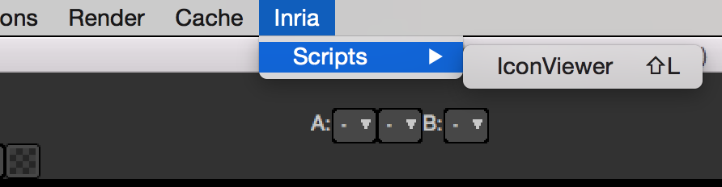

.. _userCommands:

User menu commands
===================

In Natron you can add multiple menu commands that will then be available to the user via
the menu. You can also assign it a shortcut and the user will be able to modify it
via the shortcuts editor.

Project-wide menu commands:
---------------------------

To add a project-wipe menu command to the application's menu-bar, you need to use the
:func:`addMenuCommand(grouping,function,key,modifiers)<>` of the :ref:`PyGuiApplication<PyGuiApplication>` class
to register it::

    def createIconViewer():
        ...

    #Add a custom menu entry with a shortcut to create our icon viewer
    NatronGui.natron.addMenuCommand("Inria/Scripts/IconViewer","createIconViewer",QtCore.Qt.Key.Key_L,QtCore.Qt.KeyboardModifier.ShiftModifier)

Note that this function is to be called on the whole **application** via the **natron** variable
and is not *per-project* unlike most functions that are generally called on the **app** object.

.. warning::

    This function can only be called in the startup script **init.py** and will have no effect
    otherwise. This is not a dynamic function and will not create menu entries on the fly.

