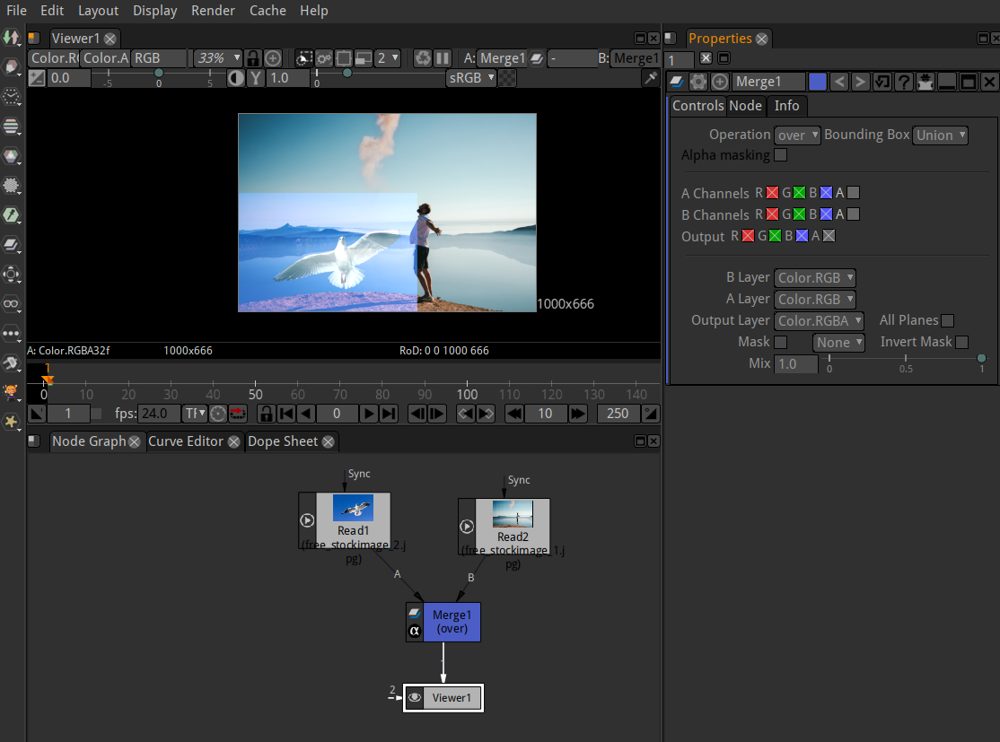
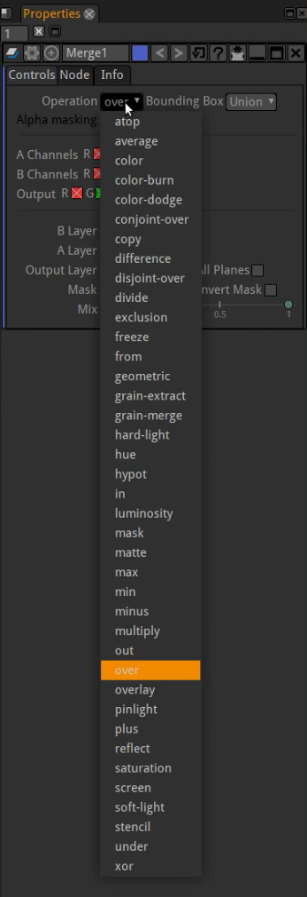
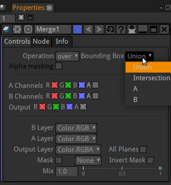

.. for help on writing/extending this file, see the reStructuredText cheatsheet
   http://github.com/ralsina/rst-cheatsheet/raw/master/rst-cheatsheet.pdf
   
Merging images
==============

With the merge node you are able to control how your images are combined.

Layering Images Together with the Merge Node
############################################

1.  	Select Merge > Merge (or press M in the Node Graph) to insert a Merge node after the images you want to layer together.
2.  	Connect your images to the Merge node’s **A** and **B** inputs. 
3.  	Connect a Viewer to the output of the Merge node so you can see the effect of your merge operation.

4.  	In the Merge node’s controls, select how you want to layer the images together from the operation dropdown menu. The most common operation is **over**, which layers input **A** over input **B** according to the alpha of input **A**. Just click through the various operations to figure out what they are doing. 

5.    Set which input's bounding box you want to use for the Merge output: 

* **union** - resize the output b box to fit both input bboxes completely.
* **intersection** - use only those parts of the image where the input bboxes overlap.
* **A or B** - use the selected input's bbox for the output.

6. With using the **A Channels** and **B Channels** checkboxes you may select which color and alpha channels to use and to output.

7. The **Mix** slider is used to fade/mix in the image from input **A**.

.. note:: **A** is always the foreground layer. **B** is always the background layer. 

.. toctree::
   :maxdepth: 2

