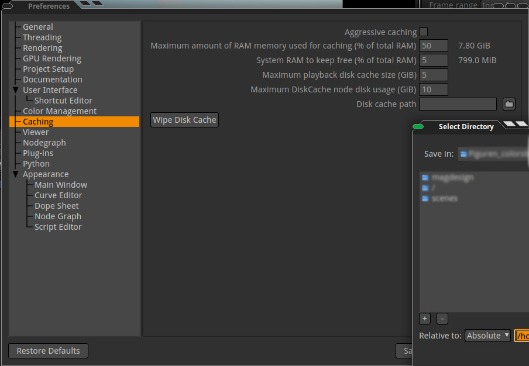

.. for help on writing/extending this file, see the reStructuredText cheatsheet
   http://github.com/ralsina/rst-cheatsheet/raw/master/rst-cheatsheet.pdf
   
Image caching
=============

When having a big comp it makes sense to cache the part of the node tree which stays as is to disk. For this we have the DiskCache node.
Sometimes this cache also helps preventing crashes while rendering.

Before using the DiskCache node, make sure you set a Disk cache path under Edit=>Preferences=>Caching.

Make sure you have enough disk space left, your computer might crash due to full harddisk!

.. image:: _images/compositing-projects-caching_03.png

Then just add the DiskCache where needed in the node tree and select Pre-Cache in the Properties panel.

You will see the progress bar, wait until its 100% finised, then continue your compositing.

.. toctree::
   :maxdepth: 2

