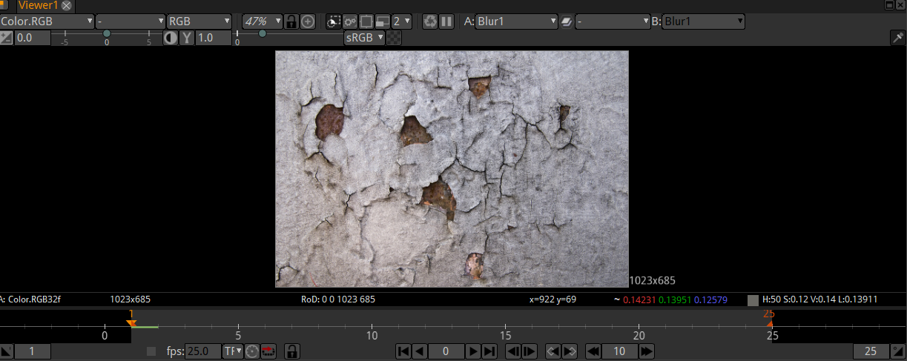

.. for help on writing/extending this file, see the reStructuredText cheatsheet
   http://github.com/ralsina/rst-cheatsheet/raw/master/rst-cheatsheet.pdf
   
Proxy Mode
==========

It is possible to enable the Proxy Mode in the Viewer.
On top of the Viewer panel there is a group of 5 buttons. Click the fourth button from the left to turn on Proxy Mode (Its the one with the two squares).
If it turns red, it's on.
The next button to the right is used to define a simple scale factor by which the images are scaled down whenever the proxy mode is activated.

As an alternative to letting Natron generate proxies on the fly, proxy files can be specified using the Proxy File fields in the Read nodes.

.. toctree::
   :maxdepth: 2

