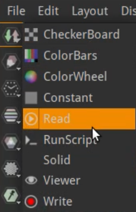
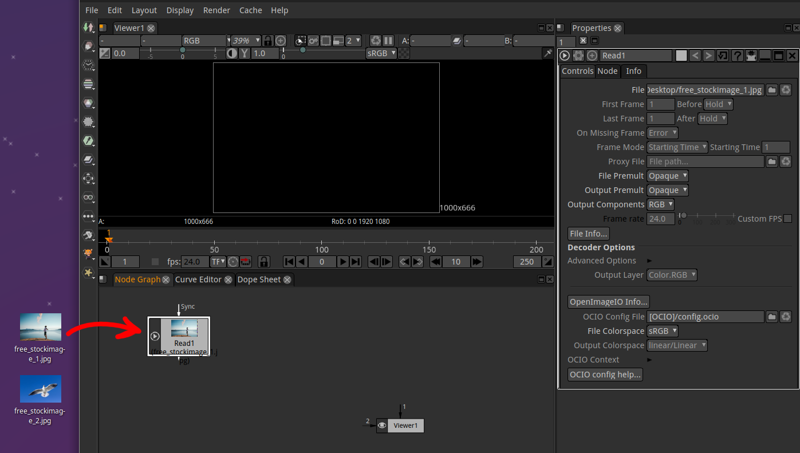
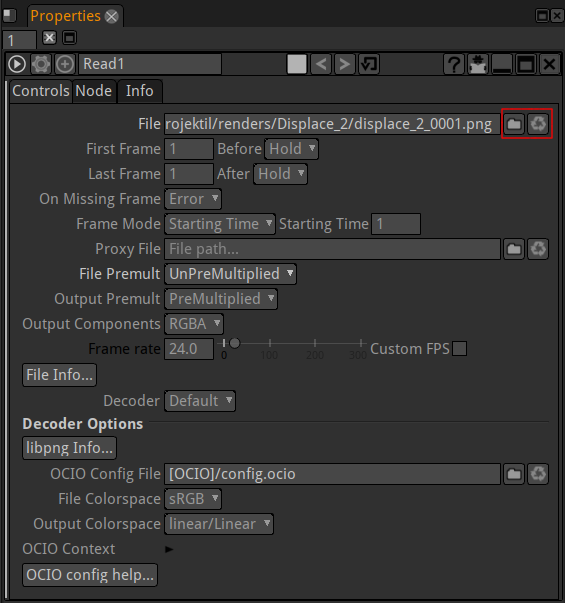

.. for help on writing/extending this file, see the reStructuredText cheatsheet
   http://github.com/ralsina/rst-cheatsheet/raw/master/rst-cheatsheet.pdf
   
Loading Images / Video
========================

The preferred method to import footage into Natron is to import image sequences.

.. note:: The video reader is only here for convenience, it may have difficulties decoding some videos. Avoid using videos with inter-frame compression, this includes H.264 (AVCHD) and H.265 (HEVC) video. ProRes and DNxHR is OK but slow. Individual frames are *best* (DPX, EXR, TIFF, PNG, JPEG, whatever suits your input video quality and bit depth).

See this chapter :doc:`tutorial on how to convert videos to image sequences <tutorials-imagesequence>` on how to create image sequences.

Loading footage
---------------

There are three ways to load footage into Natron:

- Add a Read Node from the sidebar and select your media:

- In the Node Graph hit 'R' on your keyboard and select your media:

.. image:: _images/compositing-Read_node02.png
   

- Drag'n'drop your media to the Node Graph:

.. note:: To see the imported footage in the viewer, select the Read Node in the Node Graph and hit 1 on your keyboard.

In the Properties Panel on the right side you can make several adjustments to your Read Node, its more or less self-explanatory:

.. toctree::
   :maxdepth: 2

