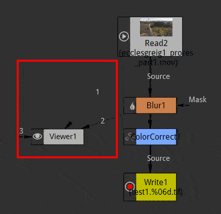
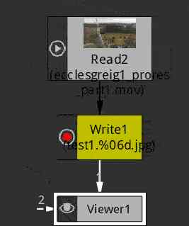
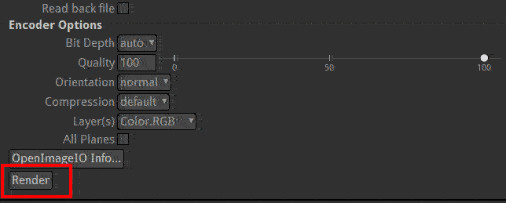

.. for help on writing/extending this file, see the reStructuredText cheatsheet
   http://github.com/ralsina/rst-cheatsheet/raw/master/rst-cheatsheet.pdf
   
Preview and rendering
=====================

Preview
-------
While working in Natron you can preview your work in many ways:

- connect the input of the viewer node to the node you want to look
  
   * pick the input arrow of the viewer node
   * select the node to view then use shortcuts ``0`` to ``9``
- select the quality of the render (full/proxy)
- start playing
- the images are rendered in memory
- when the preview render is finished all memories are storeed in the memory cache and the playback becomes realtime and plays in loop

See :doc:`The Viewer <getstarted-environment-viewer>` section for more information.

rendering
---------

When  you want to get the result of your nodetree as image file(s) on disk:
- create a write node (shortcut  ``w``) 
- connect the write node to the last node of your NodeTree

- start the render with the render button in the Write node properties

See :doc:`The Write node <thenodes-image-write>` section for more information.
