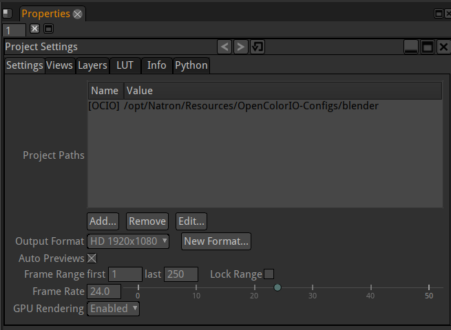

.. for help on writing/extending this file, see the reStructuredText cheatsheet
   http://github.com/ralsina/rst-cheatsheet/raw/master/rst-cheatsheet.pdf

Project setup
=============

Natron will automatically adjust the project settings when importing media using a Read Node or by drag'n'dropping content into the Node Graph.

- To access the Project Settings, go to  "Display > Show Project Settings" or  press "S" on the keyboard. 

Output Format
~~~~~~~~~~~~~
While clicking on Output Format, a dropdown appears with various standard formats to choose from.
If the desired format is not in the menu:

1. Select New Format.
2. Copy a format from any viewer by selecting the viewer and choose Copy From or define a custom width and height in the w and h fields. 
3. Enter a new for your new format.
4. Click OK to save the new format, it now appears in the Output Format dropdown menu.

Frame Range and Frame Rate
~~~~~~~~~~~~~~~~~~~~~~~~~~
- Define the lenght of the project with Frame Range first and last frames value. 
- Enter the desired FPS in the Frame Rate field. 

GPU Rendering
~~~~~~~~~~~~~
User can select when to activate GPU rendering for plug-ins. Note that if the OpenGL Rendering parameter in the Preferences/GPU Rendering is set to disabled then GPU rendering will not be activated regardless of that value.
Enabled: Enable GPU rendering if required resources are available and the plugin supports it.
Disabled: Disable GPU rendering for all plug-ins.
Disabled if background: Disable GPU rendering when rendering with NatronRenderer but not in GUI mode.

.. toctree::
   :maxdepth: 2
