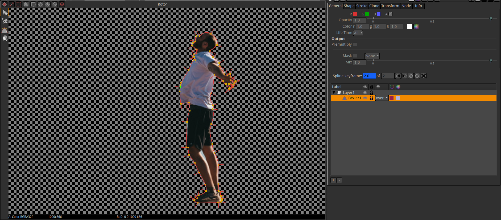
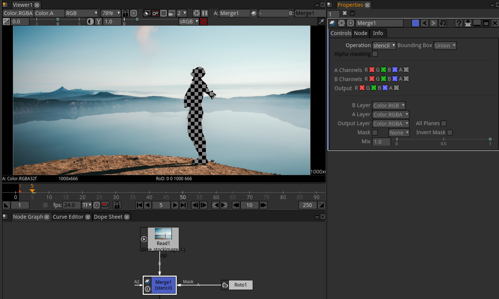

.. for help on writing/extending this file, see the reStructuredText cheatsheet
   http://github.com/ralsina/rst-cheatsheet/raw/master/rst-cheatsheet.pdf
   
Using Roto / Rotopaint
======================

Natron features a vector-based RotoPaint node for help with tasks like rotoscoping, rig removal, garbage matting, and dustbusting. You can draw Bezier and B-Spline shapes with individual and layer group attributes, including per-point and global feather, motion blur, blending modes and individual or hierarchical 2D transformations.

Roto or RotoPaint?
******************
There are two similar nodes in Natron for rotoscoping, Roto and RotoPaint.
The main difference between these two is that you can only create and edit Bezier and B-spline shapes with Roto, while RotoPaint allows you to draw paint strokes too with various brushes. So the Roto node is an optimal choice if you’re doing rotoscoping only, whereas RotoPaint gives you a broader scale of tools to use.

All tools and controls in the Roto node work the same way as they do in RotoPaint node.

Roto (Mask)
***********

You can use Roto for masking things, similar to mask tools on other known VFX software.
In the following example we will mask the person in the picture:

1. Insert a Merge node.
2. Insert a Roto node.
3. Plug the B pipe of the Merge node to the footage.
4. Plug the A pipe into Roto node.
5. Double click the Merge node, in the Poperties panel under Operation select: mask and make sure that all A Channels are ticked (This is the first thing to double check if the result is not as expected!).

.. image:: _images/compositing-rotopaint_01.png

6. Double click Roto node and in the Viewer's left side apears a menu, select Bezier tool.
7. Draw your Bezier directly in the viewer. While holding the mouse it draws curved points, when just clicking it draws edges. Try it yourself to get the feeling.
8. Close your Bezier with hitting Enter or clicking the first point drawn:

9. To feather some parts, you can drag the red handle lines. To feather everything just add a Blur node between Roto and Merge.
10. To animate the mask, just move the curser in the Timeline, then move your mask, it will Keyframe automatically.

Roto (Stencil)
**************

If you want to invert the mask:

1. Change the Operation in Merge node to: Stencil

RotoPaint (Paint)
*****************

The RotoPaint node gives you a broader scale of tools to use than Roto, though many of the controls are shared across both nodes.
As with the Roto node, you should use the Viewer tools to create shapes and paint strokes, and then edit them using the control panel.

.. toctree::
   :maxdepth: 2

