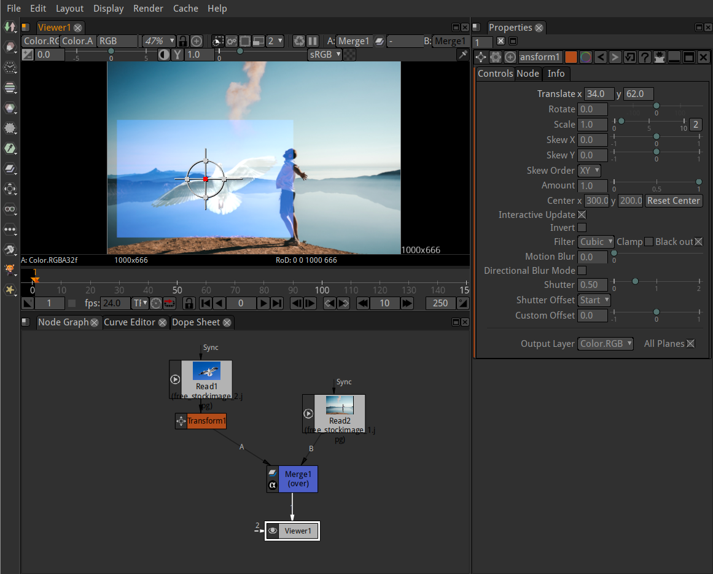
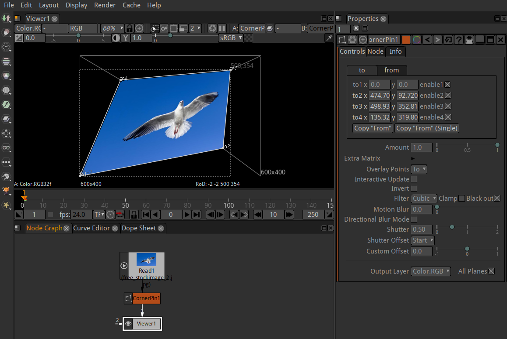

.. for help on writing/extending this file, see the reStructuredText cheatsheet
   http://github.com/ralsina/rst-cheatsheet/raw/master/rst-cheatsheet.pdf
   
Transforming elements
=====================

Transform nodes are used to deal with translation, rotation, and scale. 

Transforming Images
###################

1.  	Select Transform > Transform (or press T in the Node Graph) to insert a Transform node after the image you want to transform.
2.    On the viewer there will appear a control element called "Gizmo" (the circle with the crosshairs). Use your mouse within the "Gizmo" to scale, rotate, skew and move your image. Just hover with the mouse over the crosshairs or the circle of the "Gizmo" to fastly select the operation you need.
3.    In the Controls Panel you can also input your values with typing in numbers, highligthing the value and scrolling the middle mouse wheel or dragging the sliders (with CTRL pressed the slider reacts in a higher resolution). 

Corner Pin Images
#################

1.  	Select Transform > Corner Pin to map the position of the four corners of an image.
2.    Now you are able to move the corners directly with the mouse or entering values in the Controls Panel.

.. toctree::
   :maxdepth: 2

