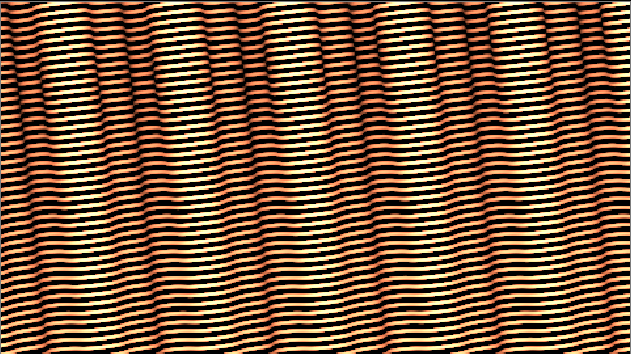

.. for help on writing/extending this file, see the reStructuredText cheatsheet
   http://github.com/ralsina/rst-cheatsheet/raw/master/rst-cheatsheet.pdf

Main Concepts
=============

Generic Description
###################
The purpose of Natron is to process video images using elementary "effect" bricks called nodes.

Image Flow
##########
The image is processed, in order, passing through each node. The nodes are connected with links that define the order of the processing.
These connected nodes are called the node graph.

.. note::  If you place your nodes in a top to bottom order you can compare your process to water flowing in pipes that will be collected as a result in the last node of the graph.

.. image:: _images/mainconcepts_tree_01.png
 :width: 600px

Here is what happens in the node graph shown above.

We bring an image with the read node (grey).

.. image:: _images/mainconcepts_tree_03.png
 :width: 200px

Then we blur it with the Blur Node (orange).

We create a repetitive texture with the cell node.

Sometimes procedural images can be generated from scratch in Natron. This is the only case when a node has no input.

We mix together both images with a merge node (blue). The mixer nodes can have several inputs

To see the result in the viewer we connect the Viewer node to the output of the Merge.

.. image:: _images/mainconcepts_tree_04.png
 :width: 200px

To save the result to disk, we connect the Write node (yellow).
The result will only be saved to disk if we launch the render of the image 
by clicking "render" in the node properties or Render menu 
A node can have only one resulting output image. This one result can still be used by several nodes (here Write and Viewer, thus appearing like multiple output connections).
Here we use a "dot" node to avoid this ambiguous situation

Parameters
############

Each node has parameters allowing to customize the effect produced on the incoming image. (e.g. the size of the blur in the Blur node). We can modify these parameters in several ways:

Properties pane:
  Here we can move sliders, type in numbers to change their values
  
  .. image:: _images/properties_01.png
    :width: 600px
Curve editor:
  When parameters are animated along time, their value can be displayed and modified as a curve.
  
  .. image:: _images/curve_editor_01.png
    :width: 600px

Dope sheet:
  Here each keyframe value you entered for parameters are displayed as small blocks that you can move in time (left-right). This is handy to retime an  animation without modifying its content.
  
  .. image:: _images/dopesheet_01.png
    :width: 600px

.. note::  One big difference with a paint program is we don't often paint on the image. This would not be handy for processing video as the paint strokes would appear as jittering artifacts if we painted one frame after the other.

Non destructive workflow
########################

In the ``.ntp`` project files saved by Natron no actual pixels are stored. Only the description of the graph is stored.

To display an image in the viewer, Natron reloads the source files, reprocesses each node one after the other then bring it to the display.

This has several implications:

- Your source files will never be damaged by Natron (unless you use a write node to overwrite your source, wich you should never do).
- You have unlimited undos in Natron as you can always remove a node from the graph. You can always change your mind. (regular undos are still provided in the menus).
- You must keep your source video files as they are not stored in the project file. If you change their folder location you will have to update the paths in Natron. If you want to bring a project to another computer you must carry the source files too.
- A lot of reprocessing is required. To keep your computer responsive, Natron provides a caching mechanism to limit recalcutions. This is very memory hungry and you have a "Cache" menu (and preferences) to help you keep Natron's responsiveness.
