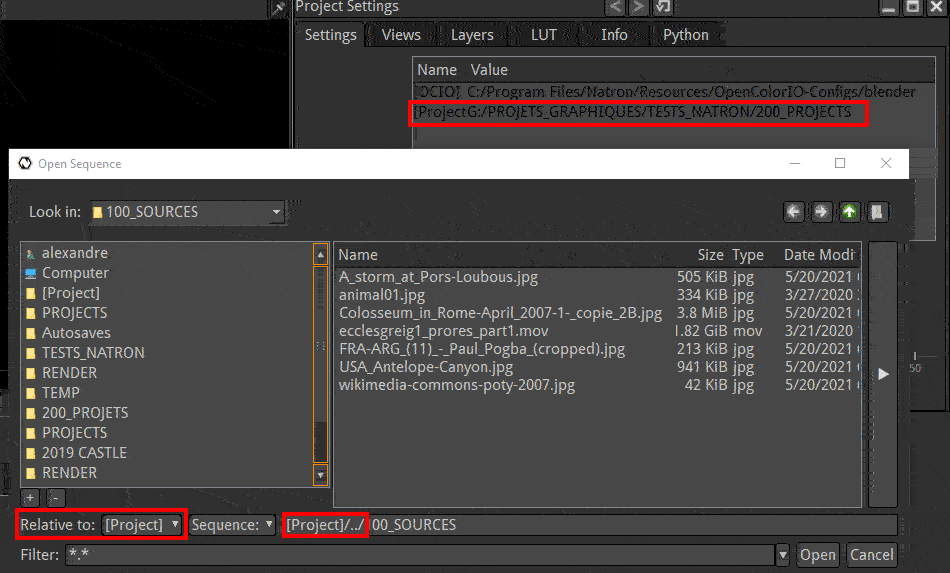

.. for help on writing/extending this file, see the reStructuredText cheatsheet
   http://github.com/ralsina/rst-cheatsheet/raw/master/rst-cheatsheet.pdf
   
Using the file browser
======================

The File browser in Natron has some specific features.

Relative Path
-------------

in order to allow moving files without breaking links or to allow sharing files between computers with different storage setups, Natron allows relative path.

The Short method 
:::::::::::::::::
To use path relative to the current Natron .ntp project file
-  Save your current project where you want but in the disk tree as your video files.
  This creates a [project] entry in the Project Paths list
- Create a read or write file. You have now access to Files path relative to the current .ntp file by selecting Relative to:[project]

The complete method
:::::::::::::::::::
First create a "base path"
   .. image:: _images/Project_Settings-Project_Path.jpg

- open "Project settings" (shortcut "s")
- create a "project path" by clicking "add..." then choose a folder
- rename the path shortcut by clicking on its name

Then use it to read or write a file in relative path.
   .. image:: _images/File_Browser-Relative_Paths.jpg

- open the browser from the read or write node you want
- navigate to your file
- switch Relative to the preset name you have created before

Your path is now converted to relative.
Should you move your files, you would only have to edit the shortcut in the settings with the 'Edit...' button

Favorites
---------
If you want fast access to often used folders you can create favorites.
   .. image:: _images/File_Browser-Favorites.jpg

When the browser is opened, click the ``+`` icon to make the current folder a favorite.

Click the ``-`` to remove the favorite from the list.

.. note::
   **Tip:**
   It's good practice to create a folder to store the different layouts you use for working in Natron and create a Favorite to this folder

File sequence
-------------

|  In Natron, videos can be made of a list of image files instead of a single video file.
|  image.0001.jpg
|  image.0002.jpg
|  image.0003.jpg
|  ...
|  
|  instead of:
|  image.mp4

.. note::
   **Tip:**
   Natron behaves way better with image sequence (numbered) files rather than Movies (quicktime, mp4, ...). More reliable, faster access, possibility to overwrite parts of sequence when (re)rendering are the main reasons for this

.. warning::
   To have a consistent behavior, all images must be of the same resolution. (ie. number of pixels)

for this reason the file browser automatically groups numbered files and would display in the list:
image.####.jpg 1-3

If you want to pick a single image of the list you should switch the 'sequence' button to 'File' to see each individual file.

|When you set the filename in the bottom line you can tell Natron  how many digits it should use to write or read the files:
|image.####.jpg
|or 
|image.%04d.jpg
These are two different ways to tell Natron to use 4 digits in the file name. This is called padding

.. note::
   **Tip:**
   It's good practice to put the image number between two dots

Slash Antislash
---------------
Linux shows subfolder with '/' when windows uses '\\'
Natron support both syntax in the file path of the browser.