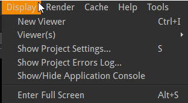
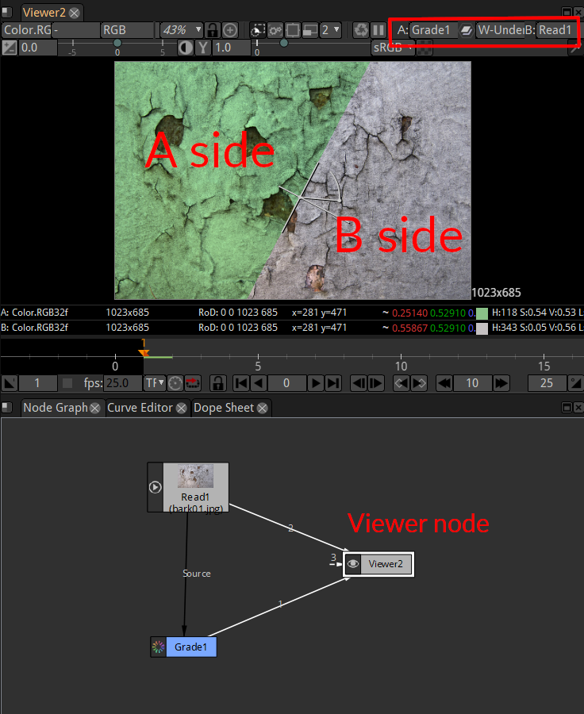
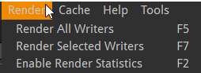
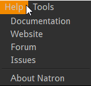
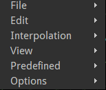
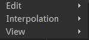
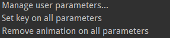
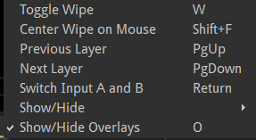

.. for help on writing/extending this file, see the reStructuredText cheatsheet
   http://github.com/ralsina/rst-cheatsheet/raw/master/rst-cheatsheet.pdf

Using the menus
===============

.. toctree::
   :maxdepth: 2

Modifications of your project are done using items located in menus located in different places of the interface.

The menu bar
############

.. image:: _images/menubar_01.jpg
   :width: 600px
   
File menu
---------

.. image:: _images/menu_file_01.png

New Project
  Clear the node graph to start from scratch a new process.
Open Project...
  Load a ``.ntp`` file that is the description of a node graph. The ``.ntp`` contains no image data but only the instructions on how to process the images.
Open Recent...
  Shortcut access to the most recently loaded ``.ntp`` files.

If a saved project is currently opened, the open functions will open in a new window.

Reload Project
  Reload the current ``.ntp`` from disk. This can be used if you break something in your graph and don't know exactly what.
Close Project
  Close the current project but keep other projects opened.
Save Project
  Save the current node graph.
Save Project As...
  Save the current node graph with a new name
New Project Version
  Increment the version number in the project file.
  
Project files are very small files. It is thus recommended to save different files for the different steps of your work. Would you want to recover a previous state or in case your ``.ntp`` gets corrupted.

Natron expects the version number to be in the form ``name_001.ntp``, ``name_002.ntp`` and so on.
  

.. note::  You can number your files with different patterns like ``name_v01`` but you will have to increment manually with "Save Project As..."

Export Project As Group
  With this item you can export a group of nodes to be reused later. This way you can create custom tools for Natron named plugins or Pyplugs.
  The group of nodes will appear as a single node when reused. This is why you must add one "output" node and "input" node(s) if relevant. So that Natron can determine how to connect your group when you will reuse it as part of another node graph

Edit menu
---------

.. image:: _images/menu_edit_01.png

Preferences...
  Many preferences let you change the display of informations inside Natron. Many optimisation settings are also located in this menu.

Undo/Redo
  The Undo item is modified dynamically to hint you about the last operation that can be undone.

Layout menu
-------------
.. image:: _images/menu_layout_01.png

The Layout is the position of the different user interface elements of Natron. This menu let's you manage different layout configuration.

Useful for:

- Use different configs according to your present task (animating with a bigger curve editor, rotoscoping with a bigger viewer,...)
- Export a layout to use on a different computer
- create separate viewer and tools windows when using a dual monitor setup.

Import Layout...
   Load a file containing the position of UI elements. The file extension is usually ``.nl``
   
Export Layout...
  Save a ``.nl`` file.
  
Restore default layout

Some UI elements are stacked in the same screen position to acees these you can click on their tab names.

In default Layout: Node Graph, Curve Editor, Dope Sheet are in the same lower left pane accessible through Tab navigation

Here are 3 commands better used through their keyboard shortcuts:

Previous Tab
  Shortcut: CTrl+Shift+T
Next Tab
  Shortcut: Ctrl+T
Close Tab
  Shortcut: Shift+Esc
  
  
Display menu
-------------

In Natron you can view different parts of your work in different windows. For each window a viewer node is present in the node graph.
To better compare different images each viewer can be split in side A/side B. This menu helps you manage these settings.

   
Above: a viewer can have multiple inputs, up to 10.
By default only one input is displayed. Once you choose a mixing mode (see red box above) A and B sides become active. "W_under" is the usual mode.

New Viewer
  Add a new viewer node in the node graph. The new viewer will be displayed in a new tab.
  This command also comes in handy if you inadvertently delete the first viewer node.

Viewer(s)>Connect to A/B side>Connect Viewer to input 1/.../10
  Show the image connected to input 1..10 in the A (or B) side of the viewer.
  If a node is selected it is also connected to the input 1..10 of the viewer.
  
  It is very convenient to use shortcuts:
  :kbd:'0'
  to
  :kbd:'9'
  to quickly show the output of the selected node.
  
Show project Settings...

Show project errors log...
  This console shows error issued while rendering.(e.g. GPU specific errors can be inspected here as this is a sensitive area depending on your computer configuration).

Show/Hide application console
  This console shows error that may occur when Natron's configuration change (e.g. new plugins installed). Also handy to get the result of your python scripts.

Enter Full Screen
  Save some screen space removing the title bar of Natron.

  

Render menu
-------------

   
The final result of Natron image processing is only written to disk as a new image. When a Write node has been setup and the render process has been launched.

Render All Writers
  Launch the rendering for all write nodes. The frame range to render is defined by the project settings and the Write node settings

Render Selected Writers
  Launch the rendering for one or more  write nodes.

Enable Render Statistics
  Display a window showing how long it takes to render each node. This can help find bottlenecks when a project takes a very long time to render.

Cache menu
------------
.. image:: _images/menu_cache_01.png

   
To improve Natron speed, some intermediate images of the node graph are kept in memory/on disk. This caching mechanism sometimes need to be cleared to free up memory/disk space. Use this if Natron seems to slow down or warn you about memory usage.

Clear Disk Cache
  Clears the internal disk cache (which is persistent between Natron runs), and data generated by "DiskCache" nodes.
Clear Playback Cache
  Clears final images sent to the viewer. Useful for previewing long sequences
Clear Per-Node Cache
  Clears in-memory intermediate results. Useful when you make change high up in the node tree or have nodes with "Force caching" enabled.
Clear All caches
  Best way to free up space in Natron.
Clear Plug-Ins Load Cache
  Will trigger a full plugins scan on next Natron run.

Help menu
-----------

Documentation
  -
Website
  -
Forum
  -
Issues
  -
  
Links to various resources to help you with Natron.

About Natron
  Information about your version of Natron.

Tools menu
-----------
.. image:: _images/menu_tools_01.png

   
In this menu additional functions are added through python scripting. Natron interface can be vastly modified through scripting.  

Context menus
-------------

You can right-click in many places of Natron to get quick access to a contextual menu. Here are the main ones:

   
   Context menu for the Curve Editor window

*

   
   Context menu for the Dope Sheet window

.. figure:: _images/menu_context_nodegraph_01.png

   
   Context menu for the node graph window

*

.. figure:: _images/menu_context_parameter_01.png

   
   Context menu for the Node Graph window

*

   
   Context menu for the Properties window

*
   
.. figure:: _images/menu_context_parameter_01.png

   
   Context menu for a parameter box in the Properties window

*
   

   
   Context menu for the Viewer window

Menus Usage
-----------

When a menu item has a keyboard shortcut associated, it is visible inside the menus.

