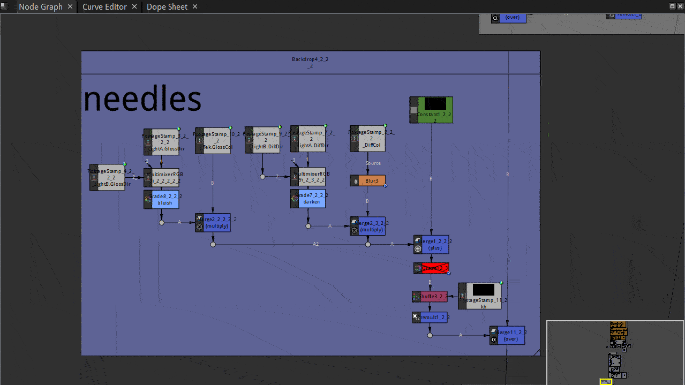
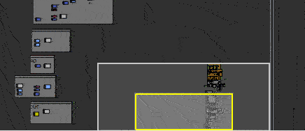
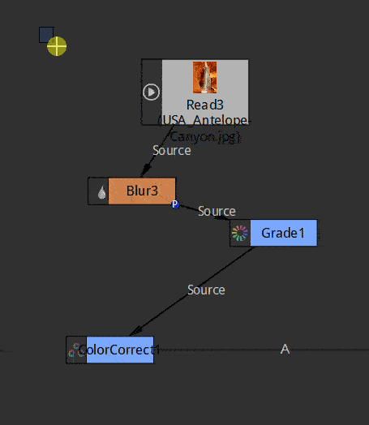
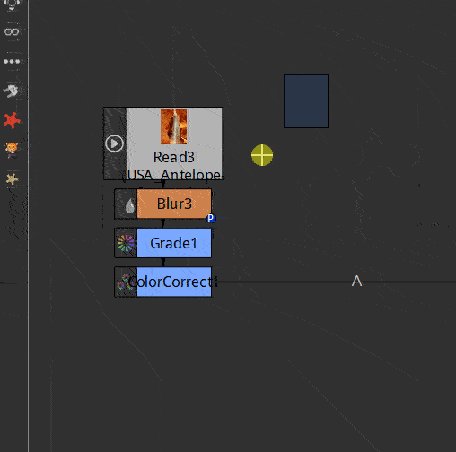
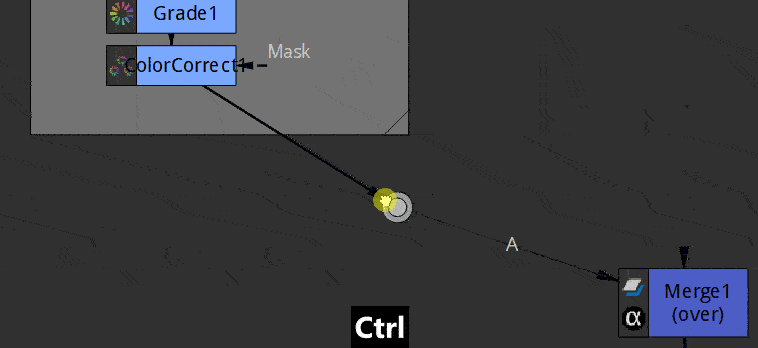
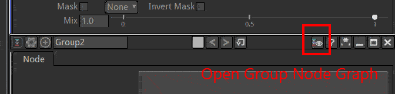
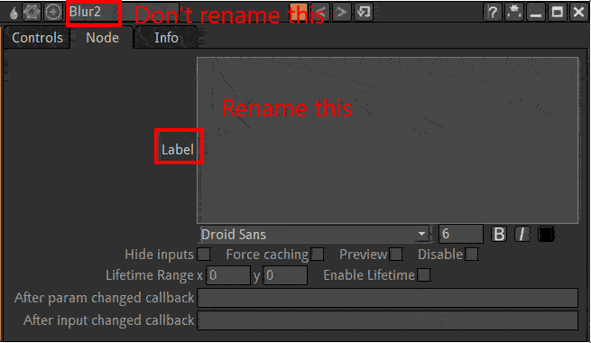
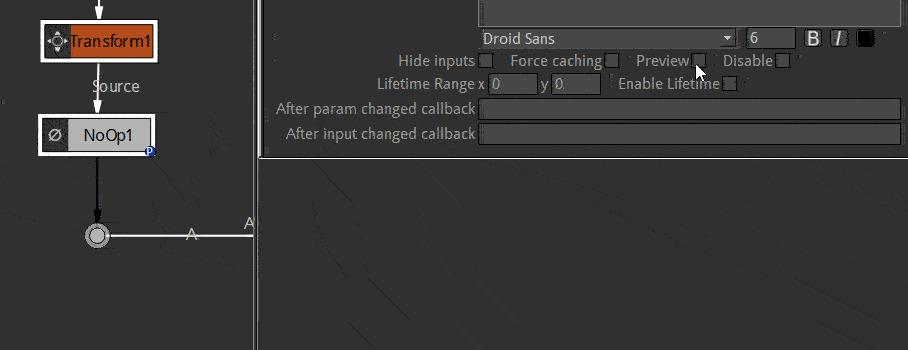
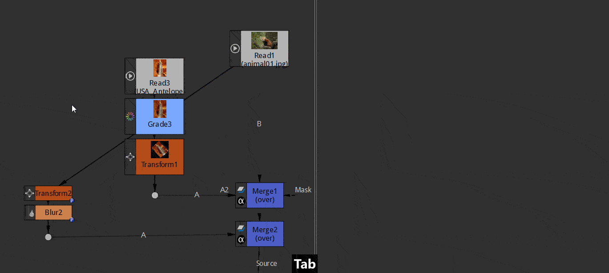

.. for help on writing/extending this file, see the reStructuredText cheatsheet
   http://github.com/ralsina/rst-cheatsheet/raw/master/rst-cheatsheet.pdf
   
Navigating inside the Node Graph
================================

Pan the nodes view: ``middle mouse drag``

zoom the nodes view: ``ALT + middle mouse drag``

Frame all nodes: shortcut ``f``

Frame only selected nodes: shortcut ``f``

Mini Node Graph
   The bottom right rectangle shows a minified view of the graph.
   
   Click and drag the yellow rectangle to change the part of the graph that is displayed

Node Graph Tidiness
===================

Rearrange Nodes
---------------
- Select several nodes connected in chain
- press shortcut ``L``
Nodes are automatically aligned vertically without moving the last one

Natron's Tidy Nodes
-------------------

Natron has a couple of nodes devoted entirely to script housekeeping.

Backdrop
::::::::

A Backdrop is a flat colored sheet that can be placed behind a bunch of nodes. This is useful for making a complex script easier to read. I use backdrops in many of my. The other useful thing about a backdrop, is that its entire contents can be moved about by simply dragging on its header bar.
Colored backdrops in a node graph.

Create a backdrop
  - Tools Palette "Other"
  - Select "Backdrop
  or
  - Press ``Tab``
  - Type "bac"
  - Select Backdrop in the list

Backdrops can be color coded. 
   A common  convention is:
   
   - Grey 	   Mattes
   - Blue 	   CG
   - Green 	Live action footage
   - Yellow 	Made in Nuke
   - Pink 	   Other

.. note:: A backdrop can be used as a sticky note to store text information inside nuke's project.
      
   Use the "Control"/"label" text field to type in

Dot
:::

A Dot can be added to any arrow that runs between nodes. This can be used to maintain tidiness. One general rule of node graph tidiness is that arrows should run vertically or horizontally, not diagonally. To add a dot, hold down the 'command' key and click the yellow dot that appears.

Group
:::::

Many nodes can be grouped together to make the graph easier to read.

- select the Nodes
- hit ``CTRL+G``. 
  The nodes will be replaced by a group node containing them all. 
  
  Its content is automatically opened in a new node graph tab called "Group"
  To reopen later this node graph click the eye icon in the top bar of the group node.

Nodes properties
----------------

Nodes naming
::::::::::::

Label everything (using NoOps with preview enabled, BackDrops etc)

Rename the "Label" of a node not the "script name"

Previews
::::::::

A node can show a thumbnail of it's output by ticking the Preview checkbox.

.. note:: If a node graph has many previews it can slow down the display. You can disable the auto refresh of these previews disabling the "Auto Previews" checkbox of the project settings (shortcut ``S`` in the node graph)
   
   .. image:: _images/Environment/environment-nodes-autopreview.gif

Hide input
::::::::::

When nodes have very long connections they can make the node graph difficult to read. To avoid this you can hide the input arrow of a node.

The input arrows only disappear when the node is not selected.

To make the script easy to read you often enable the preview and rename the node with the input hiddens

Nodes placement convention
--------------------------

Scripts should be readable: laid out in a rational and consistent manner. This is to enable their easy reading by you and anyone else who might review your script.

A common  convention is:

- Main input feed from the top.
  
   the B input of the merge that is transmitted when the node is disabled
- Masks feed in from the right 
   
   usually labelled mask
- Image secondary inputs feed in from the left.
   
   the A input for the Merge
- Favour vertical connections for main branches. 
  
   They allow naming the nodes without overlap and take less screen room. The autoarrange functions is coded for this.
- Favour horizontal connections over diagonal ones to connect several branches.
  
   Dots can be used to make this happen.
- Put everything inside backdrops.
  
   This useful even for moving groups of nodes, to ensure you don't forget part of a function
- Label everything.
  
   Using backdrops, postage stamps, and the Labels of the nodes.
- Don't change the script name.
  
   This can be confusing for humans and the expression engine.
   It's not a viable option because no two nodes can have the same name. Hence  Natron does some automatic renaming when duplicating nodes

   For more in depth information on Nodes see :doc:`Nodes <getstarted-environment-nodes>`