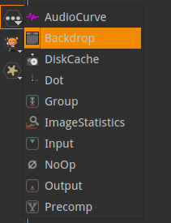
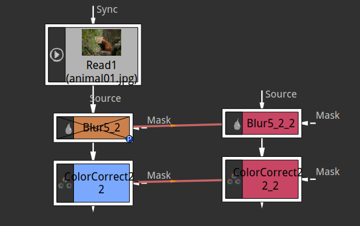

.. for help on writing/extending this file, see the reStructuredText cheatsheet
   http://github.com/ralsina/rst-cheatsheet/raw/master/rst-cheatsheet.pdf
   
Working with nodes
==================

.. toctree::
   :maxdepth: 2

A node is asingle step in the image processing created in the Node Graph. It is displayed as a brick in the Node Graph window. You can link the nodes with arrow lines to determine in wich order will take place the different operations

Add nodes
----------

There is several ways to add nodes to the graph:
	- select a node name in the toolbar menus
	- select a node name in the right-click menu
	- use shortcuts (defaults are G for Grade, B for Blur, C for color correct,O for Roto, P for Paint, M for Merge,...)
	  hit :kbd:`tab` to open a search box where you can find a node by it's name even if you don't know the exact name.

		.. image:: _images/nodes_tab-search_01.png
 			:width: 200px

 	- hit :kbd:`tab` again to get the same node type again
 	- copy and paste nodes with :kbd:`ctrl` + :kbd:`c`  and :kbd:`ctrl` + :kbd:`v`

Most nodes have  one or more inputs. and only one output. 
It may look like a node has several outputs when multiple node are connected to it. But they actually all receive the same output.

Read nodes and "generator" nodes don't have (or don't need) an input.
Merge nodes have several inputs
Write nodes don't have output
Most nodes have a mask input to limit the effect of the node to the area defined by the mask input (with it's alpha channel by default)

The node in the graph
----------------------
Insert
	- If you select one node before creating or pasting the new one, the new one will be inserted right under the selected one. This is a handy way to apply multiple effects one after the other
	- If you hold :kbd:`ctrl` while moving an existing node in the interface you can insert your node between two connected nodes or after a node at the end of the graph. A dotted green line hints you about what connexion will be made if you release the mouse.
Extract
	- you can extract the node from the graph with :kbd:`ctrl` + :kbd:`shift`  + :kbd:`x`. The node is still visible, ready to be reconnected somewhere else in the Graph.

When the node has multiple inputs these can be switched with :kbd:`shift` + :kbd:`x`

.. note::  The common way to setup the Graph is with Inputs on top and outputs at bottom thus resulting in a vertical flow of the nodes from top to bottom 

keep the Graph clean
---------------------

Dot node

	.. image:: _images/nodes_dot_01.png

	You can insert dot nodes to help keep the connection lines readable. The dot has no effect on the image. It's shortcut is "keyboard: Numpad '.'
	It is also useful to make obvious that only one image is going of any node.

Backdrop

	.. image:: _images/nodes_backdrop_01.png

	The backdrop node is a visual aid to show that a group of nodes serve a specific task. It is also handy to easily move a grou of nodes as they are all selected when you select the backdrop.
	Usage: select all the node you want in the backdrop then insert the backdrop (from the utility nodes toolbar)

Hiding connections
	When too many lines are connected you can declutter the interface by hiding the input line of a node.
	- open the properties of the node with select + RETURN
	- in the properties > Node tab > enable "Hide Inputs" checkbox
	The connection is hidden only when the node is unselected
			
		.. note:: To keep the graph readable this function is most useful for "Postage stamps" (see below). It's also a good habit to give a meaningful name to the the node with hidden input.

	When parameters are linked with expressions they are displayed as green lines between the nodes. Only values are connected, no actual pixel goes from one node to the other. You can toggle hide these lines with:
	- Shift+E in the node graph

Postage stamps
	You can display a thumbnail showing the image of your graph at any given point.
	- add a NoOp node (Tab+"Noop")
	- open its properties
	- In the properties panel, goto Node tab and check the "preview" box

Clones
-------
If you want to apply the same processing to different images you can clone a node (Alt+K). This makes a copy of the selected node(s). What makes this copy special is that if you change the parameters of a clone it will be also changed in the "sibling" node.
Would you finally decide to unlink the clones, it is also possible (Ctrl+Shift+k)

Cloned nodes are red and are linked to the 'original' with red arrow.

Moving nodes across files
--------------------------
Save part of a Graph
	- Select then copy the nodes you want to save apart
	- open another Natron window (File>New Project)
	- Paste and save the project.

Conversely you can insert a group of nodes coming from another Natron instance.

This allows you to create templates or librarys of '.ntp' files to easily transfer the nodes setups you use most. This can be used as an "insert nodes from file" function

Node names
-----------
A node name is unique to allow unambiguous usage in expressions. But nodes can be renamed (keyboard :kbd:`n`). It is convenient to keep original names to identify the node type at first glance. You can customize it with the label property.

Disable node
-------------
You can disable/enable the selected nodes with the 'D' key. This is handy to quickly compare the result of a node with the image fed to it's input
For the merge nodes, it is the B input that is passed untouched when the node is disabled.

Node display settings
----------------------
color and font of the node name and label can be changed through the Properties window

