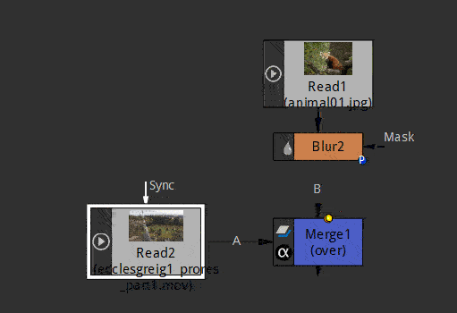
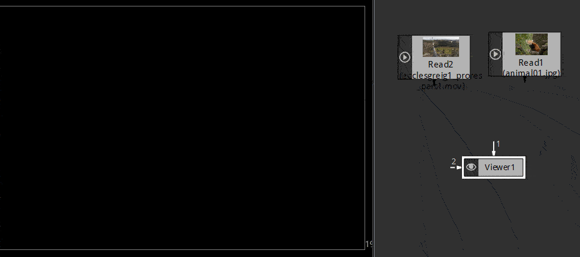
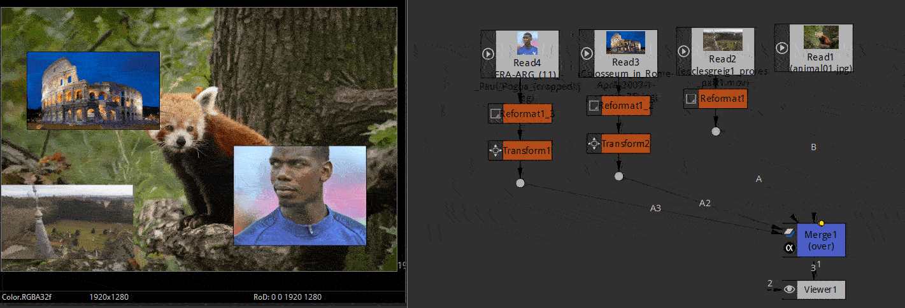
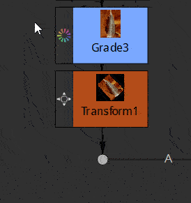
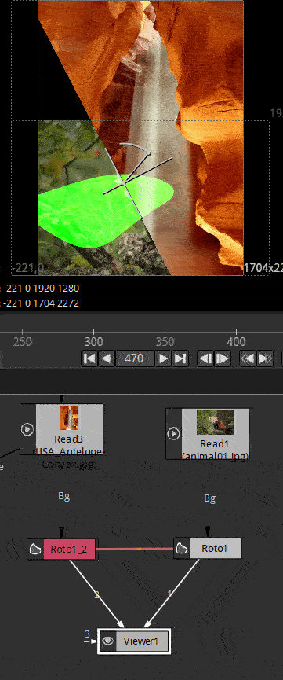
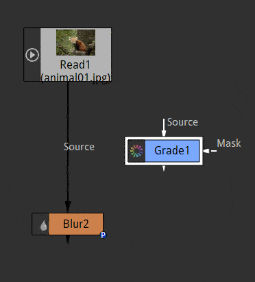
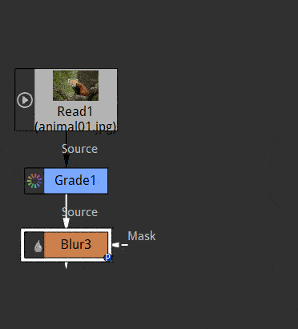
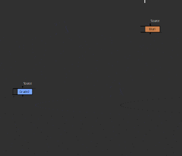

.. for help on writing/extending this file, see the reStructuredText cheatsheet
   http://github.com/ralsina/rst-cheatsheet/raw/master/rst-cheatsheet.pdf
   
Working with nodes
==================

For a brief introduction to the concept of nodes and images in Natron see: :doc:`Main concepts <getstarted-about-mainconcepts>`

Main rules
----------

- Nodes can have 1 or more inputs.
   Most processing nodes have only 1 input (blur, color corrections...)

   Merging nodes have several inputs that are turned into one "mixed" output
- mask input is present on many nodes.
   It's purpose usually is to limit the effect of the node to the part of the image defined by the white part of the mask
- Nodes always have exactly 1 output. 
   If several nodes B and C connect their inputs to the same output of node A they will receive the same image
   
   The only node without any output is the Viewer node. It determines what node is shown in the Viewer pane

When a node has several inputs (eg. Merge node) the B input is the "background" and A is the "foreground" image. If you disable the node, B input is passed unmodified
Merge nodes can have many inputs added when required to allow many merge operations at once

Creating nodes
--------------
Nodes can be created in 3 ways

- Use their shortcut
   ``G`` Grade
   
   ``T`` Transform
   
   ``B`` Blur
   
   ``C`` ColorCorrect 
   
   ``R`` Read
   
   ``W`` Write
   
   ``.`` Dot
   
   ``O`` Roto
   
   ``P`` Rotopaint
   
   ``M`` Merge
- Pick the node in the tools palette under each category.

.. image:: _images/toolbar_02.jpg

- Call the Node search menu with ``tab`` then type some letters to make the list of the names appears

Duplicating Nodes
-----------------

Nodes can be duplicated by copying (shortcut ``CTRL+C``) and pasting  (shortcut ``CTRL+V``)

This create two independent copies.

If you want the two copies to process different images with the same parameters even when they are changed the nodes can be cloned (shortcut ``ALT+K``). 

The link between the nodes is shown with a pink arrow.

.. note::
   - Even Group (New in v2.4) and Roto can be cloned (which is not possible in nuke)
   - Beware that parameters of the group are clones dynamically updated but not the internal structure of nodes inside the group

Connections
------------
To connect a node to another:
grab the tip of the input arrow and drop it onto the input node

.. image:: _images/TheNodes-Image/node_connect_disconnect.gif

insert in the graph:
hold ``ctrl`` + drag and drop node C onto a existing connection between A and B will insert the node inbetween. resulting in A->C->B
To show you where the node will be inserted, a green arrow is displayed

To disconnect a node:
select it, press ``ctrl+shift+x``

**community scripts**

To connect distant nodes, select output node, input node, press ``y``

For more in depth information on how to manage your nodegraph see :doc:`Nodegraph <getstarted-environment-nodegraph>`