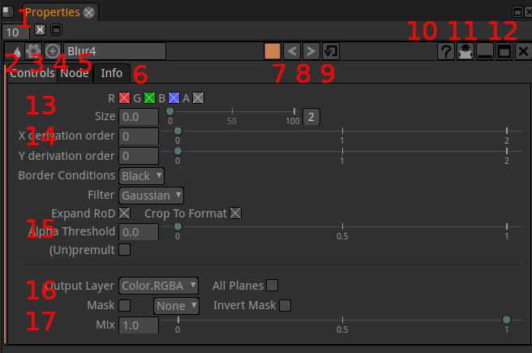
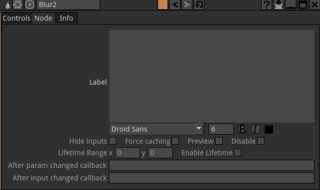
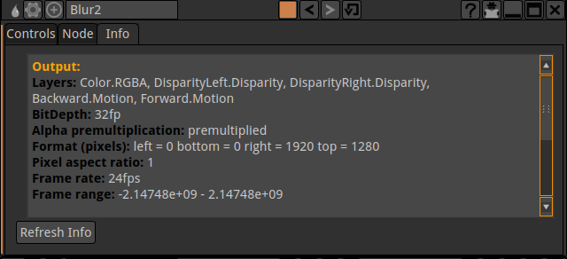

.. for help on writing/extending this file, see the reStructuredText cheatsheet
   http://github.com/ralsina/rst-cheatsheet/raw/master/rst-cheatsheet.pdf
   
Properties panels
=================

.. toctree::
   :maxdepth: 2

Here you can interact with the node properties to fine tune the effect on the image. As in the rest of Natron all changes are non destructive and can be modified at any time. 

The elements of the properties panel are:
 - 1 Maximum number nodes opened in the properties window
 - 2 icon of the node to identify it's type. Most useful when the name has been changed. Hovering the icon popups the node type in plain text
 - 3 icon of the presets / user menu :ref:`Presets_menu`
 - 4 icon of the center in node graph. When you click this the view in the node graph is moved to center the node on screen
 - 5 Node name This can be changed but it is good to keep this name to easily tell the type of a node and keep syntax short, should you reference this node in an expression. For more verbosity the node "label" field gives more freedom.
 - 6 Node parameter tabs. The parameters of a node are spread across several tabs. The controls, Node, Info tabs are present in most nodes but others can sometimes be found too. You can even add tabs through
 - 7 The color of the node in the graph window
 - 8 Undo/redo specific for this node and not the overall Natron session.
 - 9 restore values for this operator. When clicked it will reset the node (including those with expressions)
 - 10 the ? icon opens the documentation for the specific node
 - 11 shrink the node pane to show only animated parameters. Use only after you started your animations.
 - 12 flat line: shrink completely the node parameters display. Box icon: detach the node of the current pane
 - 13 Global parameters :ref: proppanel_parameters
 - 14 Main parameters
 - 15 Optimisation parameters
 - 16 Limitation parameters  

_proppanel_parameters:
Controls tab
--------------

RGBA
	The channels that will be computed
Main parameters
	These ones are different for each node type as they are the ones really defining the effect.
Border Conditions
	Sets the way to evaluate pixels beyond the canvas edges
	"Nearest" virtually extends the image to avoid the appearance of dark edges when blurring and set to "Black"
Expand RoD
	Let the calculation of the node run for "out of image" pixels. These pixels could be brought back in frame by a subsequent transform lower in the graph
Crop to Format
	crop the result to the format defined in pro ject settings avoiding useless calculations 
Output Layer
	Define the channels that will actually be modified by the node
Mask
	Define how the mask provided on the mask input should be treated. By default the node affects the image only where the alpha channel of the mask input is not Black
Mix
	Let's you revert partially the effect to go back toward the original image

Node tab
---------

label
	Here you can put custom test or expressions that will be shown in the node graph on the "body" of the node.
Hide inputs
	Hide the incoming connexion arrow of the node. Useful when it is very far from it's inputs
Force caching
	Avoid rerendering this node (and ustream ones) when your are done setting up this part and will start to add more nodes downstream.
Preview
	Add a "postage stamp" to the node to get a preview of the image getting out of it.

Disable
	Same as toggle with "D" key to compare with and without the effect of the node
Lifetime
	Save computation time by not evaluating this node outside of the Lifetime interval. This is similar to the in/out points of a clip in editing
Callbacks
	are for python scripting and automation of Natron

Info tab
---------

Here you can check the properties of the data generated by the node. It may be useful if your project becomes suddenly very slow to compute. For example, memory can be filled by an image carrying too many Layers that may not be useful

User tab(s)
-------------
To build expressions you can add new parameters to your node. They can't be added to default tabs. You will be prompted to add a user tab before adding new parameters to it with command "Manage user parameters... " :ref:`Presets_menu`

.. _Presets_menu:

Presets menu
--------------

   This menu let's you work on the parameters of the node
   
   .. image:: _images/proppanel_presets_01.png

Import  Export presets
	Let you save to file the values of all the parameters of the node at once. This can then be restored with "Import"

Manage user parameters... 
	A menu to add new parameters to your node. They will be useful to build expressions that can be modified interactively (on "real" parameters)

Set key on all parameters
	A quick and dirty way to animate the values of a node

Remove animation on all parameters
	A quick way to "freeze" a node settings. Only animation curves will be frozen. Expressions are kept.

