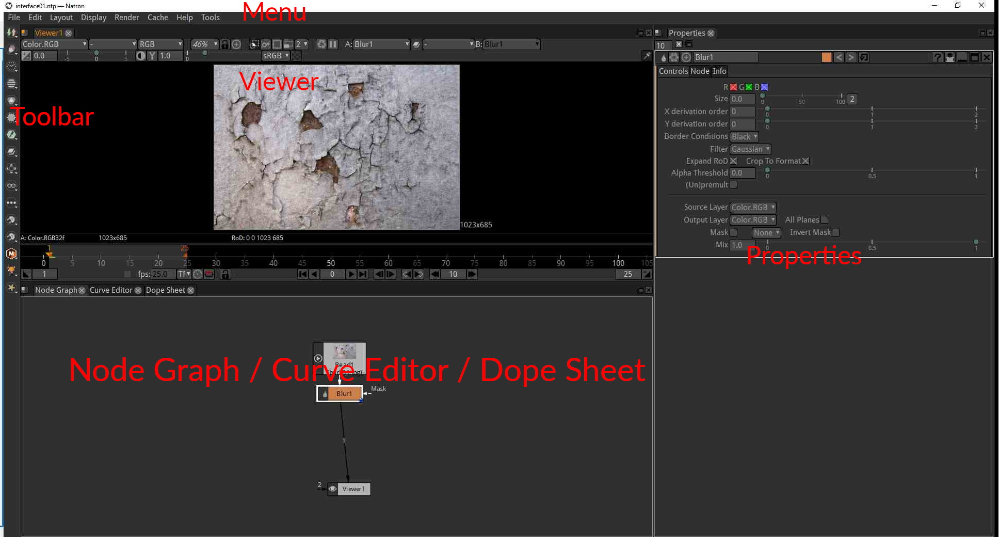
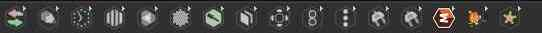
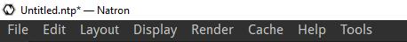
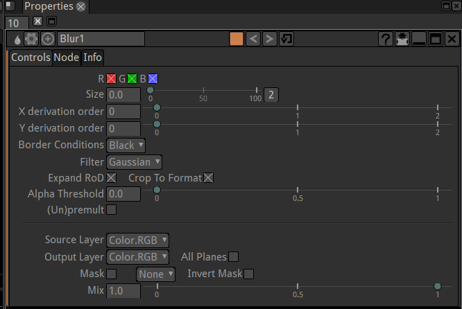
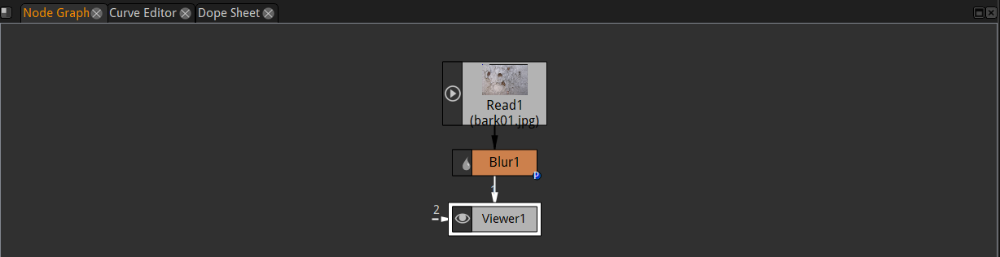
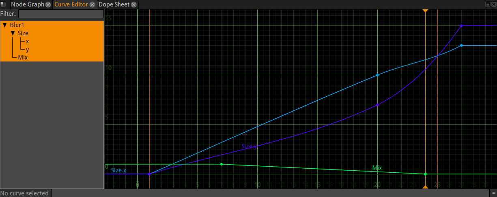

.. for help on writing/extending this file, see the reStructuredText cheatsheet
   http://github.com/ralsina/rst-cheatsheet/raw/master/rst-cheatsheet.pdf

Environment
===========

The interface of Natron is composed of different elements

Standard layout of Natron

Generic Description
###################
The purpose of Natron is to process video images using elementary "effect" bricks called nodes.

for more details see:
:doc:`Main concepts <getstarted-about-mainconcepts>`

The image is processed in order passing through each node. The nodes are connected with links that define the order of the processing.
These connected nodes are called the node graph.

Each node has parameters allowing to customize the effect produced on the incoming image.

The Toolbar 
###########

It is the list of icons on the left-hand side of Natron.

Each icon is a menu giving access to different categories of nodes (ie. image processing tools) that Natron offers to process or create images.

The Menu bar 
##############

Located on top of Natron window, it gives acces to various actions other than adding nodes to the node graph.
Most actions are done on the whole project like saving, rendering...

The Viewer panel
#################
.. image:: _images/viewer_01.png
 :width: 600px

Here is displayed the result of the image processing. To choose what is displayed, each viewer is related to a viewer node in the graph that can be connected to any intermediate point in the graph.

The Properties editor
######################

This panel shows the parameters of one or several nodes from the graph.

The Node graph
#################

This panel is were connections are made between the nodes to define the processing order of the image.

The Curve editor
#################

This panel allows to edit graphically the changes intime of the parameters of the nodes (these are the same as the numerical values shown in the Properties editor).

The Dopesheet
################
.. image:: _images/dopesheet_01.png
 :width: 600px

This panel allows to quickly edit the timing of the animations but without access to the actual values. Each little box correspond to a keyframe set on a parameter from one the nodes.

.. toctree::
   :maxdepth: 2

   getstarted-environment-menus
   getstarted-environment-toolbar
   getstarted-environment-nodes
   getstarted-environment-nodegraph
   getstarted-environment-proppanels
   getstarted-environment-color
   getstarted-environment-presets
   getstarted-environment-anim
   getstarted-environment-viewer
   getstarted-environment-fileselect
   getstarted-environment-undoredo
   getstarted-environment-progressbar
