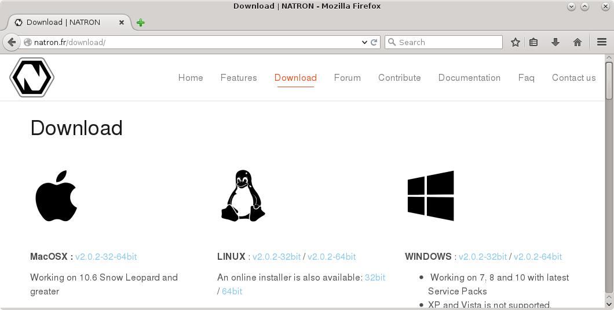
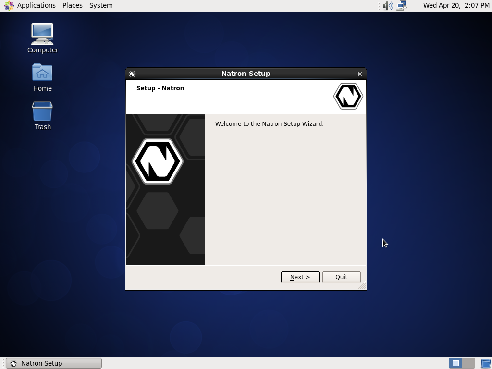
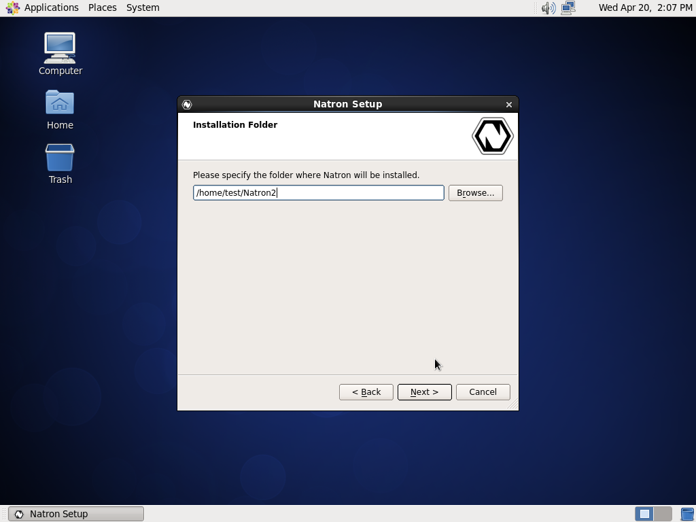
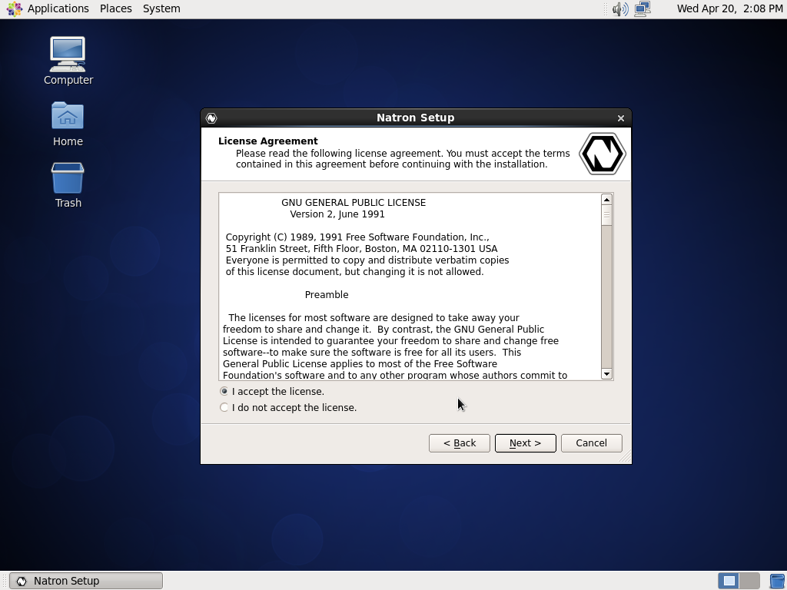
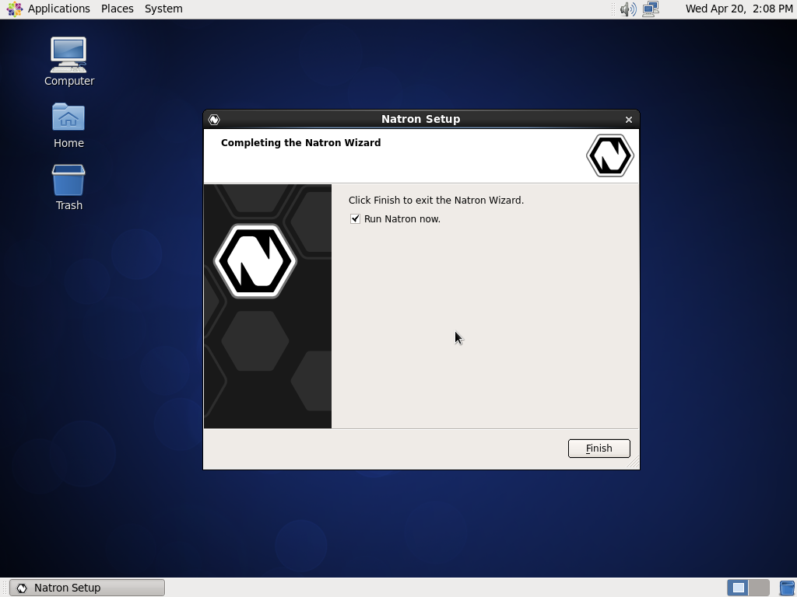
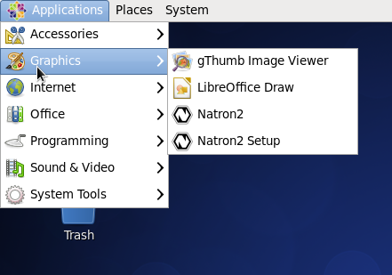
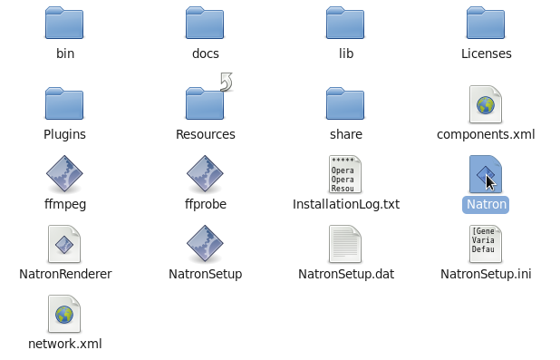
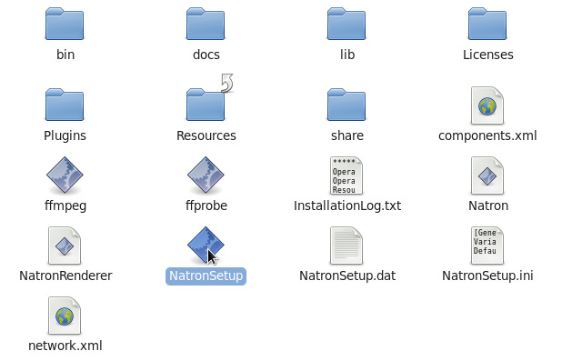

.. for help on writing/extending this file, see the reStructuredText cheatsheet
   http://github.com/ralsina/rst-cheatsheet/raw/master/rst-cheatsheet.pdf
   
Linux
=====

.. toctree::
   :maxdepth: 2

This chapter will guide your through the installation and maintenance of Natron on Linux.

Requirements
------------

Natron will work on any Linux distribution which still receives seccurity updates.
This includes (but not limited to):

 * `CentOS <https://www.centos.org/>`_ / `RHEL <https://www.redhat.com/en/technologies/linux-platforms/enterprise-linux>`_ 7 and later
 * `Debian <https://www.debian.org/>`_ 8 "Jessie" and later
 * `Ubuntu <https://www.ubuntu.com/>`_ 16.04 LTS (Xenial Xerus) and later
 * `Fedora <https://getfedora.org>`_ 32 and later

The official binaries are built on CentOS 7, thus the basic system requirements are:

 * x86 compatible CPU (Core2 x86_64 or higher recommended)
 * Linux 2.6.32 and higher
 * Glibc 2.12 and higher
 * libgcc 4.4 and higher
 * OpenGL 2.0 or higher with the following extensions:
    * **GL_ARB_texture_non_power_of_two** *(Viewer and OpenGL rendering)*
    * **GL_ARB_shader_objects** *(Viewer and OpenGL rendering)*
    * **GL_ARB_vertex_buffer_object** *(Viewer and OpenGL rendering)*
    * **GL_ARB_pixel_buffer_object** *(Viewer and OpenGL rendering)*
    * **GL_ARB_vertex_array_object** or **GL_APPLE_vertex_array_object** *(OpenGL rendering only)*
    * **GL_ARB_framebuffer_object** or **GL_EXT_framebuffer_object** *(OpenGL rendering only)*
    * **GL_ARB_texture_float** *(OpenGL rendering only)*

Download
--------

Navigate to https://natrongithub.github.io/1#download and download the latest version. This documentation will assume that you downloaded the installer (our default and recommended choice).

Extract
-------

When the file has been downloaded, extract the file. This can be done in your file browser, usually just right-click and select 'Extract Here'.

.. image:: _images/linux_install_02.png
   :width: 30%

Install
-------

You are now ready to start the installation, double-click on the extracted file to start the installation.

.. image:: _images/linux_install_04.png
   :width: 30%

*On some installations you are not allowed to execute downloaded files, right-click and select properties, then tick the 'Execute file as program' option. This option may have a different name depending on your distribution and desktop environment. You can also make the file executable through the terminal, type chmod +x filename.*

You should now be greated with the installation wizard.

Click 'Next' to start the installation, you first option is where to install Natron. Usually the default location is good enough. If you select a installation path outside your home directory you will need to supply the root (administrator) password before you can continue.

Your next option is the package selection, most users should accept the default. Each package has an more in-depth description if you want to know what they provide.

.. image:: _images/linux_install_07.png
   :width: 30%

Then comes the standard license agreement, Natron and it's plug-ins are licensed under the GPL version 2. You can read more about the licenses for each component included in Natron after installation (in Help=>About).

The installation wizard is now ready to install Natron on your computer. The process should not take more than a minute or two (depending on your computer).

.. image:: _images/linux_install_09.png
   :width: 30%

The installation is now over! Start Natron and enjoy.

Natron can be started from the desktop menu (under Graphics) or by executing the 'Natron' file in the folder you installed Natron.

Maintenance
-----------

Natron includes a maintenance tool called 'NatronSetup', with this application you can easily upgrade Natron and it's components when a new version is available. You can also add or remove individual packages, or remove Natron completely. The application is in the 'Graphics' section in the desktop menu, or you can start it from the folder where you installed Natron.

The application also include a basic settings category, where you can configure proxy and other advanced options.

Advanced installation
---------------------

Natron also has RPM and DEB packages, these are recommended for multi-user installations or for deployment on more than one machine. You can find more information on our website at https://natrongithub.github.io/ .
