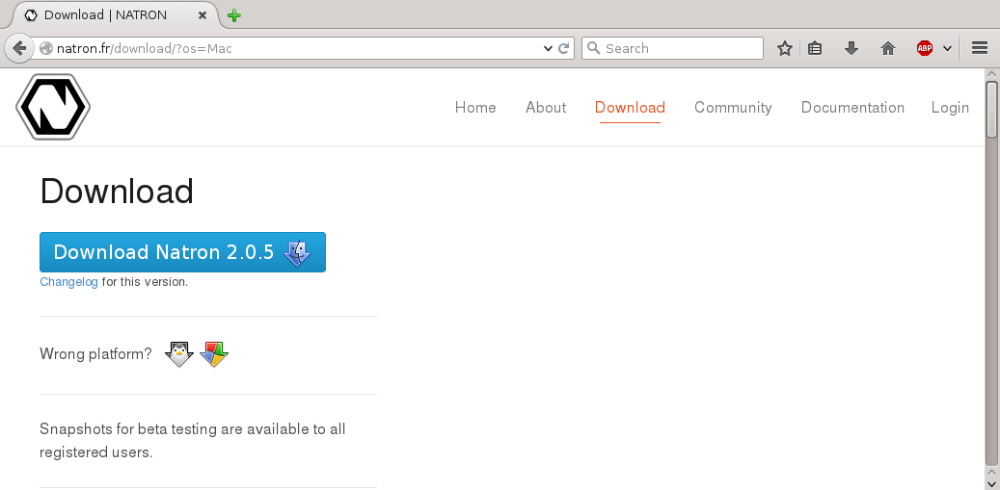
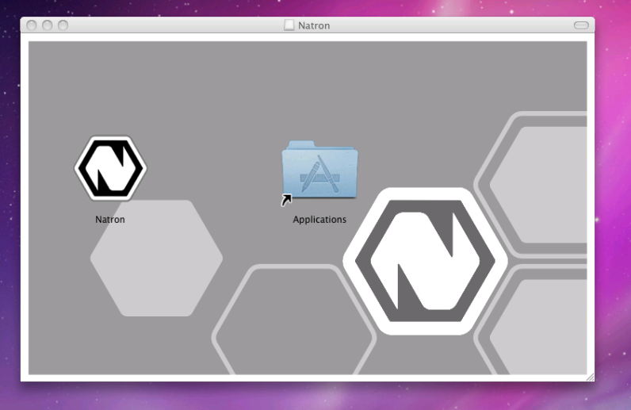

.. for help on writing/extending this file, see the reStructuredText cheatsheet
   http://github.com/ralsina/rst-cheatsheet/raw/master/rst-cheatsheet.pdf
   
macOS
=====

.. toctree::
   :maxdepth: 2

This chapter will guide your through the installation of Natron on macOS (formerly known as Mac OS X or OS X).

Requirements
------------

 * Mac OS X 10.6 (Snow Leopard) or higher
 * x86 compatible CPU (Core2 x86_64 or higher recommended)
 * OpenGL 2.0 or higher with the following extensions:
    * **GL_ARB_texture_non_power_of_two** *(Viewer and OpenGL rendering)*
    * **GL_ARB_shader_objects** *(Viewer and OpenGL rendering)*
    * **GL_ARB_vertex_buffer_object** *(Viewer and OpenGL rendering)*
    * **GL_ARB_pixel_buffer_object** *(Viewer and OpenGL rendering)*
    * **GL_ARB_vertex_array_object** or **GL_APPLE_vertex_array_object** *(OpenGL rendering only)*
    * **GL_ARB_framebuffer_object** or **GL_EXT_framebuffer_object** *(OpenGL rendering only)*
    * **GL_ARB_texture_float** *(OpenGL rendering only)*

Download
--------

Navigate to https://natrongithub.github.io/#download and download the latest version.

Install
-------

Double-click the DMG file and copy Natron where you want it.

Run
---

On OS X 10.7 and later, you may get the message *"Natron has not been signed by a recognized distributor and may damage your computer. You should move it to the trash"*.

The macOS binaries are not signed with an Apple Developer ID, because of incompatibilities between the Apple code signing tools and the compiler (GCC 4.9) and target OS (Mac OS X 10.6) we use.

There are at least four options to launch Natron on macOS:

- rather than double-clicking on the Natron application, right-click or control-click on it and select Open
- after an unsuccessful launch of Natron, go to the Security & Privacy preferences panel, and enable it.
- from the terminal command-line, execute ``spctl --add /Applications/Natron.app``, as explained in `this OSXDaily article <http://osxdaily.com/2015/07/15/add-remove-gatekeeper-app-command-line-mac-os-x/>`_.
- (not recommended) click "Allow apps downloaded from: Anywhere" in the Security & Privacy preferences panel. Since macOS 10.12 Sierra, this option is not available anymore, but it is possible to re-enable it, as explained in `that OSXDaily article <http://osxdaily.com/2016/09/27/allow-apps-from-anywhere-macos-gatekeeper/>`_.
