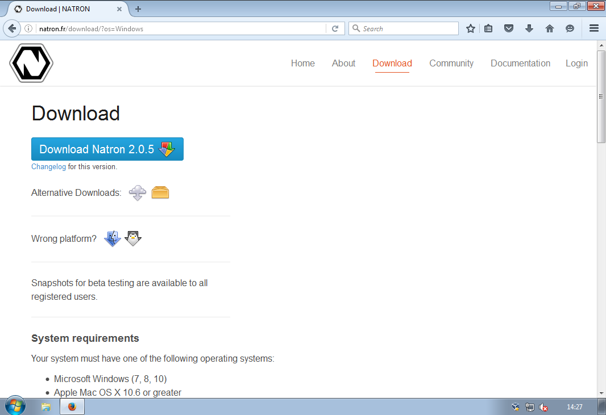
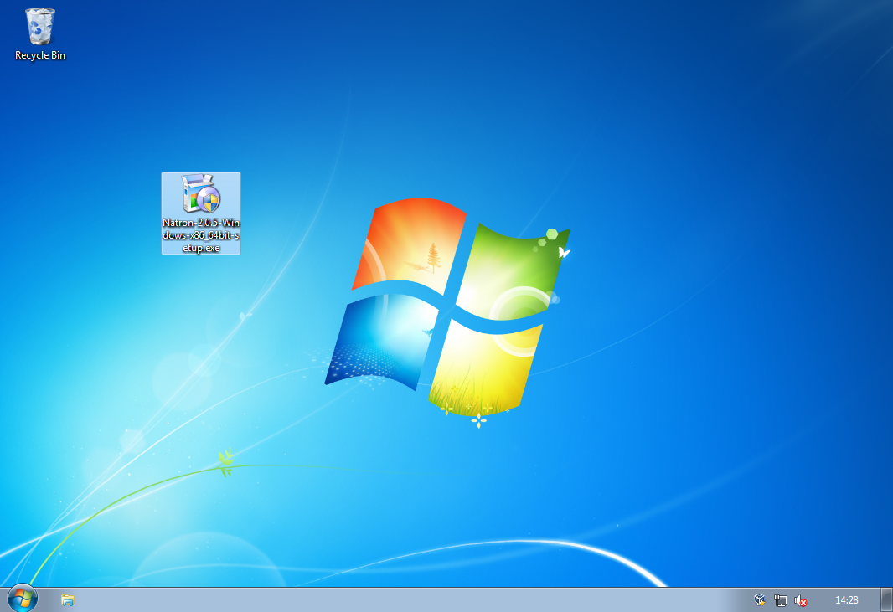
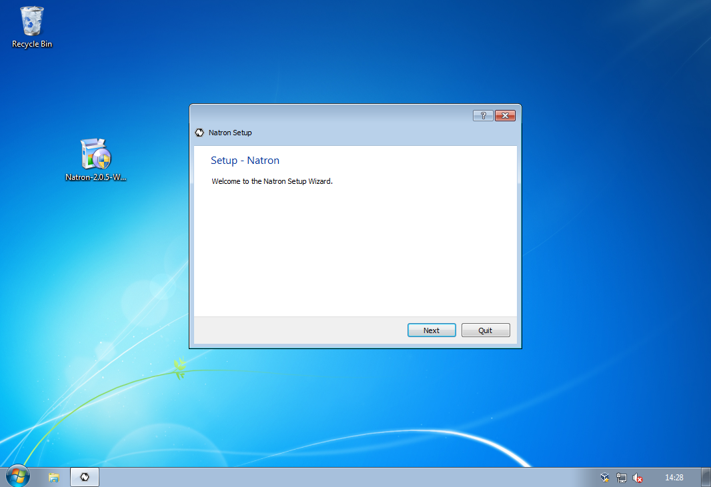
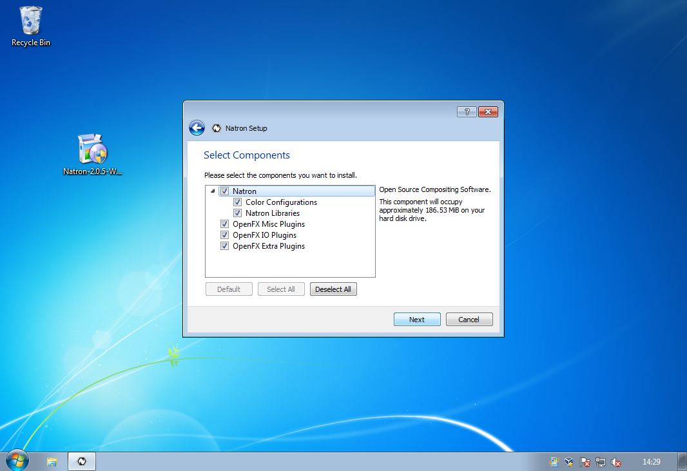
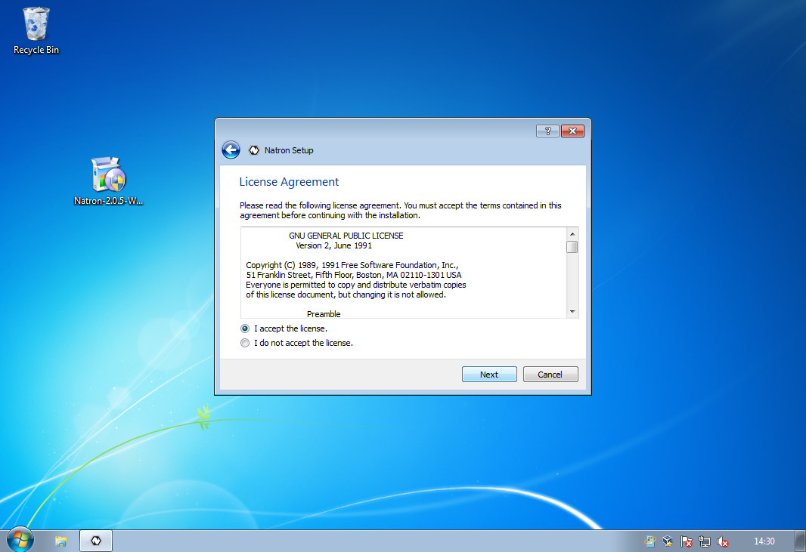
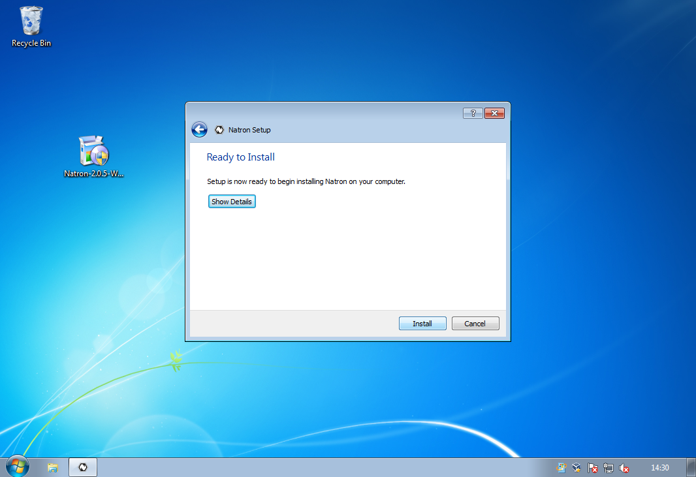
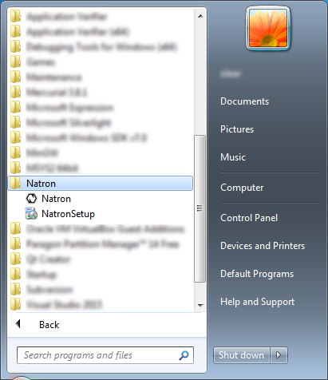
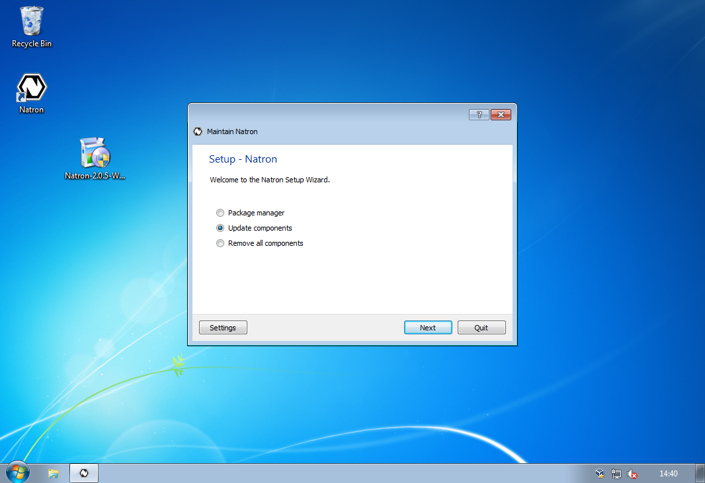
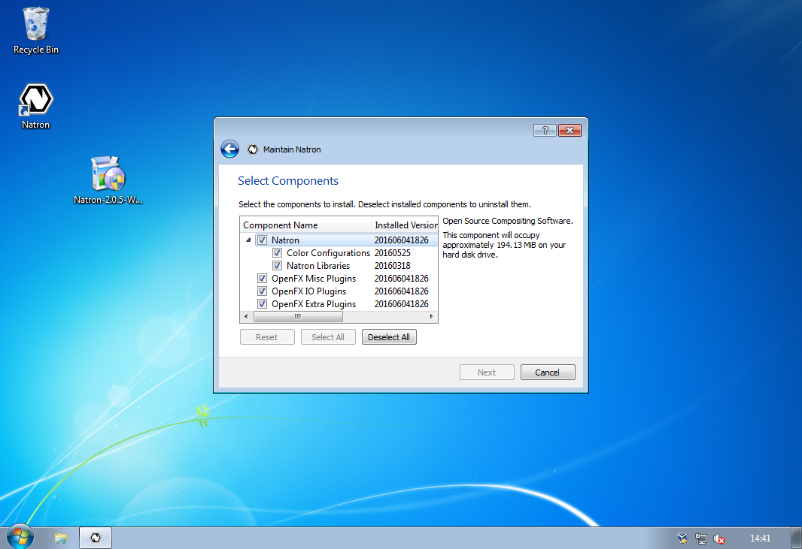

.. for help on writing/extending this file, see the reStructuredText cheatsheet
   http://github.com/ralsina/rst-cheatsheet/raw/master/rst-cheatsheet.pdf
   
Windows
=======

.. toctree::
   :maxdepth: 2

This chapter will guide you through the installation and maintenance of Natron on Windows.

Requirements
------------

Natron will work on Windows 7, 8.x, 10 with the latest updates.

The basic requirements are:

 * x86 compatible CPU (Core2 x86_64 or higher recommended)
 * OpenGL 2.0 or higher with the following extensions:
    * **GL_ARB_texture_non_power_of_two** *(Viewer and OpenGL rendering)*
    * **GL_ARB_shader_objects** *(Viewer and OpenGL rendering)*
    * **GL_ARB_vertex_buffer_object** *(Viewer and OpenGL rendering)*
    * **GL_ARB_pixel_buffer_object** *(Viewer and OpenGL rendering)*
    * **GL_ARB_vertex_array_object** or **GL_APPLE_vertex_array_object** *(OpenGL rendering only)*
    * **GL_ARB_framebuffer_object** or **GL_EXT_framebuffer_object** *(OpenGL rendering only)*
    * **GL_ARB_texture_float** *(OpenGL rendering only)*

If you don't have the minimum required OpenGL extensions we provide a Software OpenGL solution, install the package *Software OpenGL* from the installer. If you have the portable ZIP file copy *bin\\mesa\\opengl32.dll* to *bin\\*.

Download
--------

Navigate to https://natrongithub.github.io/#download and download the latest version. This documentation will assume that you have downloaded the installer (Our default and recommended choice).

Install
-------

You are now ready to start the installation, double-click on the setup file to start the installation.

You should now be greeted with the installation wizard.

Click 'Next' to start the installation. You will be asked to specify the installation folder for Natron . The default location is recommended.

You will then be asked to select the component packages you want to be installed, most users should accept the default selection. Each package has a more in-depth description if you want to know what they provide.

Then comes the standard license agreement, Natron and its plug-ins are licensed under the GPL version 2. You can read more about the licenses for each component included in Natron after installation (in menu Help→About).

The installation wizard is now ready to install Natron on your computer. This process should not take more than a minute or two (depending on your computer).

The installation is now over! Start Natron and enjoy.

Natron can now be started from the desktop icon or from the start menu.

Maintenance
-----------

Natron includes a maintenance tool called 'NatronSetup', with this application you can easily upgrade Natron and its components whenever a new version is available. You can also add or remove individual packages, or remove Natron completely. The application should be in the same start menu folder as Natron, or you can start it from the folder where you installed Natron.

The application also includes a basic settings category, where you can configure proxy and other advanced options.
