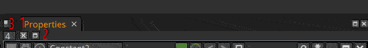
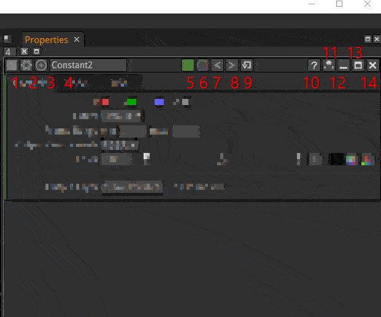

.. for help on writing/extending this file, see the reStructuredText cheatsheet
   http://github.com/ralsina/rst-cheatsheet/raw/master/rst-cheatsheet.pdf

.. toctree::
   :maxdepth: 2

Common Properties
=================

We describe here the type of parameters that can be found on many nodes. And how to use the properties window.

The properties window
---------------------

1: Clears the properties panel. It is a quick way to close everything in the properties panel.

2: Minimize the panels to keep only the node names visible. One can then choose wich ones to close completely with their own close button (see 14).

3: Maximum number of nodes simultaneously opened in the propoerties pane. Too many opened panes can be confusing as some are not visible anymore because of limited screen space. Too many nodes opened can also slow down the user interface.

The Utility icons
-----------------

1: The node icon. Just a visual clue to see what a node really is (in case its name was changed). It is the same icon used in the node Graph.

2: Special settings of the nodes. If a node is often used with the same settings, these can be saved/loaded as a preset file. This function is not used very much as it can be more convenient to copy-paste the node from a dummy Natron project used as a node presets library.

One can also remove animations while keeping parameter values. This complements the "Restore Defaults" button (cf. 9).

3: Center the node graph on this node. This can be useful to check wich node your are about to make changes on.

4: The script name of the node as it appears on the top of the box in the node graph

It is considered a good practice to leave this name unchanged and change the Label in the node tab instead. It helps see what the node really does just by looking at the graph. There cannot be 2 nodes with the same name. The names cannot contain spaces.

In Python, this name is accessed through the ``getLabel`` function.

5: The node color as seen in the graph. Click to change. This is just a visual cue and has no effect on the resulting image.

6: Overlay color. For nodes that draw helpers in the viewer, a color can be specified here. This can be used if multiple transform nodes are opened to help you tell wich one belongs wich handle.

7 / 8: Undo / Redo. These functions are specific to the node. It is separate from the global Undo / Redo of Natron and thus gives you more control on your changes.

9: Restore default values for this node on all parameters, and delete animations.

10: Help brings you to the reference documentation for this node.

11: Hide parameters without modifications.
.. note::
   **Tip:**
   This button is a quick way to find what parameters were modified in a node.

Layers Properties
-----------------

Channels to process
Output Layer
Mask

Time Properties
---------------

Frame Range

Lifetime Range

Enable Lifetime

Geometric Properties
--------------------

Extent

Transform

Filtering

Functional Properties
---------------------

Mix

Utility

Hide Inputs

Force caching

Preview

Disable

