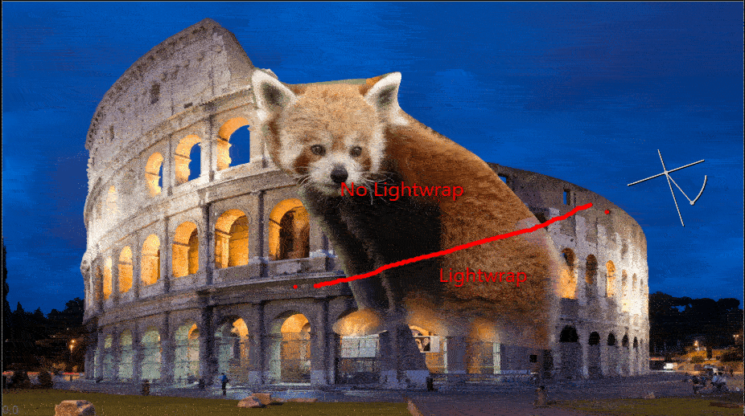
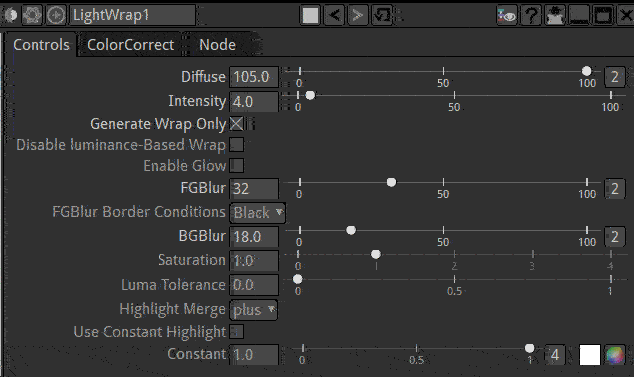
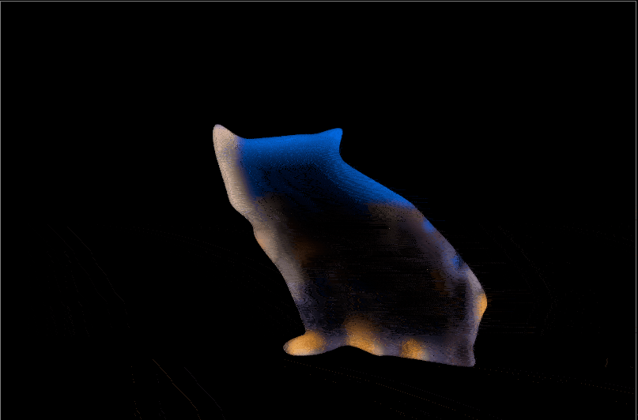
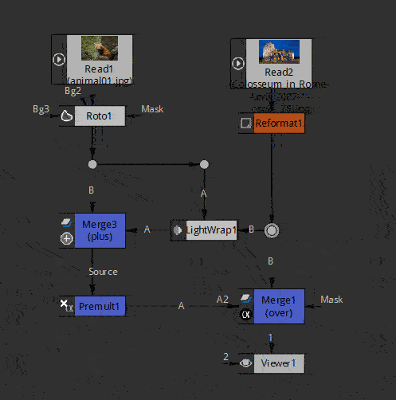

.. for help on writing/extending this file, see the reStructuredText cheatsheet
    http://github.com/ralsina/rst-cheatsheet/raw/master/rst-cheatsheet.pdf

Lightwrap Node
==============

LightWrap helps composite objects onto a bright background by simulating reflections from the background light on the foreground, around its edges. 

Input A is the foreground image and its matte, and input B the the background to use for the wrapping effect.

The output of LightWrap should then be composited over the background to give the final composite.

    

    
Usage
--------

Increase FGBlur and Intensity to make the Lightwrap more visible.

Increase Diffuse and BGBlur to make the Lightwrap softer, that is remove details from the background.

It is easier to adjust the settings with the Generate  wrap only box.

This can be useful to manage precisely how Lightwrap is composited onto the FG image.
It is common practice to use a "plus" Merge rather than the default "Over". (see Merge3 node in the example below)

Use "Enable Glow" to allow the Lightwrap to be visible also on the background image itself.

The lightwrap can also be made of a unique color of your choice with "Use Constant Highlight" and "Constant" color.

.. toctree::
    :maxdepth: 2

