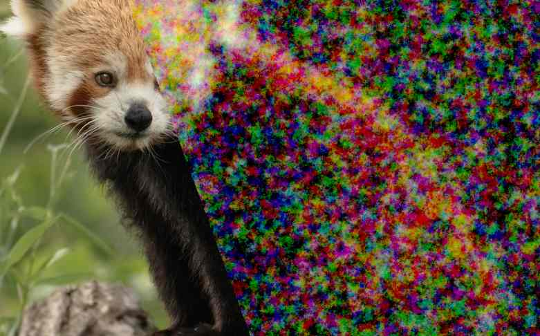
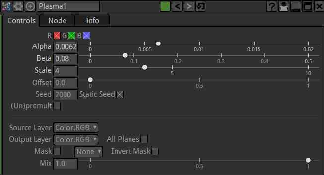
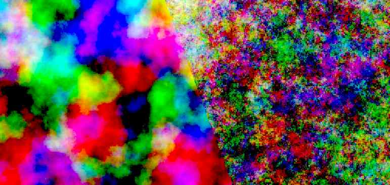

.. for help on writing/extending this file, see the reStructuredText cheatsheet
    http://github.com/ralsina/rst-cheatsheet/raw/master/rst-cheatsheet.pdf

Plasma Node
=========

Creates cloudy  noise. Brightness of the result can be modulated by the source image
    

Usage
--------

The "Scale" parameter changes the size of the clouds pattern

check "Static Seed" for a freeze frame of the effect

Above:
    - high alpha/low beta gives clean clouds

    - low alpha / high beta gives noisy clouds

This node alone is not suitable for image regrain. but with a scale of 1 it can partly simulate the splotchy behavior of high speed film stocks

.. toctree::
    :maxdepth: 2
