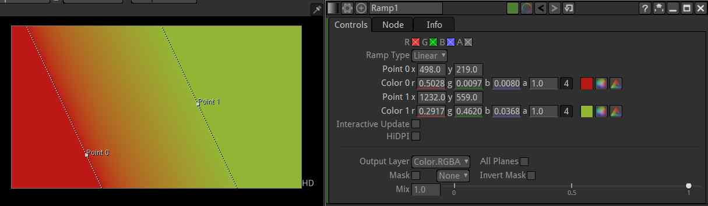

.. for help on writing/extending this file, see the reStructuredText cheatsheet
   http://github.com/ralsina/rst-cheatsheet/raw/master/rst-cheatsheet.pdf
   
Ramp Node
=========

       
Ramp is what grown-ups call a gradient. The Ramp node of Natron give a butter-smooth gradient that is best used to mask off color operations.
   

   
Usage
--------
   
The End colors can be changed. And the end positions can be moved in the viewer with the point 0 / Point 1 widgets visible in the viewer when the properties of the node are opened.

The Ramp type allows different types of transitions. The gradient is always linear. The colorwheel node can be changed to become a radial gradient.

.. toctree::
   :maxdepth: 2
