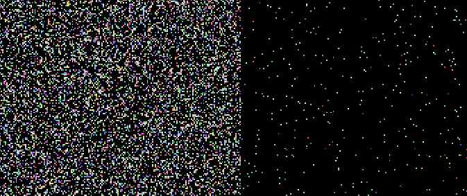
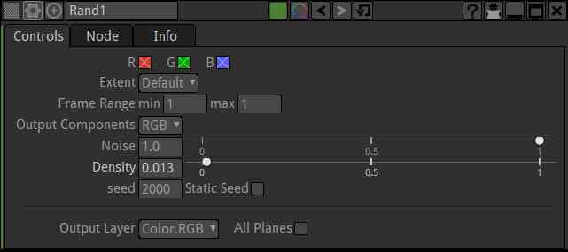
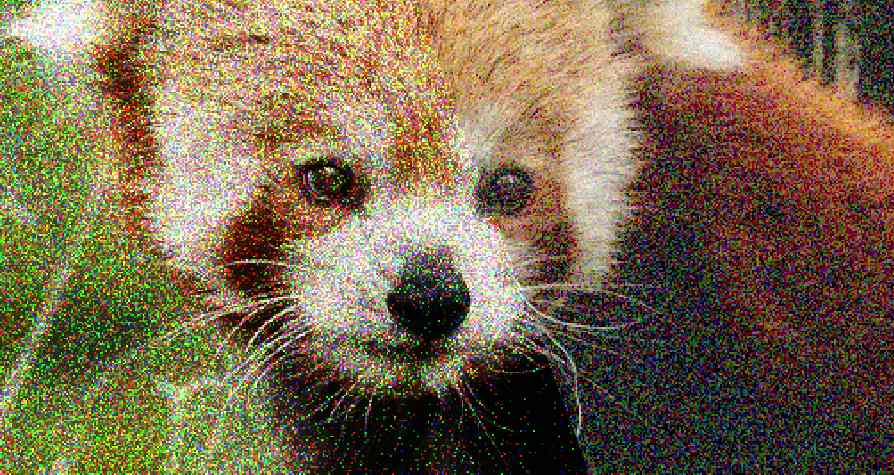
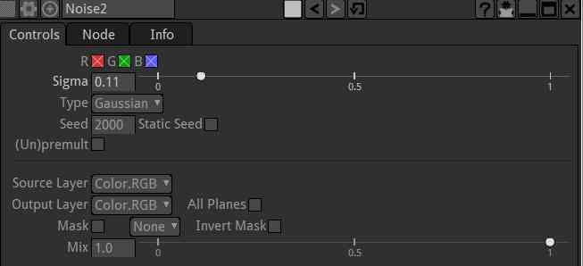

.. for help on writing/extending this file, see the reStructuredText cheatsheet
    http://github.com/ralsina/rst-cheatsheet/raw/master/rst-cheatsheet.pdf

Rand Node
=========

Creates uniform Random noise.
This node alone is not suitable for image regrain.

2 different Rand with different values of "Density"

Usage
--------

The "Density" parameter allows one to change the average distance between the random dots of the noise

check "Static Seed" for a freeze frame of the effect

Noise Node
==========

Creates noiseover the source image.

2 different types of Noise. Poisson on the left, Gaussian on the right.

Usage
--------

The Sigma parameter control the amount of noise.

The "type "Poisson" noise reacts to the source image. It could be used to simulate electronic sensor noise. It gives a black result when no source image is provided. Type "Gaussian" is more uniform and is not dependant on the source image

check "Static Seed" for a freeze frame of the effect

.. toctree::
    :maxdepth: 2
