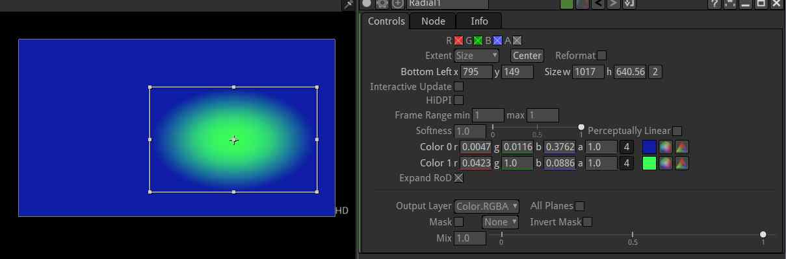

.. for help on writing/extending this file, see the reStructuredText cheatsheet
    http://github.com/ralsina/rst-cheatsheet/raw/master/rst-cheatsheet.pdf

Rectangle Node
=========

the Rectangle node makes rectangle shapes. It can add rounded corners and soft edges to the shapes.
It is very useful for masking off a color adjustment and its softness parameter can be edited without compromising its edge values too much. Frequently use it to mask out nebulous regions of an effect. 

It is faster to use and to process that a Roto or RotoPaint node. 
    

    
Usage
--------

Use the rectangle gizmo visible when properties are opened to edit the shape 
If an exact square is required then the "2" button should be disabled in the size parameters.
If the rectangle should be centered in the image press the "center" button.

A hard-edged circle can be obtained by setting the softness paramet to 0.

The End colors can be changed with "color 0" and "color 1" parameters.

To fill the image with the effect set "Extent" to "Project".

.. toctree::
    :maxdepth: 2

