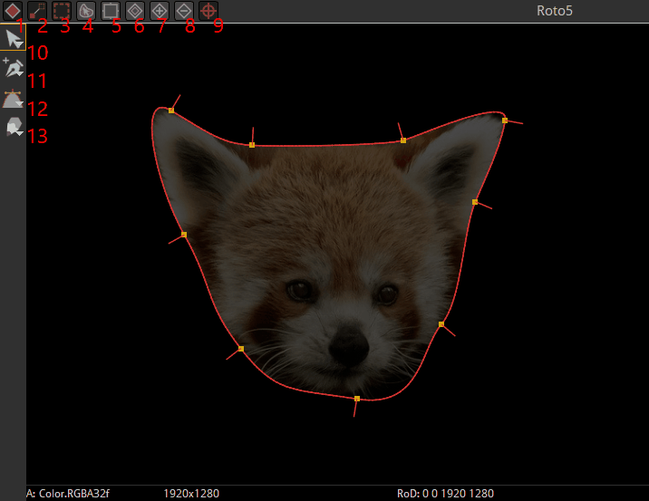
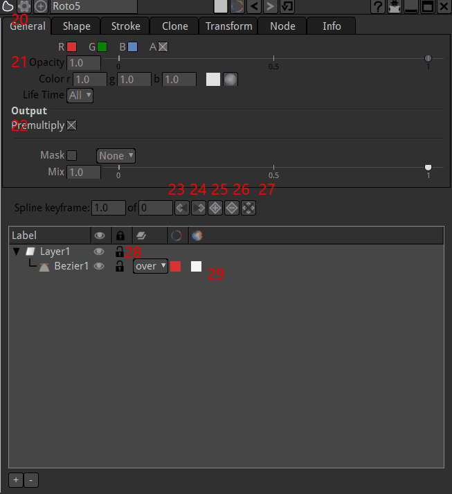

.. for help on writing/extending this file, see the reStructuredText cheatsheet
    http://github.com/ralsina/rst-cheatsheet/raw/master/rst-cheatsheet.pdf

Roto Node
=========

Using a Roto node a vector shape may be drawn (like the pen tool in Photoshop or Illustrator). There are two main uses for this node:

    - To make a mask: In a situation where a node such as Multiply is being used to darken an image, a Roto shape may be used as a mask: to limit the effects of that node.
    - To make an alpha channel: In a situation when the alpha of an image needs editing, a Roto shape may be used to add to, remove from or replace that alpha.

Added to this is a host of other functionality. It may, for example, be used to hide or revel one layer from another. This functionality can be used to hide glitches in an image using something called a 'clean plate'.

Natron's Roto node has many parameters parameters in the tabs. However, most day to day usage is covered effectively by the first two tabs. 
    

Usage
--------

Basic usage:
    - create the node with 'o' or 'p' shortcut
    - start click+dragging in the viewer
    - click on the firs point to close it
    - If you want soft edges around your shape, pull the little red lines protruding from each control points. The dotted line that appear is the limit of the soft edgea
    - That's it you image now have your shape drawn (in the alpha channel by default)

    .. image:: _images/TheNodes-Draw/nodes_draw_roto03_feather.jpg

To edit the shape you have tools in the viewer window:

In the viewer the tools to create or edit shapes are:
    - 1: "Autokey" create a new key to your shape each time you move any part of it. If this is disabled click on the "+" (25) to create a key
    - 2: "FeatherLink" lets you move a point on the shape and the feather point follows.
    - 3: "display feather" can disable viewing/editing the feather points (dotted line)
    - 4: sticky selection of vertices. Helps editing the shape with constant selection
    - 5: sticky bounding box: Helps editing the shape with constant selection.
    - 6: "Ripple Edit" let you change the shape on all keyframes in an offset manner
    - 7-8: Add / Delete keyframe to the currently selected shape (similar to 25/26 in the properties
    - 9: show transform. Let you move the whole shape without the need to edit each point of the shape. Good for rotoscoping "hard objects" wich shape doesn't change much over time.
    - 10: Select/transform "arrow" tools. Select it after the creation of the Curve
    - 11: Add/remove points tool
    - 12:create shape tool. Long click to get the choice between freeform, rectangle, ellipse shapes.
    - 13: pencil tools

.. note::
    The layers don't have geometric properties. Their only purpose is to group paint dabs/masks to enable/disable these in  s ingle click

See :doc:`The Rotopaint <compositing-rotopaint>` section for more informations.

.. toctree::
    :maxdepth: 2
