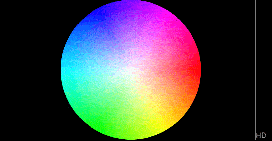
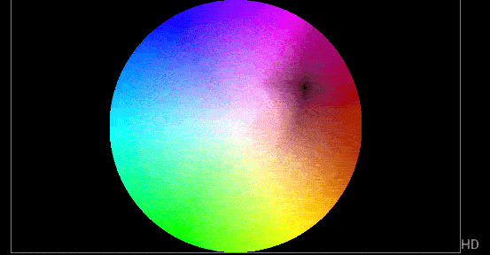
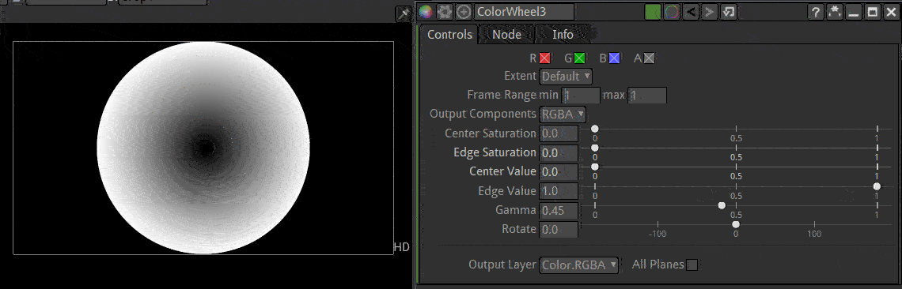

.. for help on writing/extending this file, see the reStructuredText cheatsheet
   http://github.com/ralsina/rst-cheatsheet/raw/master/rst-cheatsheet.pdf
   
ColorWheel Node
===============
    
.. toctree::
    :maxdepth: 2
    
The ColorWheel node can be used to generate disc patterns. By default it generates a preview of all the colors in the visible spectrum

Usage
--------

The pattern can be changed in size and color.

The ColorWheel can be used to test the result of a color grading. Below we can easily see the settings of an HSVTool darkening the reds.

The ColorWheel can be desaturated to turn it into a circular geometric pattern.

