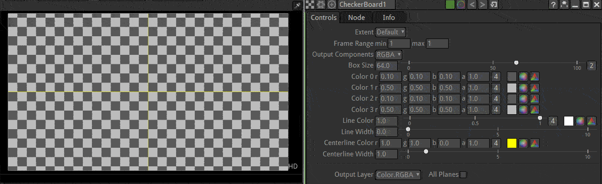
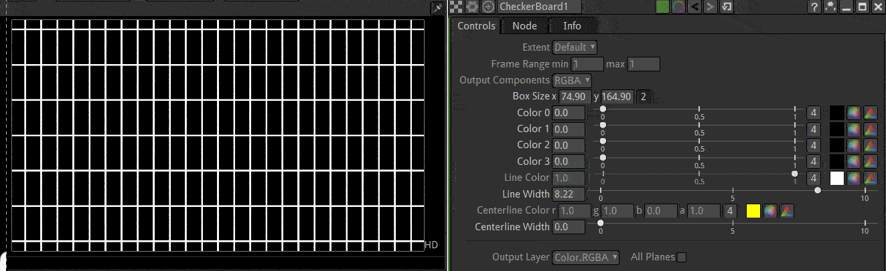
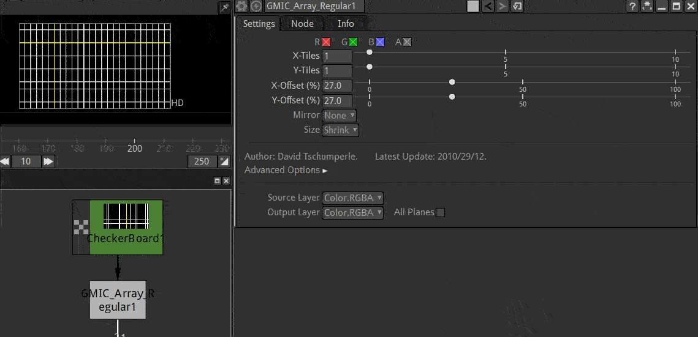

.. for help on writing/extending this file, see the reStructuredText cheatsheet
   http://github.com/ralsina/rst-cheatsheet/raw/master/rst-cheatsheet.pdf
   
Checkerboard Node
=================
   
.. toctree::
    :maxdepth: 2
   
The checkerboard node can be used to generate varoius geometric patterns. By default it generates a checkerboard

 
Usage
--------

The pattern can be changed in size and color.

The Checkerboard can be used to generate a grid when the 'line color" and "line width" are set.

The pattern is centered by default. To control the position of the lines you can add a G'MIC_ArrayRegular node with "X-Tiles"=1 and "Y-Tiles"=1. To make the pattern tileable you will have to change the Extent of the checkerborad to "Size" and choose a vulae that is a multiple of the "Box Size" parameter.

