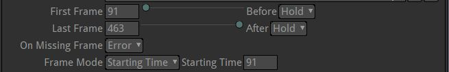
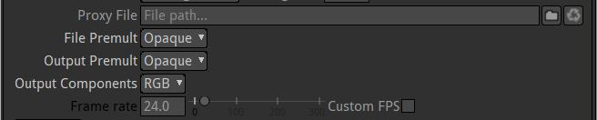
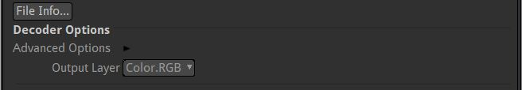
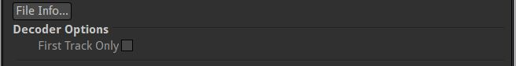
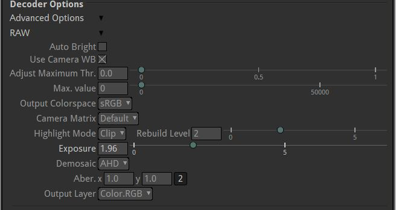
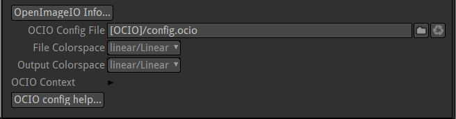

.. for help on writing/extending this file, see the reStructuredText cheatsheet
   http://github.com/ralsina/rst-cheatsheet/raw/master/rst-cheatsheet.pdf
   
Read Node
=========

.. toctree::
   :maxdepth: 2

The read node brings movies or still images into the script. When you call it from the menu (shortcut key R) a file browser will appear. You will need to navigate to the 'Users' folder and look for your user identity in the list.

It might be easier to just drag your files onto the Node Graph where they will automatically be assigned a Read node. Image sequences need to be placed inside a folder, and the folder dropped into Natron. Read-in paths can be tidied up later. Natron will find all image sequences in this folder recursively (ie. folders inside folders)

Filename
--------
| Click on the folder icon to open the file browser and choose the file you want to read from disk.
| See :doc:`The File Browser <getstarted-environment-fileselect>` section for more informations.

Timing
------

The Read node can change the timing attributes of a movie file or image sequence.

Main Settings

* "First Frame" and "Last Frame": By default the value of the beginning and end frames found on disk. (The length is not shown, it is length=Last-First+1 ). You can change the First and Last values tu cut head or tail of your clip
* "Frame mode": The sequence can be moved in time. Selecting "Time Offset" and inputing -100 into this will shift the sequence back in time by 100 frames. "Starting time" use an absolute start time.

Other Settings

* "after" and "before": They define what happens before the first frame and after the last. The default is "hold", but by selecting "loop" or "bounce", looped animations can be made. An example use of this is to loop the swaing of a tree. The value "black" in these menus results in a black transparent image. "error" also gives a black image but should stop a render
* "On Missing Frame": let"s you use a sequence by filling the gaps with previous or next image. This can be used for test renders from 3D rendered only 1 frame out of 2. or to quick fix a broken file that you have to remove

.. note::
   **Tip:**
   Natron behaves way better with image sequence (numbered) files rather than Movies (quicktime, mp4, ...). More reliable, faster access, possibility to overwrite parts of sequence when (re)rendering are the main reasons for this

Interpretation
--------------

The read node can change how the image is imported in the project

Main settings

- "Frame rate" defaults to the value as found in the file. It can be overriden if the file has been encoded with the wrong values

.. note::
   A numbered file sequence has no absolute framerate. So, when loading a sequence you should set the Frame rate here as Natron can not guess from the file. As noted below this will however not change the behavior of Natron

.. note::
   Natron is frame rate agnostic. It means that it will always process one frame in the source to one frame to the output. The framerate is mainly a metadata. You can do framerate conversions explicitely in your node tree. (24 to 25fps with "retime" node set at speed 0.96)

- Premultiplication. If your image has transparent areas, you should know if it was encoded in "premultiplied" or "unpremultiplied" mode. Natron can work in both modes (and switch from one to the other with Premult and Unpremult Nodes)

   For a video leave all this to opaque, for most photoshop like documents use "premultiplied" in all, for some 3D render passes you will switch both to "unpremultiplied".
   If both values are the same, the image is not changed but the metadata passed to the node tree.
   If the values are different, the file is "Premultiplied" or "Unpremultiplied" as needed

.. note::
   Most programs output premultiplied images, but not all 3D renderers

Other settings
- "Output Components" tells Natron wether or not to ditch the Alpha channel from the source file.

Decoding
--------

The read node can change the way an image is rendered from the values in the disk file. These options change with the type of file being read.

jpeg options:

quicktime options:

Allows multi track videos (eg. stereo files) to be split in different Layers in Natron

RAW file options:

PDF file options:

Multi-page PDFs can be loaded in Natron. To view the different pages, add a Shuffle node after the Read node to choose the layer containing the desired page.

Color
-----

The read node can change the color interpretation of an image.

The file will be converted from "File colorspace" to "Output Colorspace"

.. note::
   **Tips:**
     * It is recommended to leave "Output" to linear as this is the recommended basic workflow in Natron
     * When file and Output spaces are the same, no conversion will occur

See :doc:`The readers <compositing-projects-readers>` section for more information.
   
