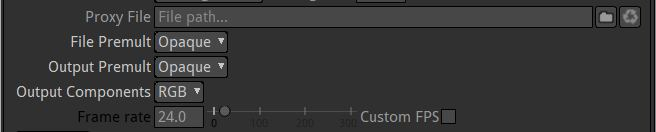

.. for help on writing/extending this file, see the reStructuredText cheatsheet
   http://github.com/ralsina/rst-cheatsheet/raw/master/rst-cheatsheet.pdf
   
Write Node
==========

.. toctree::
   :maxdepth: 2

The Write node is where the result of the script is rendered out. This may be formatted as a .mov file, or as an image sequence.

- Create a write node (shortcut  ``w``).
- Connect the write node to the last node of your NodeTree.
- Press the little folder icon next to the 'file' value, then navigate to Where you wish the result to be rendered. 

See :doc:`The File Browser <getstarted-environment-fileselect>` section for more informations.

- The name of the output must be followed by the file extension of the format (.mov, .tga, .tiff etc). Once this is in place, the parameters in the Write node will expand to include those that are specific to that format.
- The "frame range" "First Frame" "Last Frame" parameter should be specified. In the screen shot below, a frame range of 1 to 665 has been set. 

- Start the Render (ie. start calculation of the result)
   
   * press the "Render" button in the node properties. 
   
   .. image:: _images/TheNodes-Image/node_image_write_render.gif

   * Or go to the menu select Render->Render Selected Writers

Filename
--------

Click on the folder icon to open the file browser and choose the file you want to read from disk.

See :doc:`The File Browser <file_browser>` section for more informations

Format Type
-----------

The size of the output image in pixels. This size is not influenced by the proxy setting of the viewer

Color
-----

The write node can change the color space of the output image.

The file will be converted from "Input colorspace" to "File Colorspace"

.. note::
   **Tips:** Natron
     * It is recommended to leave "Input" to linear as this is the recommended basic workflow in Natron
     * When file and Input spaces are the same, no conversion will occur
     * Output usually is set to the same colorspace as the main read node. This results in an unmodified image.

Interpretation
--------------

The Write node can change how the image is exported to disk

- Premultiplication.
  
   If the processed image has transparent areas and the state of the "premultiplied" flag has been treated properly in your node tree, Natron will guess the value of the "Input Premult". 
   If the result is not correct you can force the "Input Premult" to your liking.

   when writing RGBA to a file format that does not support alpha, the write node just drop alpha and don't premultiply (This is new from v2.4 to avoid that the file written to disk look different from the viewer in Nuke

- Output Components 
   tells Natron wether or not to ditch the Alpha channel. The A option is disabled when image format doesn't support alpha channel

.. note::
   For Quicktime files the Alpha support is located in the encoder options. Beware that most codecs don't actually support alpha channel (DNxHD, Prores do)

Encoding
--------

The read node can change the way an image is rendered from the values in the disk file. These options change with the type of file being read.

quicktime options:

* Frame rate
   defaults to the value in the project settings. It can be overriden for movie file types. Image sequence don't have Frame rate.

.. note::
   **Tip:**
   Natron behaves way better with image sequence (numbered) files rather than Movies (quicktime, mp4, ...). More reliable, faster access, possibility to overwrite parts of sequence when (re)rendering are the main reasons for this

See :doc:`Rendering projects <compositing-projects-render>` section for more information.
