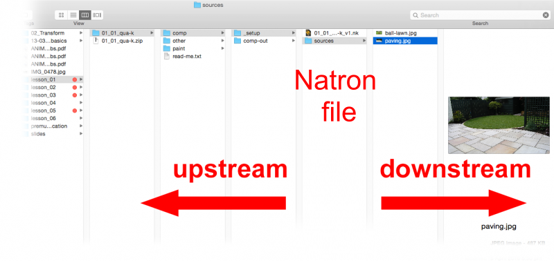
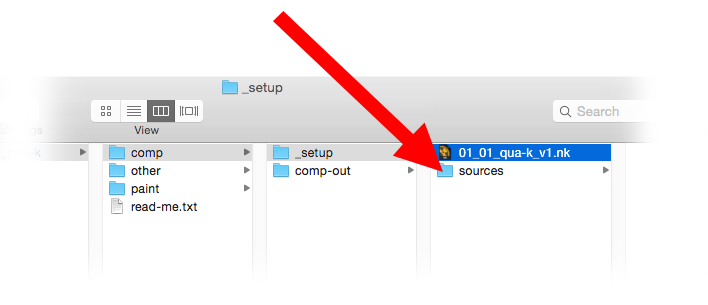

.. for help on writing/extending this file, see the reStructuredText cheatsheet
   http://github.com/ralsina/rst-cheatsheet/raw/master/rst-cheatsheet.pdf
   
   .. _evaluating-script-structure:

Thanks to Martin Constable to allow us to use his documents.
   
Evaluating Script Structure
===========================
tutorials-compositing-projects-setup
Natron is a very 'adult' application that lets you handle your material in any way that you wish.
It will not give you a warning beep or forbid you from doing anything.
For this reason it is very easy to accidentally do things in the 'wrong' way. 
This is a short (non comprehensive) list of common 'bad practice' items.
Of course, sometimes these 'rules' may be broken, but only as an exception.

File Do's and Dont's
--------------------

Folders and files should be well managed: consistently and rationally named.

**Always set the format and FPS in settings before you start**

The format once set (see :ref:`compositing-projects-setup`) , will determine all default formats after that.
This is very important as a wrongly set format can cause the format of all default nodes to be set to something other than the format that you are working in.
This can be infuriating and make script maintains every difficult.

Manage folders and files
-------------------------

**Donʼt use absolute file paths**

An absolute path is one that specifies the location of the file with respect to the computer 
e.g.``My_Computer/school/lesson_one/asset.jpg``.
A relative path is one that defines the location relative to a file or a folder.

An absolute path 'breaks' when the project folder is moved to a new computer, and each filepath will then have to be manually repaired.
A relative path, on the other hand, is far more durable.

There are two flavours of relative paths:
those that look 'downstream' (i.e. into the same folder in which the Natron file is located, or other folders within it) or 'upstream' (i.e. in the parent folders of the folders in which the Natron file is located).

For downstream, the following relative filepath is recommend.
This writes or reads into a folder called 'sources', which is located in the same folder as the Natron file. 
The image below illustrates this relationship:

``[file dirname [value root.name]]/sources/Asset_Name.jpg`` 

For upstream, the following relative filepath is recommend.
This writes or reads into a folder called 'comp-out', which is located 'upstream' to the Natron file.
The image below illustrates this relationship. To go further upstream, the value end-n needs to be increased.

``[join [lrange [split [file dirname [knob root.name]] "/"] 0 end-1] "/"]/comp-out/01_01_qua_v1.jpg``

Read node movies should be formatted as image sequences
-------------------------------------------------------

Movies rendered as QuickTime files can sometimes be difficult to perform time edits upon.
It is highly recommended that movies read into Natron should be rendered first as image sequences (see :ref:`tutorials-imagesequence`).

Script Housekeeping Do's and Dont's
-----------------------------------

Comb your hair and clean your shoes.

**Consider masking stills in Gimp or Krita.**

A Natron roto is not always a good way to mask a still image. Consider masking in Gimp/Krita instead: for complex shapes they are quicker to make and better.
Save the result as tiff or png.

**Avoid side masking a merge node**

Side masks are for things like color corrections, filters etc. They are not to be used to determine transparency in a Merge node.
If the same shape that you were recklessly going to use as a layer mask can be added to the Merge feeds as a Matte value.

**Observe the primacy of the B feed**

A script can be bothersome to manage if B feed primacy is not observed.

**Avoid feeding more than two inputs into a merge node**

Though the Merge node will accept many inputs, it does not do so in a way that is consistent and predictable. Consider instead stacking a whole bunch of merge nodes on top of each other.

**Avoid using too many points when you roto**

Too many points in a roto can be difficult to edit and hell to animate. Use as few as you can.

**Avoid recycling masks**

Two or more sequential nodes masked by the same channel can sometimes cause problems.
Better instead to use a KeyMix.

Color Grading Do's and Dont's
=============================
Some general rules to follow in color grading:

**Use HSL 'color thinking' space**

Color is a volume, with a single color value being a point in that volume.
Describing a point within a volume requires at least three coordinates (e.g. x, y and z).
Such a three point system is referred to as a color space. In digital imaging the color space most commonly used is red, green and blue (RGB).
This may be referred to as our 'working' space. However, when artists are thinking about color they traditionally refer to hue, saturation and lightness (HSL) color space. This is more perceptually agreeable that RGB... artists find it far easier to make aesthetic judgments in this space.

+-----------+--------------------------------------------------------------------------------------------------------------------------------------------------------------------------------------------------------------------+
|HUE        |This can be understood as the 'name space' of the color (i.e. whether it is a blue, green, pink etc).                                                                                                               |
+-----------+--------------------------------------------------------------------------------------------------------------------------------------------------------------------------------------------------------------------+
|Saturation |This refers to the intensity (or purity) of the color. Hence black, white and grey all have zero saturation value. Hue and saturation together make up the chroma component of the color.                           |
+-----------+--------------------------------------------------------------------------------------------------------------------------------------------------------------------------------------------------------------------+
|Lightness  |The lightness values of an image is what we are left looking at if we pull the saturation of an image down to zero. To see the lightness values of an image, hover the cursor over the viewer and press the 'Y' key.|
+-----------+--------------------------------------------------------------------------------------------------------------------------------------------------------------------------------------------------------------------+

Both lightness and saturation are expressed in terms of intensity. They are bound by terminal extremes (maximum and minimum).
They are also related: zero or maximum lightness (i.e. Black and white) both result in zero saturation.
Hue is traditionally expressed as values arranged around a wheel (i.e. A color wheel).

When color grading, it is usual to first address lightness, followed by hue, then saturation.
Sometimes an adjustment to one will result in a slight perpetual change to another.

**Respect the difference between R, G and B**

As already stated, the working space of digital color grading is RGB.
These channel are not identical in what they express:

+-----------+---------------------------------------------------------------------------------------------------------------------------------------------------------------------------------------------------------------------------------------------------------------------------------------------------+
|Red        |This is where details live. Look at the red channel, and see how even-form it is and how well it contains all the fine features of the image.                                                                                                                                                      |
+-----------+---------------------------------------------------------------------------------------------------------------------------------------------------------------------------------------------------------------------------------------------------------------------------------------------------+
|Green      |Green is where the lightness values of the image live. Look at the green channel and see how closely it matches the lightness values of the image. When making a hue adjustment, it is customary to leave the green channel alone, as any adjustment to it could effect the lightness of the image.|
+-----------+---------------------------------------------------------------------------------------------------------------------------------------------------------------------------------------------------------------------------------------------------------------------------------------------------+
|Blue       |Blue is where the large masses of the image lives. It also has the reputation of being the naughty channel, being much inclined to noisiness.                                                                                                                                                      |
+-----------+---------------------------------------------------------------------------------------------------------------------------------------------------------------------------------------------------------------------------------------------------------------------------------------------------+

**Color grade in order**

Color grading may be divided into three stages, delivered in the following order:

   1. Color correction
   2. Color matching
   3. Color stylization

**Splitting up compound color edits**

Complex color edits are best split up into small components. For example, don't try to adjust the lightness and the hue in one operation. Splitting up such compound adjustments into smaller chunks makes them easier to edit and troubleshoot.

**Consider using simple color tools before using complex ones**

Fancy nodes with lots of sliders might look fun to play with but are they necessary?
You will find that for a lot of color correction work simple nodes like Multiply or Saturation is enough.
These require less processing, but also make the script easier to read.

**Donʼt leave 'fiddle' values in the parameters**

When reading someone else's script, it can be very annoying to open something like a ColorCorrect to discover that a multiply has been set to .0003 (or some other random, completely ineffectual value).
If you intend to change a value then do so. If not, then leave it at its default value.

Merging and Premultiplication Do's and Dont's
---------------------------------------------
The following rules apply to any merging operation:

**Don't color correct premultiplied images**

Color correction should not be done on images that are premultiplied.
To un-premultiply you may use an Unpremult node, or use the (un)premult option within the node.

**Don't composite pre-multiplied images**

Don't composite a FG that is not pre-multiplied

**Don't Double pre-multiplication**

Do not apply premultiplication twice in a row to the same image. It can damage the edges of the alpha.

**Donʼt use the composite image that comes out of a keyer**

Most high end keyers output a composite image (the foreground over the background). generally, this should not be used, as no color corrections can be done to the foreground. Better instead to use the keyer's alpha channel ina merging operation further down the node tree.

