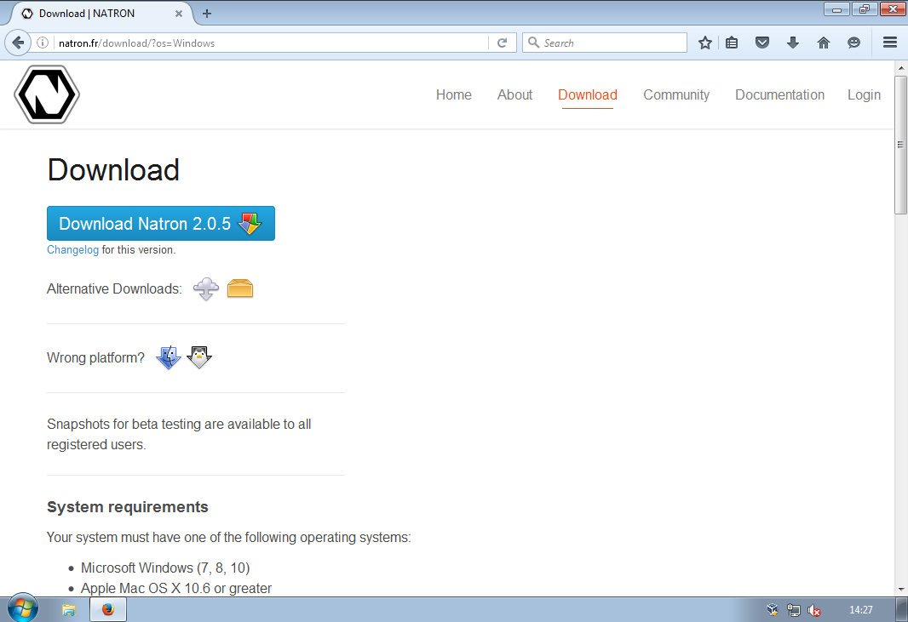
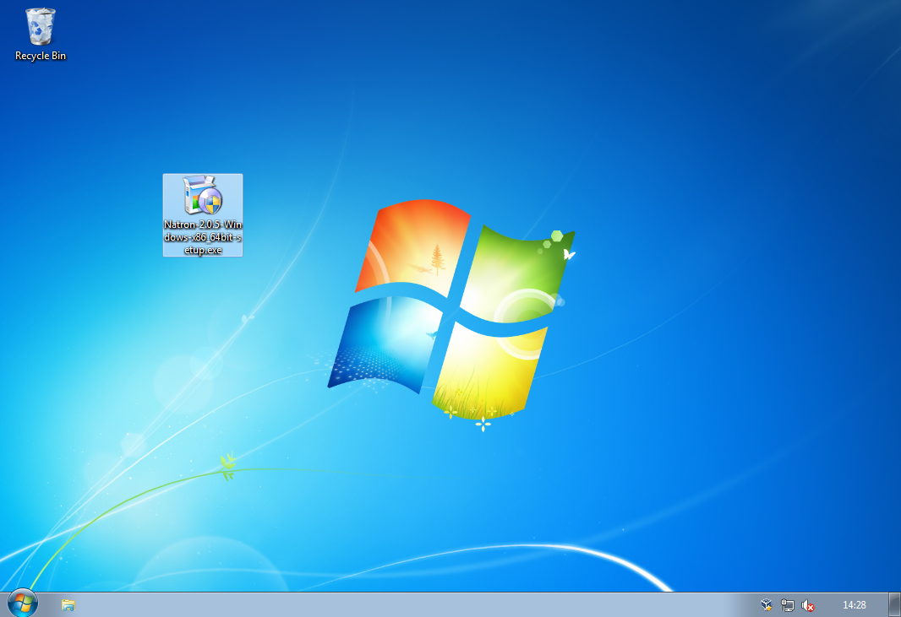
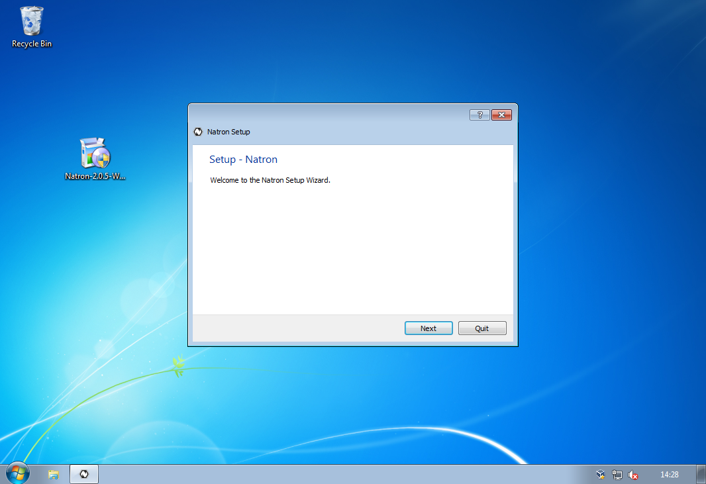
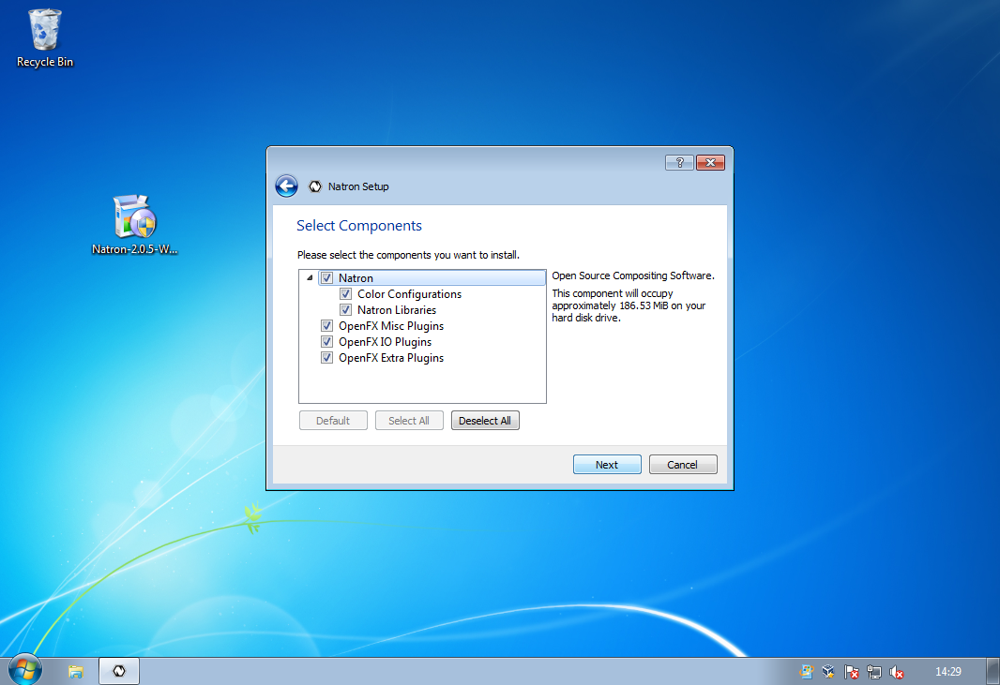
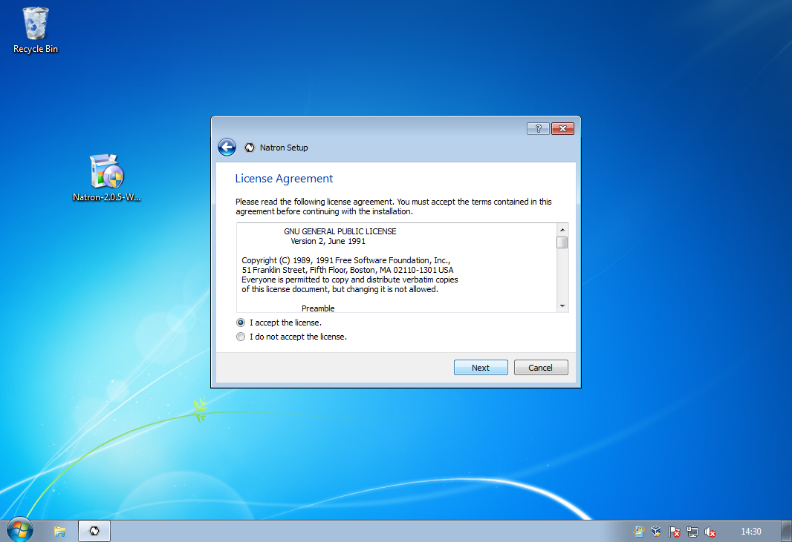
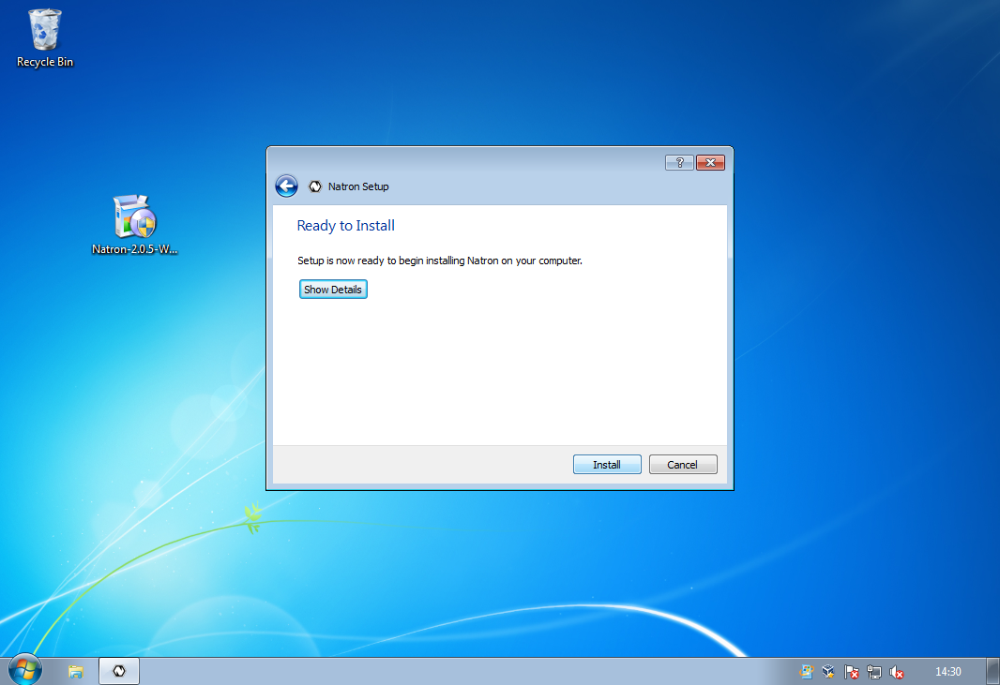
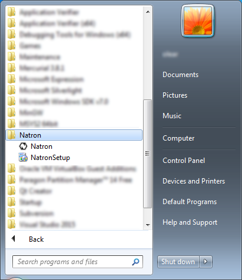
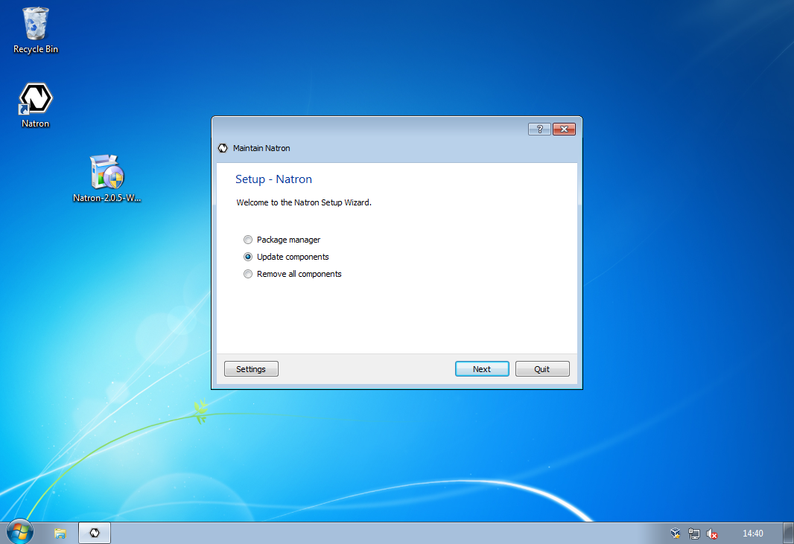
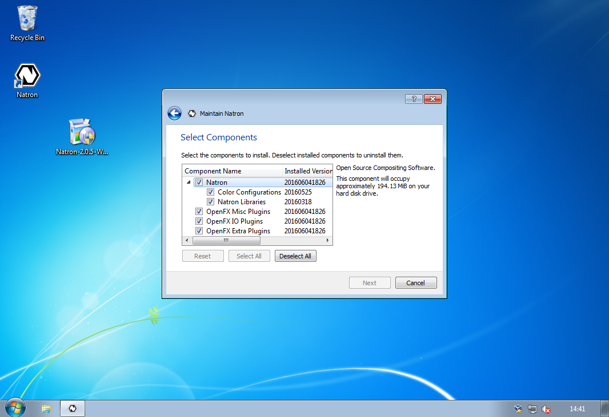

Windows
=======

.. toctree::
   :maxdepth: 2

This chapter will guide your through the installation and maintenance of Natron on Windows.

Requirements
------------

Natron will work on Windows 7, 8.x, 10 with latest updates.

The basic requirements are:

 * x86 compatible CPU (Core2 x86_64 or higher recommended)
 * OpenGL 1.5 compatible graphics card (OpenGL 2.0 or higher recommended)

Download
--------

Navigate to http://natron.fr/download and download the latest version. This documentation will assume that you downloaded the installer (our default and recommended choice).

Install
-------

You are now ready to start the installation, double-click on the setup file to start the installation.

You should now be greated with the installation wizard.

Click 'Next' to start the installation, you first option is where to install Natron. The default location is recommended.

Your next option is the package selection, most users should accept the default. Each package has an more in-depth description if you want to know what they provide.

Then comes the standard license agreement, Natron and it's plug-ins are licensed under the GPL version 2. You can read more about the licenses for each component included in Natron after installation (in Help=>About).

The installation wizard is now ready to install Natron on your computer. The process should not take more than a minute or two (depending on your computer).

The installation is now over! Start Natron and enjoy.

Natron can now be started from the desktop icon or from the start menu.

Maintenance
-----------

Natron includes a maintenance tool called 'NatronSetup', with this application you can easily upgrade Natron and it's components when a new version is available. You can also add or remove individual packages, or remove Natron completely. The application should be in the same start menu folder as Natron, or you can start it from the folder where you installed Natron.

The application also include a basic settings category, where you can configure proxy and other advanced options.
