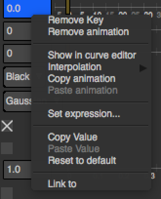
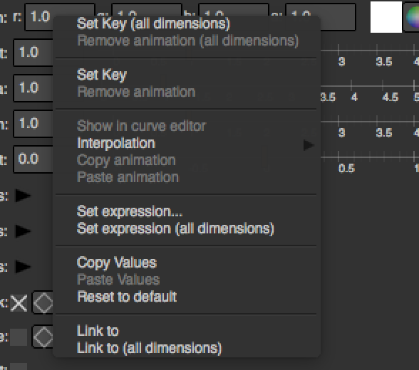
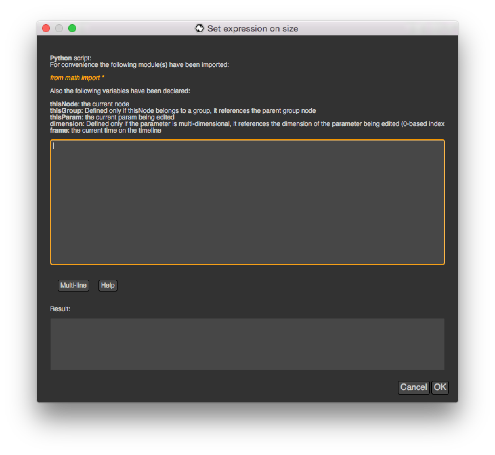

.. _paramExpr:

Parameters expressions
======================

The value of a :doc:`parameter<PythonReference/NatronEngine/Param>` can be set by
Python expressions. An expression is a line of code that can either reference the value
of other parameters or apply mathematical functions to the current value.

The expression will be executed every times the value of the parameter is fetched from a call
to :func:`getValue(dimension)<>` or :func:`get()<>`.

.. warning::

	Note that when an expression is active, all animation is ignored
	and only the result of the expression will be used to return the value of the parameter.

When executing an expression, the expression itself has a **scope**.
The **scope** of the expression defines all nodes and parameters that are possible to use
in the expression in order to produce the output value. 

Any node in the *scope* can has a variable declared corresponding to its script-name::

	Blur1

You would then access a parameter of Blur1 also by its script-name::

	Blur1.size
	
	Group1.Blur1.size
	
.. warning:: 

	Referencing the value of the same parameter which expression is being edited can lead
	to an infinite recursion which Python should warn you about
	
	
	
In fact this is exactly like referencing :ref:`auto-declared<autoVar>` nodes via the *Script Editor*
except that the *app* prefix was removed for nodes in the scope.

See :ref:`this section<nodeScriptName>` to learn how to determine the *script-name* of a node.

See :ref:`this section<paramScriptName>` to learn how to determine the *script-name* of a parameter.

By default a parameter's expression can only refer to parameters of nodes belonging to the
same Group, or to parameters belonging to the parent :doc:`PythonReference/NatronEngine/Group` node.

Parameters of a Group node are also granted in the scope the parameters contained within that group.

For instance if your graph hierarchy looks like this::

	Read1
	Blur1
	Group1/
		Input1
		Blur1
		Convolve1
		Roto1
		Output1
	Viewer1
	
	
A parameter of *Read1* would be able to reference any parameter of *Read1*, *Blur1*, *Group1*, *Viewer1*
but could not reference any parameter of the nodes within *Group1*.

Similarly, a parameter of *Group1.Blur1* would be able to reference any parameter of 
*Group1*, *Group1.Input1* , *Group1.Blur1* , *Group1.Convolve1* , *Group1.Roto1* , *Group1.Output1* but
would not be able to reference any top-level node (*Read1*, *Blur1*, *Viewer1*) except the
*Group1* node.

A parameter of *Group1* would on the other hand be able to reference any parameter in
top-level nodes and in the nodes of *Group1*.

The *scope* was introduced to deal with problems where the user would write expressions
referencing parameters that would probably no longer be referable when loading the script
again in another project.

.. warning::

	Note that you would still be able to reach any node or parameter in the project using the
	*app1* (or *app* prefix in command-line mode)  but is not recommended to do so::
		
		app1.Blur1.size
		
	
All functions available in the Python API are made available to expressions. Also for 
convenience the **math** Python module has been made available by default to expressions.

.. _settingExpr:

Setting an expression:
-----------------------

To create an expression from the user interface, right click a parameter and choose *Set Expression...*

	
Note that for multi-dimensional parameters such as :doc:`PythonReference/NatronEngine/ColorParam`, the
*Set Expression...* entry will **only set an expression for the right-clicked dimension**.

The *Set Expression (all dimensions)* entry will on the other hand set the same expression on all
dimensions of the parameter at once.

	
A dialog will open where you can write the expression:

	
	
By default you do not have to assign any variable as the result of the expression, Natron
will do it by itself::

	#Expression for Blur1.size
	
	Transform1.translate.get[0]
	
	#Will be expanded automatically by Natron to
	
	ret = Transform1.translate.get[0]

However if you were to write an expression that spans over multiple lines you would need
to specifically set the **ret** variable yourself and toggle-on the *multi-line* button::

	a = acos(Transform1.translate.get[0])
	b = sin(Transform1.rotate.get())
	ret = (tan(a * b) / pi) + Group1.customParam.get()
	

You can also set an expression from a script using the :func:`setExpression(expr,hasRetVariable,dimension)<>` function
of :doc:`PythonReference/NatronEngine/AnimatedParam`.

Writing an expression:
----------------------

For convenience the following variables have been declared to Python when executing the expression:

	* **thisNode**: It references the node holding the parameter being edited
	
	* **thisGroup**: It references the group containing *thisNode*

	* **thisParam**: It references the param being edited
	
	* **dimension**: Defined only for multi-dimensional parameters, it indicates the dimension (0-based index)
	of the parameter on which the expression has effect. 
	
	* **frame**: It references the current time on the timeline
	
To reference the value of another parameter use the :func:`get()<>` function which retrieves the value
of the parameter at the current timeline's time. If the parameter is multi-dimensional, you need to use 
the subscript operator to retrieve the value of a particular dimension.

The :func:`getValue(dimension)<>` does the same thing but takes a *dimension* parameter to retrieve
the value of the parameter at a specific *dimension*. The following is equivalent::

	ColorCorrect1.MasterSaturation.get()[dimension]
	
	ColorCorrect1.MasterSaturation.getValue(dimension)
	
Note that for 1-dimensional parameter, the :func:`get()<>`function cannot be used with subscript, e.g::

	Blur1.size.get()
	
To retrieve the value of the parameter at a specific *frame* because the parameter is animated,
you can use the :func:`get(frame)<>` function. 

Again the :func:`getValueAtTime(frame,dimension)<>` does the same thing but takes a *dimension* parameter to retrieve
the value of the parameter at a specific *dimension*. The following lines are equivalent to 
the 2 lines above::

	ColorCorrect1.MasterSaturation.get(frame)[dimension]
	
	ColorCorrect1.MasterSaturation.getValueAtTime(frame,dimension)

We ask for the value of the *MasterSaturation* parameter of the *ColorCorrect1* node its value
at the current *frame* and at the current *dimension*, which is the same as calling the :func:`get()<>` function
without a *frame* in parameter.

Copying another parameter through expressions:
----------------------------------------------

If we want the value of the parameter **size** of the node *BlurCImg1*  to copy the
parameter **mix** of the node *DilateCImg1*, we would set the following expression on the
**size** parameter of the node *BlurCImg1* (see :ref:`setting an expression<settingExpr>`)::
 
 	DilateCImg1.mix.get()
 	
 
If mix has an animation and we wanted to get the value of the mix at the previous *frame*, 
the following code would work::
 
 	DilateCImg1.mix.get(frame - 1)
 	
 
Note that when choosing the *Link to...* option when right-clicking a parameter, Natron writes
automatically an expression to copy the parameter to link to for you. 
	