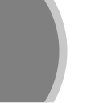

.. _eu.cimg.EdgeDetect:

EdgeDetect node
===============

.. raw:: html

   <!-- Do not edit this file! It is generated automatically by Natron itself. -->

|pluginIcon| 

*This documentation is for version 4.0 of EdgeDetect (eu.cimg.EdgeDetect).*

Description
-----------

Perform edge detection by computing the image gradient magnitude. Optionally, edge detection can be preceded by blurring, and followed by erosion and thresholding. In most cases, EdgeDetect is followed a Grade node to extract the proper edges and generate a mask from these.

For color or multi-channel images, several edge detection algorithms are proposed to combine the gradients computed in each channel:

- Separate: the gradient magnitude is computed in each channel separately, and the output is a color edge image.

- RMS: the RMS of per-channel gradients magnitudes is computed.

- Max: the maximum per-channel gradient magnitude is computed.

- Tensor: the tensor gradient norm [1].

References:

- [1] Silvano Di Zenzo, A note on the gradient of a multi-image, CVGIP 33, 116-125 (1986). http://people.csail.mit.edu/tieu/notebook/imageproc/dizenzo86.pdf

CImg is a free, open-source library distributed under the CeCILL-C (close to the GNU LGPL) or CeCILL (compatible with the GNU GPL) licenses. It can be used in commercial applications (see http://cimg.eu).

Inputs
------

+--------+-------------+----------+
| Input  | Description | Optional |
+========+=============+==========+
| Source |             | No       |
+--------+-------------+----------+
| Mask   |             | Yes      |
+--------+-------------+----------+

Controls
--------

.. tabularcolumns:: |>{\raggedright}p{0.2\columnwidth}|>{\raggedright}p{0.06\columnwidth}|>{\raggedright}p{0.07\columnwidth}|p{0.63\columnwidth}|

.. cssclass:: longtable

+-----------------------------------+---------+----------+----------------------------------------------------------------------------------------------------------------------------------------------------------------------------------------------------------------------------------------------------------------+
| Parameter / script name           | Type    | Default  | Function                                                                                                                                                                                                                                                       |
+===================================+=========+==========+================================================================================================================================================================================================================================================================+
| Filter / ``filter``               | Choice  | Gaussian | | Edge detection filter. If the blur size is not zero, it is used as the kernel size for quasi-Gaussian, Gaussian, box, triangle and quadratic filters. For the simple, rotation-invariant and Sobel filters, the image is pre-blurred with a Gaussian filter. |
|                                   |         |          | | **Simple (simple)**: Gradient is estimated by centered finite differences.                                                                                                                                                                                   |
|                                   |         |          | | **Sobel (sobel)**: Compute gradient using the Sobel 3x3 filter.                                                                                                                                                                                              |
|                                   |         |          | | **Rotation Invariant (rotinvariant)**: Compute gradient using a 3x3 rotation-invariant filter.                                                                                                                                                               |
|                                   |         |          | | **Quasi-Gaussian (quasigaussian)**: Quasi-Gaussian filter (0-order recursive Deriche filter, faster) - IIR (infinite support / impulsional response).                                                                                                        |
|                                   |         |          | | **Gaussian (gaussian)**: Gaussian filter (Van Vliet recursive Gaussian filter, more isotropic, slower) - IIR (infinite support / impulsional response).                                                                                                      |
|                                   |         |          | | **Box (box)**: Box filter - FIR (finite support / impulsional response).                                                                                                                                                                                     |
|                                   |         |          | | **Triangle (triangle)**: Triangle/tent filter - FIR (finite support / impulsional response).                                                                                                                                                                 |
|                                   |         |          | | **Quadratic (quadratic)**: Quadratic filter - FIR (finite support / impulsional response).                                                                                                                                                                   |
+-----------------------------------+---------+----------+----------------------------------------------------------------------------------------------------------------------------------------------------------------------------------------------------------------------------------------------------------------+
| Multi-Channel / ``multiChannel``  | Choice  | Tensor   | | Operation used to combine multi-channel (e.g. color) gradients into an edge detector. This parameter has no effect if a single channel (e.g. alpha) is processed.                                                                                            |
|                                   |         |          | | **Separate (separate)**: The gradient magnitude is computed in each channel separately, and the output is a color edge image.                                                                                                                                |
|                                   |         |          | | **RMS (rms)**: The RMS of per-channel gradients magnitudes is computed.                                                                                                                                                                                      |
|                                   |         |          | | **Max (max)**: The maximum per-channel gradient magnitude is computed.                                                                                                                                                                                       |
|                                   |         |          | | **Tensor (tensor)**: The tensor gradient norm is computed. See Silvano Di Zenzo, A note on the gradient of a multi-image, CVGIP 33, 116-125 (1986).                                                                                                          |
+-----------------------------------+---------+----------+----------------------------------------------------------------------------------------------------------------------------------------------------------------------------------------------------------------------------------------------------------------+
| Blur Size / ``blurSize``          | Double  | 0        | Size of the blur kernel applied before edge detection.                                                                                                                                                                                                         |
+-----------------------------------+---------+----------+----------------------------------------------------------------------------------------------------------------------------------------------------------------------------------------------------------------------------------------------------------------+
| Erode Size / ``erodeSize``        | Double  | 0        | Size of the erosion performed after edge detection.                                                                                                                                                                                                            |
+-----------------------------------+---------+----------+----------------------------------------------------------------------------------------------------------------------------------------------------------------------------------------------------------------------------------------------------------------+
| Non-Maxima Suppression / ``nms``  | Boolean | Off      | Perform non-maxima suppression (after edge detection and erosion): only values that are maximal in the direction orthogonal to the contour are kept. For multi-channel images, the contour direction estimation depends on the multi-channel operation.        |
+-----------------------------------+---------+----------+----------------------------------------------------------------------------------------------------------------------------------------------------------------------------------------------------------------------------------------------------------------+
| Expand RoD / ``expandRoD``        | Boolean | On       | Expand the source region of definition by 1.5*size (3.6*sigma).                                                                                                                                                                                                |
+-----------------------------------+---------+----------+----------------------------------------------------------------------------------------------------------------------------------------------------------------------------------------------------------------------------------------------------------------+
| Crop To Format / ``cropToFormat`` | Boolean | On       | If the source is inside the format and the effect extends it outside of the format, crop it to avoid unnecessary calculations. To avoid unwanted crops, only the borders that were inside of the format in the source clip will be cropped.                    |
+-----------------------------------+---------+----------+----------------------------------------------------------------------------------------------------------------------------------------------------------------------------------------------------------------------------------------------------------------+
| (Un)premult / ``premult``         | Boolean | Off      | Divide the image by the alpha channel before processing, and re-multiply it afterwards. Use if the input images are premultiplied.                                                                                                                             |
+-----------------------------------+---------+----------+----------------------------------------------------------------------------------------------------------------------------------------------------------------------------------------------------------------------------------------------------------------+
| Invert Mask / ``maskInvert``      | Boolean | Off      | When checked, the effect is fully applied where the mask is 0.                                                                                                                                                                                                 |
+-----------------------------------+---------+----------+----------------------------------------------------------------------------------------------------------------------------------------------------------------------------------------------------------------------------------------------------------------+
| Mix / ``mix``                     | Double  | 1        | Mix factor between the original and the transformed image.                                                                                                                                                                                                     |
+-----------------------------------+---------+----------+----------------------------------------------------------------------------------------------------------------------------------------------------------------------------------------------------------------------------------------------------------------+

