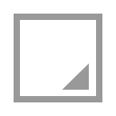

.. _fr.inria.openfx.OIIOResize:

Resize node
===========

.. raw:: html

   <!-- Do not edit this file! It is generated automatically by Natron itself. -->

|pluginIcon| 

*This documentation is for version 2.0 of Resize (fr.inria.openfx.OIIOResize).*

Description
-----------

Resize input stream, using OpenImageIO.

Note that only full images can be rendered, so it may be slower for interactive editing than the Reformat plugin.

However, the rendering algorithms are different between Reformat and Resize: Resize applies 1-dimensional filters in the horizontal and vertical directins, whereas Reformat resamples the image, so in some cases this plugin may give more visually pleasant results than Reformat.

This plugin does not concatenate transforms (as opposed to Reformat).

Inputs
------

+--------+-------------+----------+
| Input  | Description | Optional |
+========+=============+==========+
| Source |             | No       |
+--------+-------------+----------+

Controls
--------

.. tabularcolumns:: |>{\raggedright}p{0.2\columnwidth}|>{\raggedright}p{0.06\columnwidth}|>{\raggedright}p{0.07\columnwidth}|p{0.63\columnwidth}|

.. cssclass:: longtable

+--------------------------------+---------+------------------+----------------------------------------------------------------------------------------------------------------------------------------------------------------------------+
| Parameter / script name        | Type    | Default          | Function                                                                                                                                                                   |
+================================+=========+==================+============================================================================================================================================================================+
| Type / ``type``                | Choice  | Format           | | Format: Converts between formats, the image is resized to fit in the target format. Size: Scales to fit into a box of a given width and height. Scale: Scales the image. |
|                                |         |                  | | **Format (format)**                                                                                                                                                      |
|                                |         |                  | | **Size (size)**                                                                                                                                                          |
|                                |         |                  | | **Scale (scale)**                                                                                                                                                        |
+--------------------------------+---------+------------------+----------------------------------------------------------------------------------------------------------------------------------------------------------------------------+
| Format / ``format``            | Choice  | PC_Video 640x480 | | The output format                                                                                                                                                        |
|                                |         |                  | | **PC_Video 640x480 (PC_Video)**                                                                                                                                          |
|                                |         |                  | | **NTSC 720x486 0.91 (NTSC)**                                                                                                                                             |
|                                |         |                  | | **PAL 720x576 1.09 (PAL)**                                                                                                                                               |
|                                |         |                  | | **NTSC_16:9 720x486 1.21 (NTSC_16:9)**                                                                                                                                   |
|                                |         |                  | | **PAL_16:9 720x576 1.46 (PAL_16:9)**                                                                                                                                     |
|                                |         |                  | | **HD_720 1280x1720 (HD_720)**                                                                                                                                            |
|                                |         |                  | | **HD 1920x1080 (HD)**                                                                                                                                                    |
|                                |         |                  | | **UHD_4K 3840x2160 (UHD_4K)**                                                                                                                                            |
|                                |         |                  | | **1K_Super35(full-ap) 1024x778 (1K_Super35(full-ap))**                                                                                                                   |
|                                |         |                  | | **1K_Cinemascope 914x778 2 (1K_Cinemascope)**                                                                                                                            |
|                                |         |                  | | **2K_Super35(full-ap) 2048x1556 (2K_Super35(full-ap))**                                                                                                                  |
|                                |         |                  | | **2K_Cinemascope 1828x1556 2 (2K_Cinemascope)**                                                                                                                          |
|                                |         |                  | | **2K_DCP 2048x1080 (2K_DCP)**                                                                                                                                            |
|                                |         |                  | | **4K_Super35(full-ap) 4096x3112 (4K_Super35(full-ap))**                                                                                                                  |
|                                |         |                  | | **4K_Cinemascope 3656x3112 2 (4K_Cinemascope)**                                                                                                                          |
|                                |         |                  | | **4K_DCP 4096x2160 (4K_DCP)**                                                                                                                                            |
|                                |         |                  | | **square_256 256x256 (square_256)**                                                                                                                                      |
|                                |         |                  | | **square_512 512x512 (square_512)**                                                                                                                                      |
|                                |         |                  | | **square_1K 1024x1024 (square_1K)**                                                                                                                                      |
|                                |         |                  | | **square_2K 2048x2048 (square_2K)**                                                                                                                                      |
+--------------------------------+---------+------------------+----------------------------------------------------------------------------------------------------------------------------------------------------------------------------+
| Size / ``size``                | Integer | x: 200 y: 200    | The output size                                                                                                                                                            |
+--------------------------------+---------+------------------+----------------------------------------------------------------------------------------------------------------------------------------------------------------------------+
| Preserve PAR / ``preservePAR`` | Boolean | On               | Preserve Pixel Aspect Ratio (PAR). When checked, one direction will be clipped.                                                                                            |
+--------------------------------+---------+------------------+----------------------------------------------------------------------------------------------------------------------------------------------------------------------------+
| Scale / ``scale``              | Double  | x: 1 y: 1        | The scale factor to apply to the image.                                                                                                                                    |
+--------------------------------+---------+------------------+----------------------------------------------------------------------------------------------------------------------------------------------------------------------------+
| Filter / ``filter``            | Choice  | Default          | | The filter used to resize. Lanczos3 is great for downscaling and blackman-harris is great for upscaling.                                                                 |
|                                |         |                  | | **Impulse (impulse)**: No interpolation.                                                                                                                                 |
|                                |         |                  | | **box**                                                                                                                                                                  |
|                                |         |                  | | **triangle**                                                                                                                                                             |
|                                |         |                  | | **gaussian**                                                                                                                                                             |
|                                |         |                  | | **sharp-gaussian**                                                                                                                                                       |
|                                |         |                  | | **catmull-rom**                                                                                                                                                          |
|                                |         |                  | | **blackman-harris**                                                                                                                                                      |
|                                |         |                  | | **sinc**                                                                                                                                                                 |
|                                |         |                  | | **lanczos3**                                                                                                                                                             |
|                                |         |                  | | **radial-lanczos3**                                                                                                                                                      |
|                                |         |                  | | **nuke-lanczos6**                                                                                                                                                        |
|                                |         |                  | | **mitchell**                                                                                                                                                             |
|                                |         |                  | | **bspline**                                                                                                                                                              |
|                                |         |                  | | **disk**                                                                                                                                                                 |
|                                |         |                  | | **cubic**                                                                                                                                                                |
|                                |         |                  | | **keys**                                                                                                                                                                 |
|                                |         |                  | | **simon**                                                                                                                                                                |
|                                |         |                  | | **rifman**                                                                                                                                                               |
|                                |         |                  | | **Default (default)**: blackman-harris when increasing resolution, lanczos3 when decreasing resolution.                                                                  |
+--------------------------------+---------+------------------+----------------------------------------------------------------------------------------------------------------------------------------------------------------------------+

