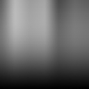

.. _net.fxarena.openfx.Modulate:

Modulate node
=============

|pluginIcon| 

*This documentation is for version 1.2 of Modulate.*

Modulate color node.

Powered by ImageMagick 6.9.6-6 Q32 x86\_64 2017-01-04 http://www.imagemagick.org

ImageMagick (R) is Copyright 1999-2015 ImageMagick Studio LLC, a non-profit organization dedicated to making software imaging solutions freely available.

ImageMagick is distributed under the Apache 2.0 license.

Inputs
------

+----------+---------------+------------+
| Input    | Description   | Optional   |
+==========+===============+============+
| Source   |               | No         |
+----------+---------------+------------+
| Mask     |               | Yes        |
+----------+---------------+------------+

Controls
--------

.. tabularcolumns:: |>{\raggedright}p{0.2\columnwidth}|>{\raggedright}p{0.06\columnwidth}|>{\raggedright}p{0.07\columnwidth}|p{0.63\columnwidth}|

.. cssclass:: longtable

+-------------------------------+-----------+-----------+---------------------------------------------------------------------------------------------------------+
| Parameter / script name       | Type      | Default   | Function                                                                                                |
+===============================+===========+===========+=========================================================================================================+
| Brightness / ``brightness``   | Double    | 100       | Adjust brightness (%)                                                                                   |
+-------------------------------+-----------+-----------+---------------------------------------------------------------------------------------------------------+
| Saturation / ``saturation``   | Double    | 100       | Adjust saturation (%)                                                                                   |
+-------------------------------+-----------+-----------+---------------------------------------------------------------------------------------------------------+
| Hue / ``hue``                 | Double    | 100       | Adjust hue (%)                                                                                          |
+-------------------------------+-----------+-----------+---------------------------------------------------------------------------------------------------------+
| OpenMP / ``openmp``           | Boolean   | On        | Enable/Disable OpenMP support. This will enable the plugin to use as many threads as allowed by host.   |
+-------------------------------+-----------+-----------+---------------------------------------------------------------------------------------------------------+
| OpenCL / ``opencl``           | Boolean   | Off       | Enable/Disable OpenCL. This will enable the plugin to use supported GPU(s) for better performance.      |
+-------------------------------+-----------+-----------+---------------------------------------------------------------------------------------------------------+

