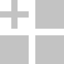

.. _net.fxarena.openfx.Tile:

Tile node
=========

.. raw:: html

   <!-- Do not edit this file! It is generated automatically by Natron itself. -->

|pluginIcon| 

*This documentation is for version 3.2 of Tile (net.fxarena.openfx.Tile).*

Description
-----------

Tile transform node.

Inputs
------

+--------+-------------+----------+
| Input  | Description | Optional |
+========+=============+==========+
| Source |             | No       |
+--------+-------------+----------+
| Mask   |             | Yes      |
+--------+-------------+----------+

Controls
--------

.. tabularcolumns:: |>{\raggedright}p{0.2\columnwidth}|>{\raggedright}p{0.06\columnwidth}|>{\raggedright}p{0.07\columnwidth}|p{0.63\columnwidth}|

.. cssclass:: longtable

+----------------------------------+---------+---------+-------------------------------------------------------------------------------------------------------+
| Parameter / script name          | Type    | Default | Function                                                                                              |
+==================================+=========+=========+=======================================================================================================+
| Rows / ``rows``                  | Integer | 2       | Rows in grid                                                                                          |
+----------------------------------+---------+---------+-------------------------------------------------------------------------------------------------------+
| Columns / ``cols``               | Integer | 2       | Columns in grid                                                                                       |
+----------------------------------+---------+---------+-------------------------------------------------------------------------------------------------------+
| Time Offset / ``offset``         | Integer | 0       | Set a time offset                                                                                     |
+----------------------------------+---------+---------+-------------------------------------------------------------------------------------------------------+
| Keep first frame / ``keepFirst`` | Boolean | On      | Stay on first frame if offset                                                                         |
+----------------------------------+---------+---------+-------------------------------------------------------------------------------------------------------+
| Matte / ``matte``                | Boolean | Off     | Merge Alpha before applying effect                                                                    |
+----------------------------------+---------+---------+-------------------------------------------------------------------------------------------------------+
| OpenMP / ``openmp``              | Boolean | Off     | Enable/Disable OpenMP support. This will enable the plugin to use as many threads as allowed by host. |
+----------------------------------+---------+---------+-------------------------------------------------------------------------------------------------------+

