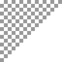

.. _net.sf.cimg.CImgDenoise:

SmoothPatchBased node
=====================

.. raw:: html

   <!-- Do not edit this file! It is generated automatically by Natron itself. -->

|pluginIcon| 

*This documentation is for version 2.0 of SmoothPatchBased (net.sf.cimg.CImgDenoise).*

Description
-----------

Denoise selected images by non-local patch averaging.

This uses the method described in: Non-Local Image Smoothing by Applying Anisotropic Diffusion PDE’s in the Space of Patches (D. Tschumperlé, L. Brun), ICIP’09 (https://tschumperle.users.greyc.fr/publications/tschumperle_icip09.pdf).

Uses the ‘blur_patch’ function from the CImg library.

CImg is a free, open-source library distributed under the CeCILL-C (close to the GNU LGPL) or CeCILL (compatible with the GNU GPL) licenses. It can be used in commercial applications (see http://cimg.eu).

Inputs
------

+--------+-------------+----------+
| Input  | Description | Optional |
+========+=============+==========+
| Source |             | No       |
+--------+-------------+----------+
| Mask   |             | Yes      |
+--------+-------------+----------+

Controls
--------

.. tabularcolumns:: |>{\raggedright}p{0.2\columnwidth}|>{\raggedright}p{0.06\columnwidth}|>{\raggedright}p{0.07\columnwidth}|p{0.63\columnwidth}|

.. cssclass:: longtable

+------------------------------------------------+---------+---------+-----------------------------------------------------------------------------------------------------------------------------------------------------------------------------------------------------------------------------------------+
| Parameter / script name                        | Type    | Default | Function                                                                                                                                                                                                                                |
+================================================+=========+=========+=========================================================================================================================================================================================================================================+
| Spatial Std Dev / ``sigma_s``                  | Double  | 10      | Standard deviation of the spatial kernel, in pixel units (>=0).                                                                                                                                                                         |
+------------------------------------------------+---------+---------+-----------------------------------------------------------------------------------------------------------------------------------------------------------------------------------------------------------------------------------------+
| Value Std Dev / ``sigma_r``                    | Double  | 0.05    | Standard deviation of the range kernel, in intensity units (>=0). In the context of denoising, Liu et al. (“Noise estimation from a single image”, CVPR2006) recommend a value of 1.95*sigma_n, where sigma_n is the local image noise. |
+------------------------------------------------+---------+---------+-----------------------------------------------------------------------------------------------------------------------------------------------------------------------------------------------------------------------------------------+
| Patch Size / ``psize``                         | Integer | 5       | Size of the patchs, in pixels (>=0).                                                                                                                                                                                                    |
+------------------------------------------------+---------+---------+-----------------------------------------------------------------------------------------------------------------------------------------------------------------------------------------------------------------------------------------+
| Lookup Size / ``lsize``                        | Integer | 6       | Size of the window to search similar patchs, in pixels (>=0).                                                                                                                                                                           |
+------------------------------------------------+---------+---------+-----------------------------------------------------------------------------------------------------------------------------------------------------------------------------------------------------------------------------------------+
| Smoothness / ``smoothness``                    | Double  | 1       | Smoothness for the patch comparison, in pixels (>=0).                                                                                                                                                                                   |
+------------------------------------------------+---------+---------+-----------------------------------------------------------------------------------------------------------------------------------------------------------------------------------------------------------------------------------------+
| fast Approximation / ``is_fast_approximation`` | Boolean | On      | Tells if a fast approximation of the gaussian function is used or not                                                                                                                                                                   |
+------------------------------------------------+---------+---------+-----------------------------------------------------------------------------------------------------------------------------------------------------------------------------------------------------------------------------------------+
| (Un)premult / ``premult``                      | Boolean | Off     | Divide the image by the alpha channel before processing, and re-multiply it afterwards. Use if the input images are premultiplied.                                                                                                      |
+------------------------------------------------+---------+---------+-----------------------------------------------------------------------------------------------------------------------------------------------------------------------------------------------------------------------------------------+
| Invert Mask / ``maskInvert``                   | Boolean | Off     | When checked, the effect is fully applied where the mask is 0.                                                                                                                                                                          |
+------------------------------------------------+---------+---------+-----------------------------------------------------------------------------------------------------------------------------------------------------------------------------------------------------------------------------------------+
| Mix / ``mix``                                  | Double  | 1       | Mix factor between the original and the transformed image.                                                                                                                                                                              |
+------------------------------------------------+---------+---------+-----------------------------------------------------------------------------------------------------------------------------------------------------------------------------------------------------------------------------------------+

