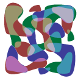

.. _net.sf.cimg.CImgPlasma:

Plasma node
===========

.. raw:: html

   <!-- Do not edit this file! It is generated automatically by Natron itself. -->

|pluginIcon| 

*This documentation is for version 2.0 of Plasma (net.sf.cimg.CImgPlasma).*

Description
-----------

Draw a random plasma texture (using the mid-point algorithm).

Uses the ‘draw_plasma’ function from the CImg library, modified so that noise is reproductible at each render..

CImg is a free, open-source library distributed under the CeCILL-C (close to the GNU LGPL) or CeCILL (compatible with the GNU GPL) licenses. It can be used in commercial applications (see http://cimg.eu).

Inputs
------

+--------+-------------+----------+
| Input  | Description | Optional |
+========+=============+==========+
| Source |             | Yes      |
+--------+-------------+----------+
| Mask   |             | Yes      |
+--------+-------------+----------+

Controls
--------

.. tabularcolumns:: |>{\raggedright}p{0.2\columnwidth}|>{\raggedright}p{0.06\columnwidth}|>{\raggedright}p{0.07\columnwidth}|p{0.63\columnwidth}|

.. cssclass:: longtable

+------------------------------+---------+---------+------------------------------------------------------------------------------------------------------------------------------------+
| Parameter / script name      | Type    | Default | Function                                                                                                                           |
+==============================+=========+=========+====================================================================================================================================+
| Alpha / ``alpha``            | Double  | 0.002   | Alpha-parameter, in intensity units (>=0).                                                                                         |
+------------------------------+---------+---------+------------------------------------------------------------------------------------------------------------------------------------+
| Beta / ``beta``              | Double  | 0       | Beta-parameter, in intensity units (>=0).                                                                                          |
+------------------------------+---------+---------+------------------------------------------------------------------------------------------------------------------------------------+
| Scale / ``scale``            | Integer | 8       | Noise scale, as a power of two (>=0).                                                                                              |
+------------------------------+---------+---------+------------------------------------------------------------------------------------------------------------------------------------+
| Offset / ``offset``          | Double  | 0       | Offset to add to the plasma noise.                                                                                                 |
+------------------------------+---------+---------+------------------------------------------------------------------------------------------------------------------------------------+
| Seed / ``seed``              | Integer | 2000    | Random seed: change this if you want different instances to have different noise.                                                  |
+------------------------------+---------+---------+------------------------------------------------------------------------------------------------------------------------------------+
| Static Seed / ``staticSeed`` | Boolean | On      | When enabled, the dither pattern remains the same for every frame producing a constant noise effect.                               |
+------------------------------+---------+---------+------------------------------------------------------------------------------------------------------------------------------------+
| (Un)premult / ``premult``    | Boolean | Off     | Divide the image by the alpha channel before processing, and re-multiply it afterwards. Use if the input images are premultiplied. |
+------------------------------+---------+---------+------------------------------------------------------------------------------------------------------------------------------------+
| Invert Mask / ``maskInvert`` | Boolean | Off     | When checked, the effect is fully applied where the mask is 0.                                                                     |
+------------------------------+---------+---------+------------------------------------------------------------------------------------------------------------------------------------+
| Mix / ``mix``                | Double  | 1       | Mix factor between the original and the transformed image.                                                                         |
+------------------------------+---------+---------+------------------------------------------------------------------------------------------------------------------------------------+

