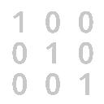

.. _net.sf.openfx.ColorMatrixPlugin:

ColorMatrixOFX
==============

*This documentation is for version 2.0 of ColorMatrixOFX.*

Multiply the RGBA channels by an arbitrary 4x4 matrix.

Inputs
------

+----------+---------------+------------+
| Input    | Description   | Optional   |
+==========+===============+============+
| Source   |               | No         |
+----------+---------------+------------+
| Mask     |               | Yes        |
+----------+---------------+------------+

Controls
--------

+-------------------+---------------+-----------+-----------------------+--------------------------------------------------------------------------------------------------------------------------------------+
| Label (UI Name)   | Script-Name   | Type      | Default-Value         | Function                                                                                                                             |
+===================+===============+===========+=======================+======================================================================================================================================+
| Output Red        | outputRed     | Color     | r: 1 g: 0 b: 0 a: 0   | values for red output component.                                                                                                     |
+-------------------+---------------+-----------+-----------------------+--------------------------------------------------------------------------------------------------------------------------------------+
| Output Green      | outputGreen   | Color     | r: 0 g: 1 b: 0 a: 0   | values for green output component.                                                                                                   |
+-------------------+---------------+-----------+-----------------------+--------------------------------------------------------------------------------------------------------------------------------------+
| Output Blue       | outputBlue    | Color     | r: 0 g: 0 b: 1 a: 0   | values for blue output component.                                                                                                    |
+-------------------+---------------+-----------+-----------------------+--------------------------------------------------------------------------------------------------------------------------------------+
| Output Alpha      | outputAlpha   | Color     | r: 0 g: 0 b: 0 a: 1   | values for alpha output component.                                                                                                   |
+-------------------+---------------+-----------+-----------------------+--------------------------------------------------------------------------------------------------------------------------------------+
| Clamp Black       | clampBlack    | Boolean   | On                    | All colors below 0 on output are set to 0.                                                                                           |
+-------------------+---------------+-----------+-----------------------+--------------------------------------------------------------------------------------------------------------------------------------+
| Clamp White       | clampWhite    | Boolean   | Off                   | All colors above 1 on output are set to 1.                                                                                           |
+-------------------+---------------+-----------+-----------------------+--------------------------------------------------------------------------------------------------------------------------------------+
| (Un)premult       | premult       | Boolean   | Off                   | Divide the image by the alpha channel before processing, and re-multiply it afterwards. Use if the input images are premultiplied.   |
+-------------------+---------------+-----------+-----------------------+--------------------------------------------------------------------------------------------------------------------------------------+
| Invert Mask       | maskInvert    | Boolean   | Off                   | When checked, the effect is fully applied where the mask is 0.                                                                       |
+-------------------+---------------+-----------+-----------------------+--------------------------------------------------------------------------------------------------------------------------------------+
| Mix               | mix           | Double    | 1                     | Mix factor between the original and the transformed image.                                                                           |
+-------------------+---------------+-----------+-----------------------+--------------------------------------------------------------------------------------------------------------------------------------+
