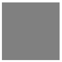

.. _net.sf.openfx.ConstantPlugin:

ConstantOFX
===========

*This documentation is for version 1.0 of ConstantOFX.*

Generate an image with a constant color.

See also: http://opticalenquiry.com/nuke/index.php?title=Constant,\_CheckerBoard,\_ColorBars,\_ColorWheel

Inputs
------

+----------+---------------+------------+
| Input    | Description   | Optional   |
+==========+===============+============+
| Source   |               | Yes        |
+----------+---------------+------------+

Controls
--------

+----------------------+---------------------------+-----------+-----------------------+--------------------------------------------------------------------------------------------------------------------------------------------------------------------------------------------------------------------------------------------------------------------------------------+
| Label (UI Name)      | Script-Name               | Type      | Default-Value         | Function                                                                                                                                                                                                                                                                             |
+======================+===========================+===========+=======================+======================================================================================================================================================================================================================================================================================+
| Extent               | extent                    | Choice    | Default               | Extent (size and offset) of the output.\ **Format**: Use a pre-defined image format.\ **Size**: Use a specific extent (size and offset).\ **Project**: Use the project extent (size and offset).\ **Default**: Use the default extent (e.g. the source clip extent, if connected).   |
+----------------------+---------------------------+-----------+-----------------------+--------------------------------------------------------------------------------------------------------------------------------------------------------------------------------------------------------------------------------------------------------------------------------------+
| Center               | recenter                  | Button    | N/A                   | Centers the region of definition to the input region of definition. If there is no input, then the region of definition is centered to the project window.                                                                                                                           |
+----------------------+---------------------------+-----------+-----------------------+--------------------------------------------------------------------------------------------------------------------------------------------------------------------------------------------------------------------------------------------------------------------------------------+
| Format               | NatronParamFormatChoice   | Choice    | HD 1920x1080          | The output format                                                                                                                                                                                                                                                                    |
+----------------------+---------------------------+-----------+-----------------------+--------------------------------------------------------------------------------------------------------------------------------------------------------------------------------------------------------------------------------------------------------------------------------------+
| Bottom Left          | bottomLeft                | Double    | x: 0 y: 0             | Coordinates of the bottom left corner of the size rectangle.                                                                                                                                                                                                                         |
+----------------------+---------------------------+-----------+-----------------------+--------------------------------------------------------------------------------------------------------------------------------------------------------------------------------------------------------------------------------------------------------------------------------------+
| Size                 | size                      | Double    | w: 1 h: 1             | Width and height of the size rectangle.                                                                                                                                                                                                                                              |
+----------------------+---------------------------+-----------+-----------------------+--------------------------------------------------------------------------------------------------------------------------------------------------------------------------------------------------------------------------------------------------------------------------------------+
| Interactive Update   | interactive               | Boolean   | Off                   | If checked, update the parameter values during interaction with the image viewer, else update the values when pen is released.                                                                                                                                                       |
+----------------------+---------------------------+-----------+-----------------------+--------------------------------------------------------------------------------------------------------------------------------------------------------------------------------------------------------------------------------------------------------------------------------------+
| Frame Range          | frameRange                | Integer   | min: 1 max: 1         | Time domain.                                                                                                                                                                                                                                                                         |
+----------------------+---------------------------+-----------+-----------------------+--------------------------------------------------------------------------------------------------------------------------------------------------------------------------------------------------------------------------------------------------------------------------------------+
| Output Components    | outputComponents          | Choice    | RGBA                  | Components in the output                                                                                                                                                                                                                                                             |
+----------------------+---------------------------+-----------+-----------------------+--------------------------------------------------------------------------------------------------------------------------------------------------------------------------------------------------------------------------------------------------------------------------------------+
| Output Bit Depth     | outputBitDepth            | Choice    | Float (32 bits)       | Bit depth of the output.8 bits uses the sRGB colorspace, 16-bits uses Rec.709.                                                                                                                                                                                                       |
+----------------------+---------------------------+-----------+-----------------------+--------------------------------------------------------------------------------------------------------------------------------------------------------------------------------------------------------------------------------------------------------------------------------------+
| Color                | color                     | Color     | r: 0 g: 0 b: 0 a: 0   | Color to fill the image with.                                                                                                                                                                                                                                                        |
+----------------------+---------------------------+-----------+-----------------------+--------------------------------------------------------------------------------------------------------------------------------------------------------------------------------------------------------------------------------------------------------------------------------------+
