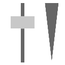

.. _net.sf.openfx.DissolvePlugin:

Dissolve node
=============

.. raw:: html

   <!-- Do not edit this file! It is generated automatically by Natron itself. -->

|pluginIcon| 

*This documentation is for version 1.0 of Dissolve (net.sf.openfx.DissolvePlugin).*

Description
-----------

Weighted average of two inputs.

Inputs
------

+-------+-------------+----------+
| Input | Description | Optional |
+=======+=============+==========+
| 0     |             | Yes      |
+-------+-------------+----------+
| 1     |             | Yes      |
+-------+-------------+----------+
| Mask  |             | Yes      |
+-------+-------------+----------+
| 2     |             | Yes      |
+-------+-------------+----------+

Controls
--------

.. tabularcolumns:: |>{\raggedright}p{0.2\columnwidth}|>{\raggedright}p{0.06\columnwidth}|>{\raggedright}p{0.07\columnwidth}|p{0.63\columnwidth}|

.. cssclass:: longtable

+------------------------------+---------+---------+----------------------------------------------------------------+
| Parameter / script name      | Type    | Default | Function                                                       |
+==============================+=========+=========+================================================================+
| Which / ``which``            | Double  | 0       | Mix factor between the inputs.                                 |
+------------------------------+---------+---------+----------------------------------------------------------------+
| Invert Mask / ``maskInvert`` | Boolean | Off     | When checked, the effect is fully applied where the mask is 0. |
+------------------------------+---------+---------+----------------------------------------------------------------+

